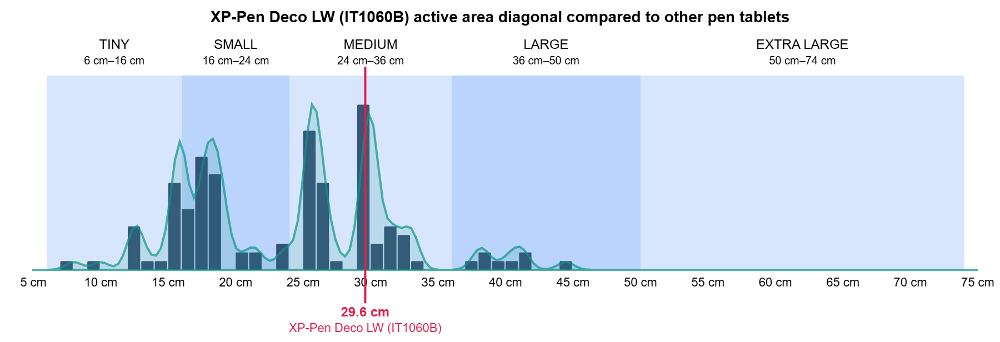
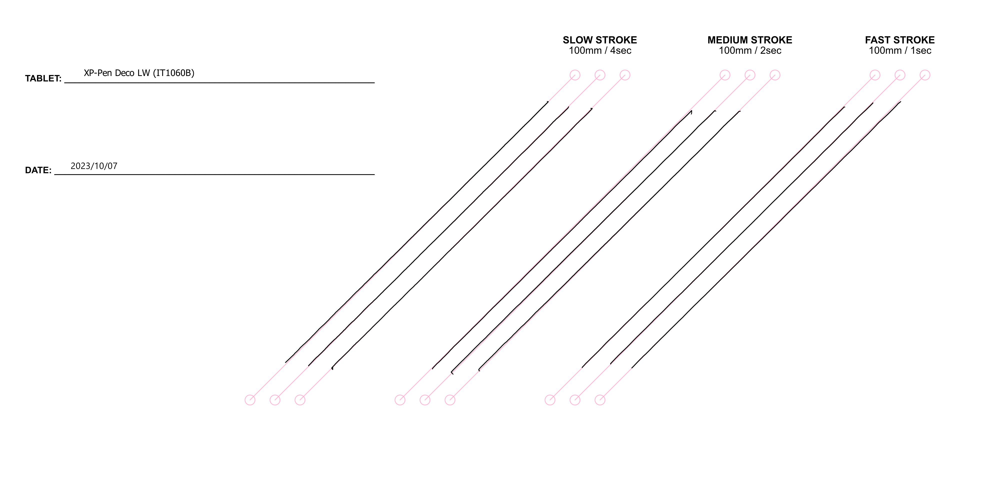

# XP-Pen Deco LW (IT1060B) notes

## Summary

A fine tablet for drawing! And it makes an excellent choice for beginners. And is a great non-Wacom choice. It has a reasonable cost, has available wireless support, has a good pen, and has buttons. It's one of my top recommendations for a beginner pen tablet.

## Basics

There are two versions of this tablet. They are exactly the same tablet but differ in connectivity

* XP-Pen Deco LW (IT1060B) is the wireless + wired version. The B stands for Bluetooth.
* XP-Pen Deco L (IT1060) is the wired-only version.

## Links

These links come from the [DrawTabData Explorer](https://thesevenpens.github.io/DrawTabDataExplorer/entity/xppen.tabletfamily.xppen_deco_2021). To add or fix a link, change it in DrawTabData.

| Source | Link | Date |
| --- | --- | --- |
| XP-Pen | [Product page](https://www.xp-pen.com/product/deco-l-deco-lw-bluetooth.html) |  |
| XP-Pen | [User manual](https://www.xp-pen.com/user-manual/deco-lw.html) (IT1060B) |  |
| XP-Pen | [User manual](https://www.xp-pen.com/user-manual/deco-l.html) (IT1060) |  |
| XP-Pen | [Product information](https://www.xp-pen.com/download/deco-lw.html) (IT1060B) |  |
| Teoh on Tech | [Review: XP-Pen Deco LW pen tablet (Bluetooth)](https://www.youtube.com/watch?v=ohKeCxLL2a0) (IT1060B) | 2022-02-19 |
| Brad Colbow | [Testing the XP-Pen Deco LW Drawing Tablet](https://www.youtube.com/watch?v=0VaH-UTRL7A) (IT1060B) | 2022-02-16 |
| Parka Blogs | [Review: XP-Pen Deco LW pen tablet (Bluetooth)](https://www.parkablogs.com/content/review-xp-pen-deco-lw-pen-tablet-bluetooth) |  |

## Specs

These specs come from the [DrawTabData Explorer](https://thesevenpens.github.io/DrawTabDataExplorer/entity/xppen.tabletfamily.xppen_deco_2021). Click a model ID to see its full record there.



| | [IT1060B](https://thesevenpens.github.io/DrawTabDataExplorer/entity/xppen.tablet.it1060b) | [IT1060](https://thesevenpens.github.io/DrawTabDataExplorer/entity/xppen.tablet.it1060) |
| --- | --- | --- |
| Name | Deco LW | Deco L |
| Released | 2021 | 2021 |
| Status | — | — |



| | [IT1060B](https://thesevenpens.github.io/DrawTabDataExplorer/entity/xppen.tablet.it1060b) | [IT1060](https://thesevenpens.github.io/DrawTabDataExplorer/entity/xppen.tablet.it1060) |
| --- | --- | --- |
| Active area | 254 × 152 mm (10 × 6 in) | 254 × 152 mm (10 × 6 in) |
| Diagonal | 296 mm (11.7 in) | 296 mm (11.7 in) |
| Aspect ratio | 1.671:1 | 1.671:1 |
| Pen technology | Passive EMR | Passive EMR |
| Pressure levels | 8192 | 8192 |
| Tilt | ±60° | ±60° |
| Accuracy (center) | — | — |
| Accuracy (corner) | — | — |
| Report rate | — | — |
| Density | 200 LPmm (5080 LPI) | 200 LPmm (5080 LPI) |
| Max hover | 10 mm | 10 mm |



| | [IT1060B](https://thesevenpens.github.io/DrawTabDataExplorer/entity/xppen.tablet.it1060b) | [IT1060](https://thesevenpens.github.io/DrawTabDataExplorer/entity/xppen.tablet.it1060) |
| --- | --- | --- |
| Included pen | [X3 Elite (PH10B)](https://thesevenpens.github.io/DrawTabDataExplorer/entity/xppen.pen.ph10b) | [X3 Elite (PH10B)](https://thesevenpens.github.io/DrawTabDataExplorer/entity/xppen.pen.ph10b) |
| Compatible pens | [X3 Elite (PH10B)](https://thesevenpens.github.io/DrawTabDataExplorer/entity/xppen.pen.ph10b) [X3 Elite Plus (PH20B)](https://thesevenpens.github.io/DrawTabDataExplorer/entity/xppen.pen.ph20b) | [X3 Elite (PH10B)](https://thesevenpens.github.io/DrawTabDataExplorer/entity/xppen.pen.ph10b) [X3 Elite Plus (PH20B)](https://thesevenpens.github.io/DrawTabDataExplorer/entity/xppen.pen.ph20b) |



| | [IT1060B](https://thesevenpens.github.io/DrawTabDataExplorer/entity/xppen.tablet.it1060b) | [IT1060](https://thesevenpens.github.io/DrawTabDataExplorer/entity/xppen.tablet.it1060) |
| --- | --- | --- |
| Buttons | 8 | 8 |
| Dials | — | — |
| Touch rings | — | — |
| Touch strips | — | — |
| Touch | No | No |



| | [IT1060B](https://thesevenpens.github.io/DrawTabDataExplorer/entity/xppen.tablet.it1060b) | [IT1060](https://thesevenpens.github.io/DrawTabDataExplorer/entity/xppen.tablet.it1060) |
| --- | --- | --- |
| Size | 315 × 187 × 8.8 mm (12.4 × 7.4 × 0.3 in) | 315 × 187 × 8.8 mm (12.4 × 7.4 × 0.3 in) |
| Weight | — | — |



| | [IT1060B](https://thesevenpens.github.io/DrawTabDataExplorer/entity/xppen.tablet.it1060b) | [IT1060](https://thesevenpens.github.io/DrawTabDataExplorer/entity/xppen.tablet.it1060) |
| --- | --- | --- |
| Ports | USB-C | USB-C |
| Attached cable | — | — |
| Bluetooth | Yes (5.0) | No |



| | [IT1060B](https://thesevenpens.github.io/DrawTabDataExplorer/entity/xppen.tablet.it1060b) | [IT1060](https://thesevenpens.github.io/DrawTabDataExplorer/entity/xppen.tablet.it1060) |
| --- | --- | --- |
| Power input | 5 V, 1 A | 5 V, 1 A |
| Consumption | — | — |
| Standby | — | — |
| Power adapter | — | — |
| Power output | — | — |



| | [IT1060B](https://thesevenpens.github.io/DrawTabDataExplorer/entity/xppen.tablet.it1060b) | [IT1060](https://thesevenpens.github.io/DrawTabDataExplorer/entity/xppen.tablet.it1060) |
| --- | --- | --- |
| Contents | — | — |



## Notes on specs

### Pens

See this for more details about the pen: [XP-Pen X3 Elite](../../pens/xppen-pens/xppen-x3elitepen-notes.md)

## Size

* Aspect Ratio: 16:9.57
* Size Category: Medium
* Similar ISO Paper: 15% larger than A5

### Comparison to other pen tablets

<figure><figcaption></figcaption></figure>

## Drawing experience

### Pressure handling

IAF - subjectively around 3gf

Max physical pressure - surprisingly good

See this for more details about the pen: [XP-Pen X3 Elite](../../pens/xppen-pens/xppen-x3elitepen-notes.md)

### Diagonal wobble

Rating: GOOD (LOW amount of diagonal wobble)

<figure><figcaption></figcaption></figure>
