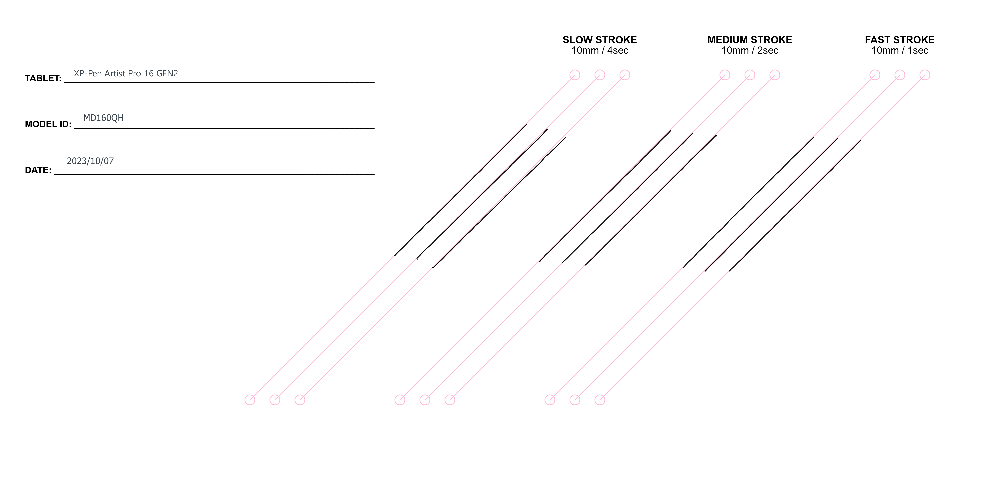
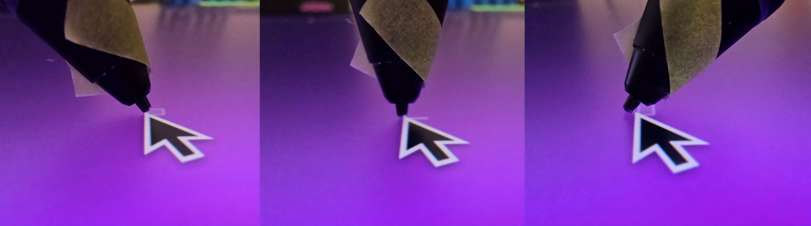

# XP-Pen Artist Pro 16 GEN2 (MD160QH) notes

## **Overall**

In summary this is a very nice tablet. Wacom Cintiq Pro models are still better (and cost MUCH more) but this tablet is good overall and I have enjoyed using it. As of July 2024, this is my top pick for a mid-range-cost 16" pen display.

## Links

These links come from the [DrawTabData Explorer](https://thesevenpens.github.io/DrawTabDataExplorer/entity/xppen.tabletfamily.xppen_artistprogen2_2023). To add or fix a link, change it in DrawTabData.

| Source | Link | Date |
| --- | --- | --- |
| XP-Pen | [Product page](https://www.xp-pen.com/product/artist-pro-16-gen-2.html) |  |
| XP-Pen | [Store page](https://www.xp-pen.com/store/buy/artist-pro-16-gen2.html) |  |
| XP-Pen | [User manual](https://www.xp-pen.com/user-manual/artist-pro-16-2nd.html) |  |
| Seven Pens | [Notes on XP-Pen Artist Pro 16 GEN2 (MD160QH)](https://www.youtube.com/watch?v=kqX05ld4oDY) | 2024-10-27 |
| David Revoy | [XPPen Artist Pro 16 (Gen 2) - review on GNU/Linux](https://www.youtube.com/watch?v=gmmIwkvZagU) | 2023-11-17 |
| David Revoy | [XPPen Artist Pro 16 (Gen 2) - review on GNU/Linux](https://www.davidrevoy.com/article1004/xppen-artist-pro-16-gen-2-review-on-gnulinux) | 2023-11-17 |
| Gartzia Artz | [¡SE HAN PASADO EL JUEGO! La mejor tableta gráfica \| Review tras 4 meses XP Pen Artist Pro 16 Gen 2](https://www.youtube.com/watch?v=3UpKDJgppcA) | 2023-10-10 |
| Brad Colbow | [XP-Pen Artist Pro 16 (Gen 2) Review](https://www.youtube.com/watch?v=NF-zDMfmgY8) | 2023-09-18 |
| Teoh on Tech | [XPPen Artist Pro 16 (gen 2) review: Huge upgrade over older model](https://youtu.be/sc4tebm4TTw?si=Y18_c25g6BUvzwk3) | 2023-09-09 |
| Grant Abbitt | [My favourite Display Tablet - XPPen Artist Pro 2nd Gen](https://youtu.be/d3Th_HD0tbE?si=5tIvFmxSM2nvS1jh) | 2023-08-20 |
| Parka Blogs | [XPPen Artist Pro 16 (gen 2)](https://www.parkablogs.com/content/review-xppen-artist-pro-16-gen-2-pen-display) |  |
| MossCharmly | [Huion Kamvas pro16 2.5K vs. XP-pen Artist pro16 GEN2](https://www.youtube.com/watch?v=41pv6STOBhY) |  |

## Specs

These specs come from the [DrawTabData Explorer](https://thesevenpens.github.io/DrawTabDataExplorer/entity/xppen.tabletfamily.xppen_artistprogen2_2023). Click a model ID to see its full record there.



| | [MD160QH](https://thesevenpens.github.io/DrawTabDataExplorer/entity/xppen.tablet.md160qh) |
| --- | --- |
| Name | Artist Pro 16 GEN2 |
| Released | 2023-08-14 |
| Status | — |



| | [MD160QH](https://thesevenpens.github.io/DrawTabDataExplorer/entity/xppen.tablet.md160qh) |
| --- | --- |
| Resolution | 2560 × 1600 |
| Aspect ratio | 16:10 |
| Pixel density | 188 PPI |
| Panel | IPS |
| Lamination | Yes |
| Anti-glare | Etched glass |
| Color gamut | — |
| Color depth | 8 bits per channel |
| Brightness | 250 cd/m² |
| Peak brightness | — |
| Viewing angle | 178° horizontal 178° vertical |
| Refresh rate | 60 Hz |
| Response time | 20 ms |



| | [MD160QH](https://thesevenpens.github.io/DrawTabDataExplorer/entity/xppen.tablet.md160qh) |
| --- | --- |
| Active area | 345 × 215 mm (13.6 × 8.5 in) |
| Diagonal | 406.5 mm (16 in) |
| Aspect ratio | 16:10 |
| Pen technology | Passive EMR |
| Pressure levels | 16384 |
| Tilt | ±60° |
| Accuracy (center) | — |
| Accuracy (corner) | — |
| Report rate | 200 Hz |
| Density | 200 LPmm (5080 LPI) |
| Max hover | 10 mm |



| | [MD160QH](https://thesevenpens.github.io/DrawTabDataExplorer/entity/xppen.tablet.md160qh) |
| --- | --- |
| Included pen | [X3 Pro (PD21)](https://thesevenpens.github.io/DrawTabDataExplorer/entity/xppen.pen.pd21) |
| Compatible pens | [X3 Pro (PD21)](https://thesevenpens.github.io/DrawTabDataExplorer/entity/xppen.pen.pd21) [X3 Pro Roller (PD22)](https://thesevenpens.github.io/DrawTabDataExplorer/entity/xppen.pen.pd22) |



| | [MD160QH](https://thesevenpens.github.io/DrawTabDataExplorer/entity/xppen.tablet.md160qh) |
| --- | --- |
| Buttons | 0 |
| Dials | — |
| Touch rings | — |
| Touch strips | — |
| Touch | No |



| | [MD160QH](https://thesevenpens.github.io/DrawTabDataExplorer/entity/xppen.tablet.md160qh) |
| --- | --- |
| Size | 405.1 × 291.4 × 20.2 mm (15.9 × 11.5 × 0.8 in) |
| Weight | — |
| VESA mount | No |
| Legs | Yes |
| Included stand | — |



| | [MD160QH](https://thesevenpens.github.io/DrawTabDataExplorer/entity/xppen.tablet.md160qh) |
| --- | --- |
| Ports | USB-C USB-C |
| Attached cable | None |
| Bluetooth | — |



| | [MD160QH](https://thesevenpens.github.io/DrawTabDataExplorer/entity/xppen.tablet.md160qh) |
| --- | --- |
| Power input | 5 V, 3 A |
| Consumption | — |
| Standby | — |
| Power adapter | — |
| Power output | — |



| | [MD160QH](https://thesevenpens.github.io/DrawTabDataExplorer/entity/xppen.tablet.md160qh) |
| --- | --- |
| Contents | — |



## Notes on specs

### Pens

The X3 Pro pen is incredibly similar in shape to the Wacom Pro Pen 2. The pen handles pressure very well and has an eraser. More here: [XP-Pen X3 Pro pens](../../pens/xppen-pens/xppen-x3propen-notes.md)

## **Design**

RATING: EXCELLENT

* I like the overall design. Looks and feels very premium.
* XP-Pen logo on bottom of tablet. It's present and visible without being obtrusive.

## **Display**

**Native resolution** - This is big improvement over an HD (1920x1080) screen at this size.

**Refresh rate** - TYPICAL. Normal for pen displays.

**Sharpness** - GOOD. The AG treatment does not add any blurriness.

**Parallax** - GOOD. Little visible parallax.

**Aspect Ratio** - It is a little more squarish than the much more common 16:9 aspect ratio. After using it for a few days, I actually like the 16:10 aspect ratio. To me it makes the tablet feel a little larger than it is.

<figure><figcaption></figcaption></figure>

**MacOS** - Some people tell me MacOS has more challenges running at resolutions like the one this tablet uses. I'm not a MacOS expert so I suggest you research this more.

## **Connections and cabling**

**Single USB-C cable connection?**

YES. I tried the cable that it came with and a Thunderbolt 3 cable. It worked in both cases. More here: [Connecting a pen display with USB-C](../../../guides/connecting/connecting-pen-display/connecting-pen-display-usbc.md)

**Ports**

There are two USB-C ports on the top edge of the tablet. Both ports are recessed into wells.

If you intend to use a 3rd-party USB-C cable, be aware they may not fit into the well.

One minor nit. The USB-C cable connects at the top edge this means you see the cable connect. This is normal for pen displays these days. But it does make the device a little less elegant.

**3-in-1 cable**

If you need to connect via HDMI you will need a 3-in-1 cable from XP-pen.

* When I bought the tablet in - this cable was s NOT provided in the box.
* However now it seems that XP-Pen is shipping the tablet with the 3-in-1 cable.

Before you purchase verify if you are getting the 3-in-1 cable if you need it.

I contacted XP-Pen support and they indidcated that this compatible 3-in-1 cable: [https://www.xp-pen.com/store/buy/3-in-1-cable-for-artist-2nd-gen-series-display.html ](https://www.xp-pen.com/store/buy/3-in-1-cable-for-artist-2nd-gen-series-display.html)

## Pointer lag

TYPICAL. Normal for a pen display. A Cintiq Pro has slightly less lag.

## Corner accuracy

VERY GOOD. Compared to other tablets has very minor inaccuracy at edges and corners. Matched XP-pens stated accuracy numbers.

## **Diagonal wobble**

RATING: OK.

Diagonal wobble is not uncommon in pen displays - but usually when it is seen it is only seen in SLOW strokes. With the unit I tested I saw it at all speeds - thought wobble slightly decreased as speed increased.

Overall - totally acceptable and addding a little brush smoothing eliminates it..

<figure><figcaption></figcaption></figure>

## Legs

It has two foldable legs on the back allow it to be propped up at an angle. However, I just use a spare HUION stand for a better angle.

## Shape

* Thicker toward the top
* Thinner toward the bottom
* The bottom edge rolls off a bit making it a bit nicer for you hand or arm to rest on that edge.

## Audio features

None. No speakers. No headphone jack.

## Heat

Felt cool (room temperature) to the touch at 100% brightness.

Cool on the right side. On the left side it was slightly warm.

## Noise

Completely silent.

## Fans

The tablet has no fans.

## Remote

The tablet comes with a remote with programmable keys.

## Tilt compensation

Tilting the pen within the supported tilt range did not significantly alter the pointer position. It remained close to the tip. I tried this with 3 different X3 Pro pens and got the same result.

In one of the photos you may notice a slight separation between pointer and tip, I think this is mostly due to the position calibration of the pen and not so much the tilt.

<figure><figcaption></figcaption></figure>

I have heard a few comments on my YouTube channel indicating that some people found very bad tilt compensation. So far I believe if there is an issue it is only with a small number of defective units.

## Anti-glare treatment

It does a very good job of glare reduction. It is on par with the Huion Kamvas Pro 19 and a bit more glare reduction than the Cintiq Pro 22.

## Pixel sharpness

Pixels are clear and well-delineated.

* Slightly sharper than my Cinitq Pro 22
* Noticeably sharper than my Huion Kamvas Pro 19

## Stand options

* XP-pen recommends the ACS05 stand. I'm not a fan of that type of stand.
* I think the AC41 stand woudl work better.
* In my testing I used the stand that came with the Xencelabs Pen Display 16 which is very similar to the AC41.
