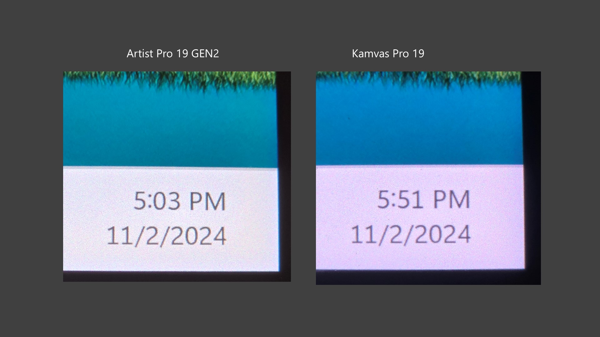
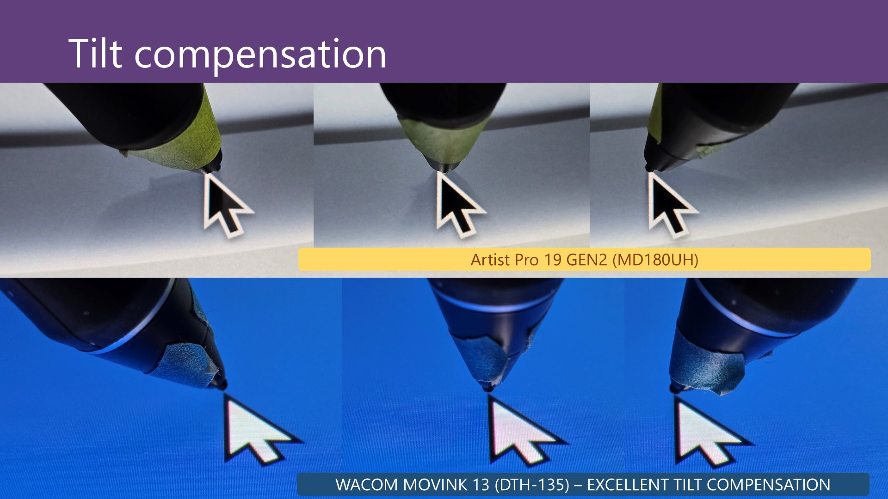
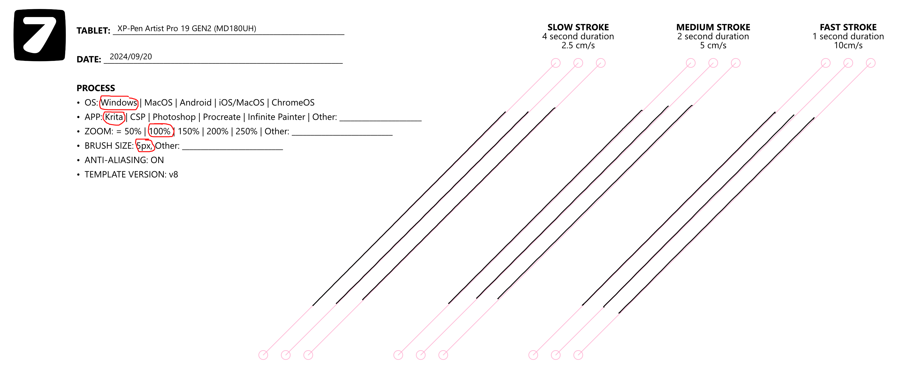
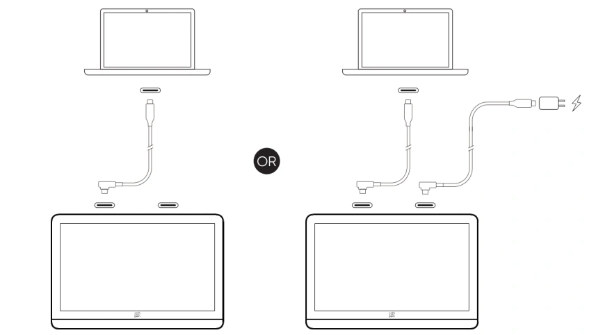
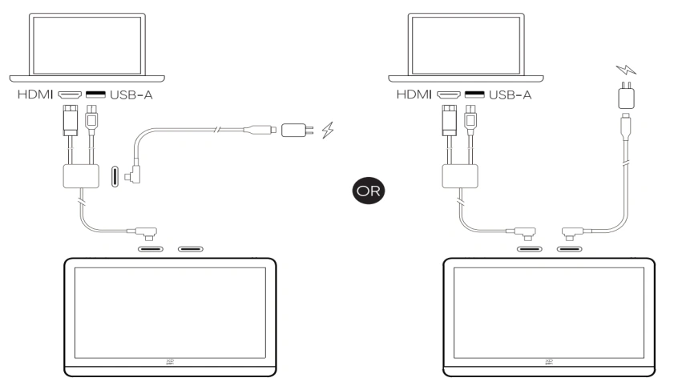
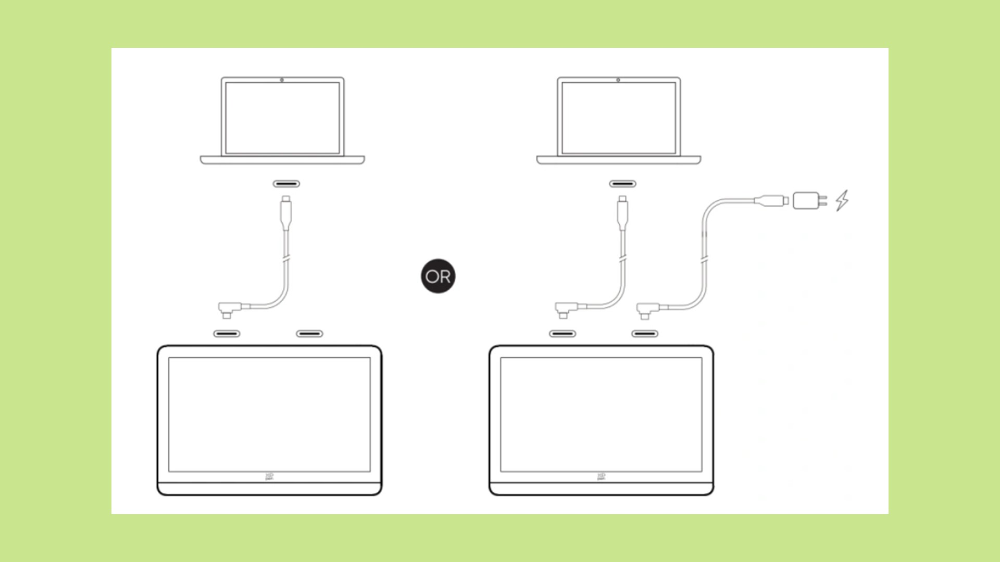

# XP-Pen Artist Pro 19 GEN2 (MD180UH) notes

## Basics

* Product page: [https://www.xp-pen.com/product/artist-pro-19-gen-2.html](https://www.xp-pen.com/product/artist-pro-19-gen-2.html)

## Specs

These specs come from the [DrawTabData Explorer](https://thesevenpens.github.io/DrawTabDataExplorer/entity/xppen.tabletfamily.xppen_artistprogen2_2023). Click a model ID to see its full record there.



| | [MD180UH](https://thesevenpens.github.io/DrawTabDataExplorer/entity/xppen.tablet.md180uh) |
| --- | --- |
| Name | Artist Pro 19 GEN2 |
| Released | 2024-08-19 |
| Status | — |



| | [MD180UH](https://thesevenpens.github.io/DrawTabDataExplorer/entity/xppen.tablet.md180uh) |
| --- | --- |
| Resolution | 3840 × 2160 |
| Aspect ratio | 16:9 |
| Pixel density | 238 PPI |
| Panel | IPS |
| Lamination | Yes |
| Anti-glare | Etched glass |
| Color gamut | sRGB 99.8% Adobe RGB 96% Display P3 98% |
| Color depth | 10 bits per channel |
| Brightness | 250 cd/m² |
| Peak brightness | — |
| Viewing angle | 178° horizontal 178° vertical |
| Refresh rate | 60 Hz |
| Response time | — |



| | [MD180UH](https://thesevenpens.github.io/DrawTabDataExplorer/entity/xppen.tablet.md180uh) |
| --- | --- |
| Active area | 409 × 230 mm (16.1 × 9.1 in) |
| Diagonal | 469.2 mm (18.5 in) |
| Aspect ratio | 16:9 |
| Pen technology | Passive EMR |
| Pressure levels | 16384 |
| Tilt | ±60° |
| Accuracy (center) | ±0.4 mm |
| Accuracy (corner) | ±0.8 mm |
| Report rate | 220 Hz |
| Density | 200 LPmm (5080 LPI) |
| Max hover | 10 mm |



| | [MD180UH](https://thesevenpens.github.io/DrawTabDataExplorer/entity/xppen.tablet.md180uh) |
| --- | --- |
| Included pen | [X3 Pro (PD21)](https://thesevenpens.github.io/DrawTabDataExplorer/entity/xppen.pen.pd21) |
| Compatible pens | [X3 Pro (PD21)](https://thesevenpens.github.io/DrawTabDataExplorer/entity/xppen.pen.pd21) [X3 Pro Roller (PD22)](https://thesevenpens.github.io/DrawTabDataExplorer/entity/xppen.pen.pd22) |



| | [MD180UH](https://thesevenpens.github.io/DrawTabDataExplorer/entity/xppen.tablet.md180uh) |
| --- | --- |
| Buttons | — |
| Dials | — |
| Touch rings | — |
| Touch strips | — |
| Touch | No |



| | [MD180UH](https://thesevenpens.github.io/DrawTabDataExplorer/entity/xppen.tablet.md180uh) |
| --- | --- |
| Size | 460 × 306.6 × 21.5 mm (18.1 × 12.1 × 0.8 in) |
| Weight | 2230 g |
| VESA mount | Yes (75×75) |
| Legs | Yes |
| Included stand | No |



| | [MD180UH](https://thesevenpens.github.io/DrawTabDataExplorer/entity/xppen.tablet.md180uh) |
| --- | --- |
| Ports | USB-C USB-C |
| Attached cable | None |
| Bluetooth | — |



| | [MD180UH](https://thesevenpens.github.io/DrawTabDataExplorer/entity/xppen.tablet.md180uh) |
| --- | --- |
| Contents | — |



## Notes on specs

### Digitizer

* NOTE: it has the exact same size Active Area as the Huion Kamvas Pro 19.

### Display

* Color: the 10 bit is 8bit+FRC

### Pens

The tablet comes with two pens

* X3 Pro Roller Stylus
* X3 Pro Slim Stylus

See [XP-Pen X3 Pro pens](../../pens/xppen-pens/xppen-x3propen-notes.md).

It is compatible with other pens in the X3 pro series.

* X3 Pro Slim Stylus
* X3 Pro - I tested this. It worked.

## Links

* Product page: [https://www.xp-pen.com/product/artist-pro-19-gen-2.html](https://www.xp-pen.com/product/artist-pro-19-gen-2.html)
* [David Review - Review of XP-Pen Artist Pro 19 GEN2](https://www.youtube.com/watch?v=d8Ft3b002LM) 2024-11-20
* [Brad Colbow - XP Pen Artist Pro 19 (GEN 2) Review](https://www.youtube.com/watch?v=eByrnaa0vf8) 2024-08-27
* [Teoh on Tech - Review of XP-Pen Artist Pro 19 (GEN2)](https://www.youtube.com/watch?v=d51hmYgfz5E) 2024-10-22

## Display experience

### Anti-glare sparkle

* RATING: VERY GOOD. Low amounts of AG sparkle.
* Maybe just slightly more than the Cintiq Pro 22.
* Similar to Huion Kamvas Pro 19

### Pixel sharpness

Pixels are relatively clear and well delineated.

The look is clearly sharper than the Huion Kamvas Pro 19 which has a soft look that some people don't like.

<figure><figcaption></figcaption></figure>

## Design

* Really does look like a larger version of the XP-Pen Artist Pro 16 GEN2

## Drawing experience

### Pen pressure

XP-Pen states these numbers for X3 Pro pens

* IAF: 3gf
* Max Pressure: 400gf

In my testing with the pens that came with the tablet

* Subjectively, 3gf seemed about right
* I measured the max pressure at around 250gf.

### Pressure transition

Moving between low and high pressure cave smooth pressure transitions.

### Accuracy

RATING: VERY GOOD.

My experience matched the accuracy numbers XP-Pen provides.

### Parallax

VERY GOOD.

On par with Cintiq Pro 22 and with Huion Kamvas Pro 19.

### Tilt compensation

OK. Minor displacement at 45deg

* Pen tilted left -> 1.8 mm displacement
* Pen vertical -> \~1 mm displacement
* Pen tilted right -> \~0 mm displacement

<figure><figcaption></figcaption></figure>

### Pressure scan rate testing

RATING: VERY GOOD

Drawing 50 strokes as fast possible results in no lost strokes.

### Diagonal wobble

Rating: GOOD low amounts of diagonal wobble.

* Just a little more than the Huion Kamvas Pro 19
* About the same as the Cintiq Pro 22
* A little less than the XP-Pen Artist Pro 16 GEN2
* About the same as the Huion Kamvas 13 GEN3
* About the same as the XP-Pen Artist 22 Plus

<figure><figcaption></figcaption></figure>

### Surface texture

As is typical for etched glass surfaces, there is a slight surface texture.

Using the same X3 Pro pen with a plastic nib

The XP-Pen Artist Pro 19 GEN2 has an amount of surface texture that is

* about the same as the XP-Pen Artist Pro 19 GEN2
* about the same as the Huion Kamvas Pro 19
* a little less than the XP-Pen Artist 22 Plus
* a little less than the Cintiq Pro 22

## Connections and cabling

### Ports

* 2 USB-C ports on the top edge
  * The ports are NOT recessed

### USB-C connection options

<figure><figcaption></figcaption></figure>

### HDMI connection options

<figure><figcaption></figcaption></figure>

### How I connected it

I tested both the configurations below with my M3 MacBook Pro and a Surface Pro 8

<figure><figcaption></figcaption></figure>

## Ergonomics

### Legs

This tablet has a two folding legs on the back.

### Stand

I used the stand that came with the Xencelabs Pen Display 16 to hold this tablet. It worked very well.

### Noise

Silent.

### Heat

GOOD. Tablet keeps cool

* Left 1/3 cool
* Right 2/3 slightly warm
* Warmer near the USB-C ports

## Other features

### Audio

There are no audio features such as a headphone jack.
