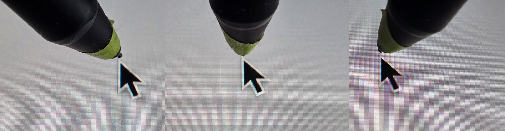
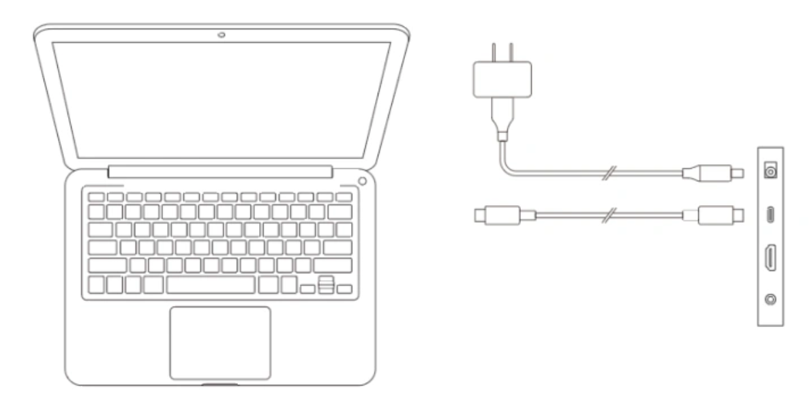
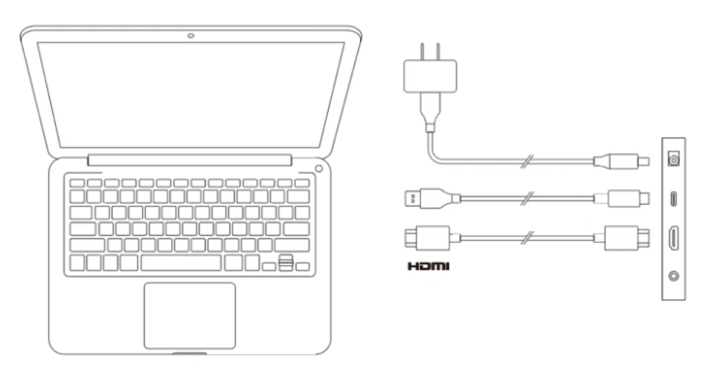

# XP-Pen Artist 22 Plus (MD220FH) notes

## Links

[Brad Colbow review of XP-Pen Artist 22 Plus](https://www.youtube.com/watch?v=YfEfGOJOQJs) 2023-11-20

## Anti-glare sparkle

Rating: VERY GOOD. very low amount of AG sparkle visible. Your eyes would have to be within a few inches to see it.

## Tilt compensation

Rating: VERY GOOD.

<figure><figcaption></figcaption></figure>

## Ports

* Power jack
* USB-C port
* HDMI
* Headphone jack

## Connections

Option 1: USB-C + power

<figure><figcaption></figcaption></figure>

Option 2: HDMI + USB + power

<figure><figcaption></figcaption></figure>

## Audio

Comes with a headphone jack.
