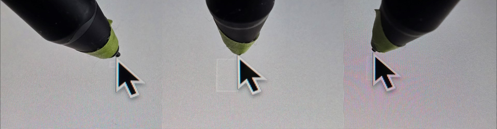
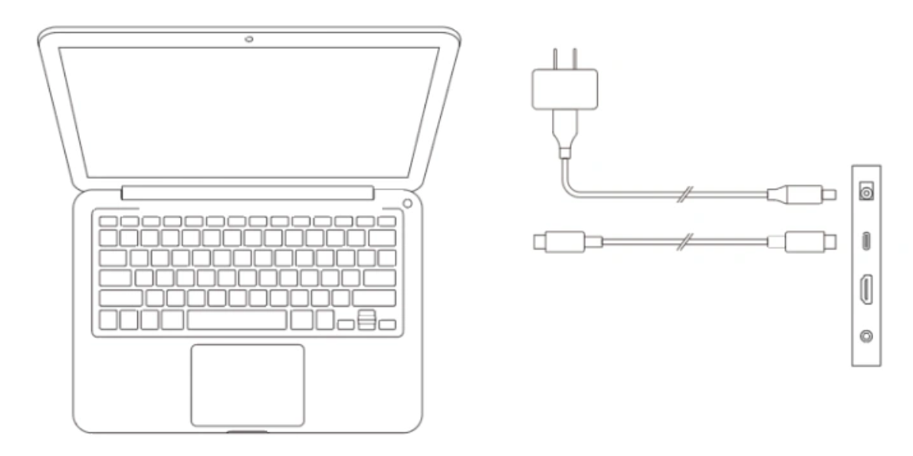
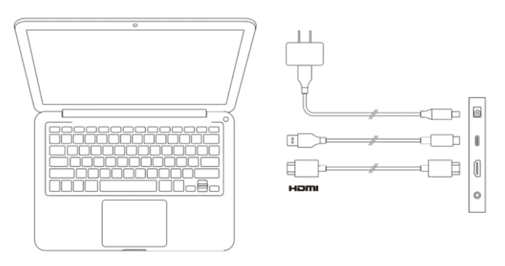

# XP-Pen Artist 22 Plus (MD220FH) notes

## Display

* **Resolution**
  * The model ID encodes this: FH is Full HD. The 22" WQHD (2560x1440) XP-Pen is the Artist Pro 22 GEN2 (MD220QH) - see [XP-Pen Artist Pro 22 GEN2 (MD220QH) notes](xppen-md220qh-notes.md).

## Specs

These specs come from the [DrawTabData Explorer](https://thesevenpens.github.io/DrawTabDataExplorer/). Click a model ID to see its full record there.



| | [MD220FH](https://thesevenpens.github.io/DrawTabDataExplorer/entity/xppen.tablet.md220fh) |
| --- | --- |
| Name | Artist 22 Plus |
| Released | 2023-06-19 |
| Status | — |
| Included pen | [X3 Pro (PD21)](https://thesevenpens.github.io/DrawTabDataExplorer/entity/xppen.pen.pd21) |



| | [MD220FH](https://thesevenpens.github.io/DrawTabDataExplorer/entity/xppen.tablet.md220fh) |
| --- | --- |
| Resolution | 1920 × 1080 |
| Panel | — |
| Lamination | Yes |
| Anti-glare | Film |
| sRGB | 99% |
| Color depth | — |
| Brightness | 250 cd/m² |
| Refresh rate | 60 Hz |
| Response time | — |



| | [MD220FH](https://thesevenpens.github.io/DrawTabDataExplorer/entity/xppen.tablet.md220fh) |
| --- | --- |
| Active area | 476 × 268 mm (18.7 × 10.6 in) |
| Pen technology | Passive EMR |
| Pressure levels | 16384 |
| Tilt | ±60° |
| Report rate | 200 Hz |
| Density | 200 LPmm (5080 LPI) |
| Max hover | 10 mm |



| | [MD220FH](https://thesevenpens.github.io/DrawTabDataExplorer/entity/xppen.tablet.md220fh) |
| --- | --- |
| Buttons | — |
| Dials | — |
| Touch rings | — |
| Touch strips | — |
| Touch | No |



| | [MD220FH](https://thesevenpens.github.io/DrawTabDataExplorer/entity/xppen.tablet.md220fh) |
| --- | --- |
| Size | 547 × 364.7 × 33.4 mm (21.5 × 14.4 × 1.3 in) |
| Weight | — |
| VESA mount | — |
| Legs | — |
| Included stand | — |



| | [MD220FH](https://thesevenpens.github.io/DrawTabDataExplorer/entity/xppen.tablet.md220fh) |
| --- | --- |
| Ports | DC power USB-C HDMI 3.5 mm audio |
| Attached cable | None |
| Bluetooth | — |



## Links

[Brad Colbow review of XP-Pen Artist 22 Plus](https://www.youtube.com/watch?v=YfEfGOJOQJs) 2023-11-20

## Anti-glare sparkle

Rating: VERY GOOD. very low amount of AG sparkle visible. Your eyes would have to be within a few inches to see it.

## Tilt compensation

Rating: VERY GOOD.

<figure><figcaption></figcaption></figure>

## Connections

Option 1: USB-C + power

<figure><figcaption></figcaption></figure>

Option 2: HDMI + USB + power

<figure><figcaption></figcaption></figure>

## Audio

Comes with a headphone jack.
