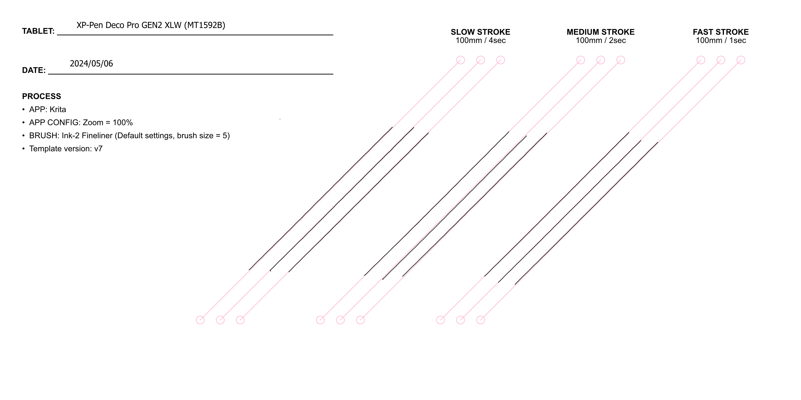

# XP-Pen Deco Pro XLW GEN2 (MT1592B) notes

## Notes

I used this tablet from 2023-07-26 to 2023-11-01 and have been very happy with it.

## Links

* [EyekooDrawsStuff review of XP-Pen Deco Pro GEN2](https://www.youtube.com/watch?v=itnwkJVlWiw) 2024-11-29
* [Teoh on Tech review of XP-Pen Deco Pro GEN2](https://youtu.be/h8NG0zmYdtE) 2023/07.25
* [Joseph Montanez XP-Pen Deco Pro GEN2 XLW](https://youtu.be/pRLBRTWPlQU) 2023-06-20
* [YRH review of XP-Pen Deco Pro XLW GEN2 on Ubuntu 22.04](https://krita-artists.org/t/xp-pen-deco-pro-xlw-gen-2-first-impressions-on-ubuntu-22-04/84085) 2024-02-08

## Size

This is large-sized tablet -comparable in size to the Wacom Intuos Pro Large (PTH-860). and you should be aware about the realities of using a tablet this big: [Using large pen tablets](../../../guides/general/large-pen-tablets.md)

## **Build quality and design**

Is great across the board. The thing looks and feels great. In this dimension, seems to rival the premium feel of Wacom. Again I am just talking about the materials here and looks. This XP-Pen tablet it seems more modern in its aesthetic than other tablets.

**XP-Pen branding** - The XP-Pen logo is prominently featured on the pen case and at the bottom edge of the tablet. Frankly I think it looks cool and I enjoy being able to visually distinguish the tablet from the many others I have.

**Indicator lights on surface**

Four indicator lights are just past the corners of the active area. They will light up if the pen is within 10 mm of the active area. The lights are white. You can turn them off in the driver.

## **Pen**

It comes with XP-Pen X3 Pro pen. The shape is very close to the Wacom Pro Pen 2. It has two buttons, an eraser. It has a good pressure range. Much more here: [XP-Pen X3 Pro pens](../../pens/xppen-pens/xppen-x3propen-notes.md) .

**Pen compatibility**

* X3 Pro pen: Compatible with this tablet
* X3 Elite: NOT compatible with this tablet

## **Surface**

**Surface texture** Seems similar to a Wacom Intuos Pro L (PTH-860).

**Replaceable surface?** No.

**Surface details**

* The surface has a nice touch. At the bottom bevel is gently arcs down so that your hands avoid contact with a hard edge.
* At surface is a slab that actually hangs over the table like a flat roof. I've never encountered a tablet with this before. It doesn't change how it works, but it is an interesting design choice. I like the look
* Surface edge at the very edge of the surface, the transition from horizontal surface to vertical is not very rounded.

## **Buttons**

The tablet itself has none.

## Pen pressure

**Maximum pressure** - Top End of pressure range for the pen seems comparable to the what I am used to with the Huion PW517. Not not as high as Wacom Pro Pen 2.

**Minimum pressure (IAF)**

* XP-Pen says 3gf.
* It is easy to drag the pen across the surface and even hear the scratch sound without the pen registering pressure.
* Compared to Wacom: Wacom Pro Pen 2 is <1gf. The difference in the IAFs is very obvious.
* Compared to Huion: It felt to me that this XP-Pen has an IAF larger than the Huion PW517 pen. I need time to evaluate this again.

## **Pointer lag**

Normal of pointer lag for non-Wacom tablets.

A little more pointer lag than a Wacom Intuos Pro tablet. If you are coming from a Wacom Intuos Pro, you might initially feel like the pointer lag is just ever-so-slightly "floaty". The effect is very subtle. After using this tablet for several months I don't even notice.

## **Diagonal wobble**

Rating: OK

It has more wobble than the Wacom Intuos Pro Large (PTH-860). Notice that wobble is slightly present even in the fast stroke. XP-Pen should be doing better here since it is targeted at a pro audience. In practice this wobble has not impacted me at all.

Enabling brush smoothing options in your applications will minimize its visibility.

<figure><figcaption></figcaption></figure>

## Hover jitter

Some users have reported that the pointer "shakes" when the pen is hovering over the tablet.

To understand what hover jitter is, go here: [Hover jitter](../../../core/hover/hover-jitter.md)

Example: [**r/XPpen - Beware of the Deco Pro Gen 2 / Rant**](https://www.reddit.com/r/XPpen/comments/1h66ei5/beware_of_the_deco_pro_gen_2_rant/) 2024-12-03

**My testing**

* Testing process: I begin with the pen 0.5mm from the surface and moved up by 0.5 mm increments and noted any jitter I experienced. I used my hover height tool to keep the tip of the pen at specific distances from the tablet surface. See: [Measuring hover](../../../process/measuring/measuring-hover.md).
* With the Deco Pro GEN2 MW
  * **<= 7mm :** No jitter
  * **>7mm to <=10 mm** : Slight & sporadic jitter
  * **>10mm to 14mm** : Jitter grows in frequency and intensity. Max jitter at 14mm
  * **>14mm** : Pen no longer detected
* With Deco Pro GEN2 XLW
  * **<= 10mm :** No jitter
  * **>10mm to <=14 mm** : Slight & sporadic jitter
  * **>14mm to 16mm** : Jitter grows in frequency and intensity. Max jitter at 16mm
  * **>16mm** : Pen no longer detected

**My evaluation:**

* This hover jitter effect did not bother me. I didn't even notice it until someone brought it to my attention in June of 2025.
* As it is a hover effect, it does NOT affect drawing
* It also appears toward the upper end of the supported hover range of 10mm. Where it might be masked by the natural tremors of the hand.
* However some people do notice this effect and are irritated by it.

## Accessories

**Pen case** - Adding the the premium feel is the pen case. Which holds the pen, extra nibs, and nib remover. It really is a slick looking.
