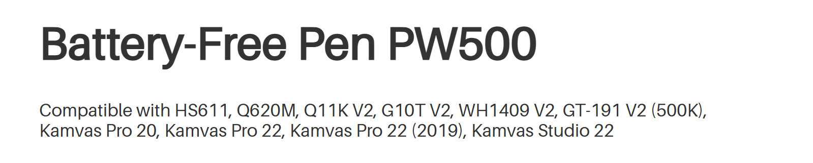
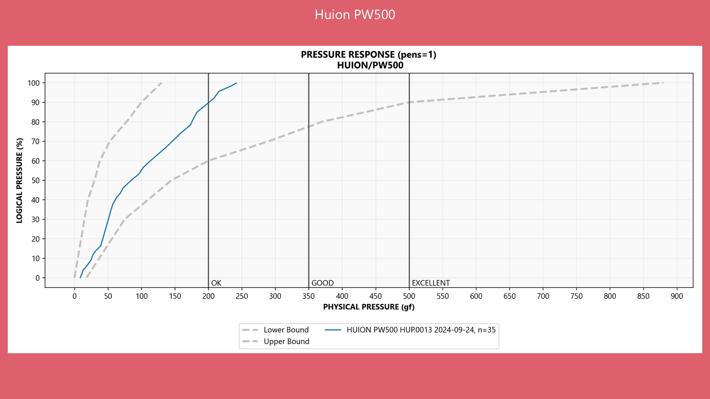

# Huion PW500 pen notes

## Overall

Overall, it performs decently. No obvious problems.

Store link: [https://store.huion.com/products/battery-free-pen-pw500](https://store.huion.com/products/battery-free-pen-pw500)

## Compatible tablets

Huion lists these compatible tablets:

* HS611
* Q620M
* Q11K V2
* G10T V2
* WH1409 V2
* GT-191 V2 (500K)
* Kamvas Pro 20
* Kamvas Pro 22
* Kamvas Pro 22 (2019)
* Kamvas Studio 22

Pen Compatibility as of 2026-02-06 from Huion's website

<figure><figcaption></figcaption></figure>

## Design

The pen is a little "plastic-feeling" and does not have a premium feeling.

The nib retracts a little more than more modern EMR pens. It doesn't impact drawing, but some people may not like the more "spongy" feeling.

## Max pressure

Max pressure is OK at around \~250gf with the unit I tested.

<table><thead><tr><th width="107">BRAND</th><th width="103">PEN</th><th width="110">INVENTORY</th><th width="106">PHYSICAL</th><th width="103">LOGICAL</th></tr></thead><tbody><tr><td>HUION</td><td>PW500</td><td>HU1013</td><td>241.6gf</td><td>99.80%</td></tr></tbody></table>

## Pressure response

<figure><figcaption></figcaption></figure>
