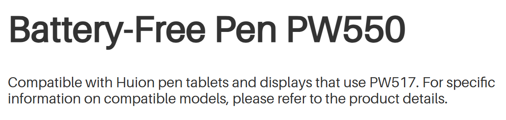
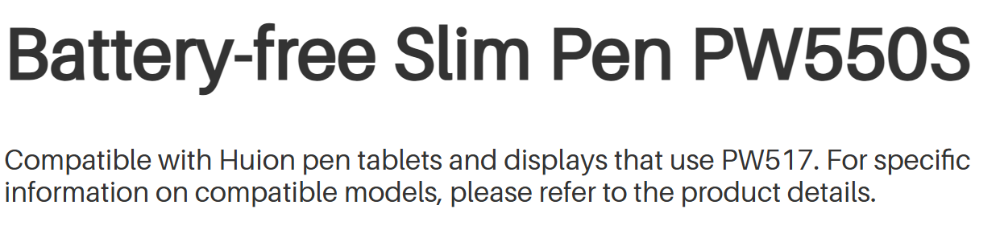
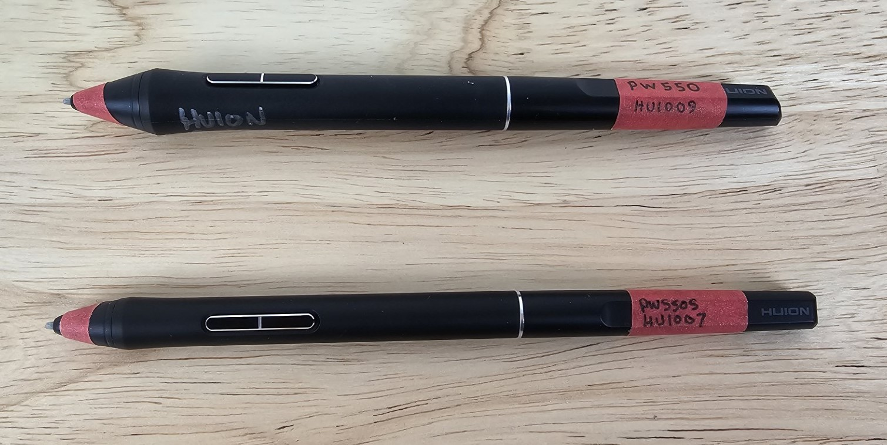
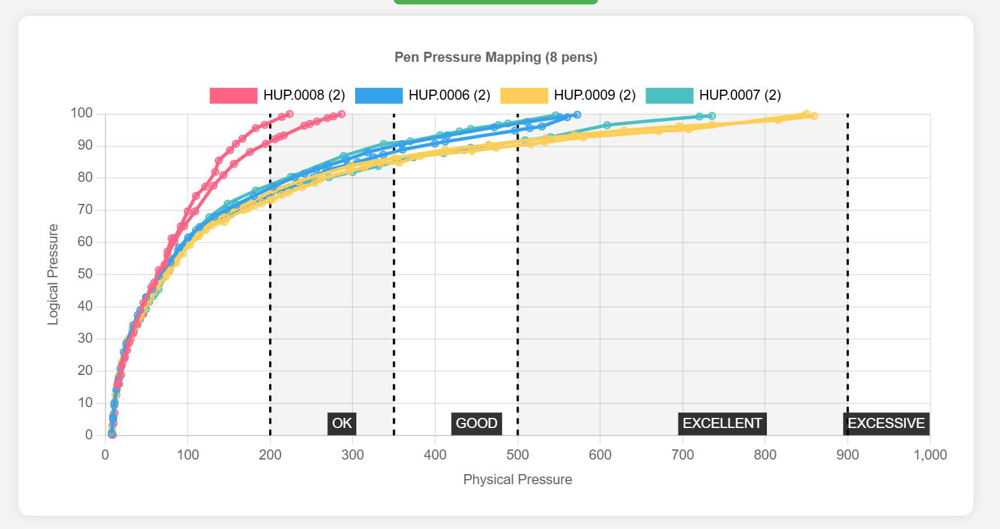
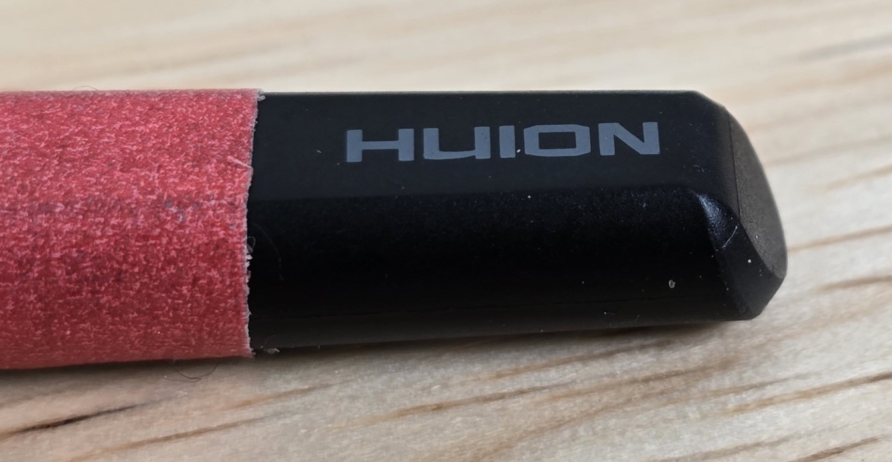
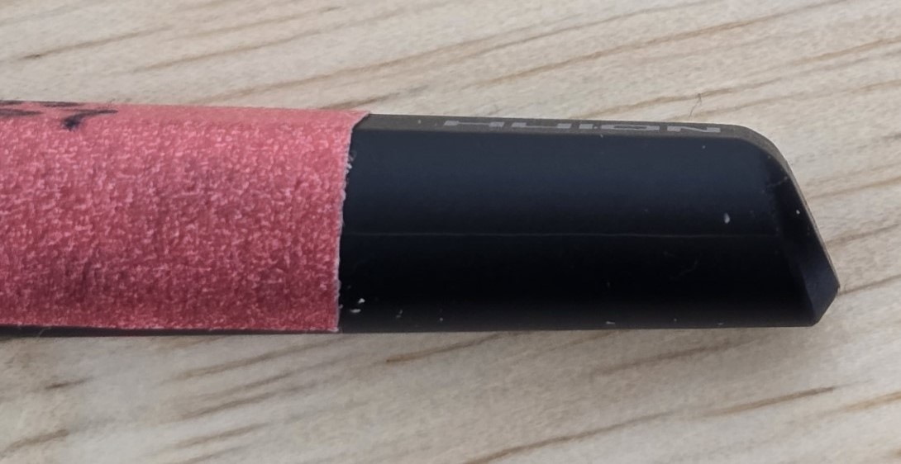

# Huion PW550 series pens notes

## Overview

These PW550 series of pens offer some of the improvements that made it into the PW600 series of pens in terms of pressure handling.

If your tablet uses a PW517 pen, consider getting the PW550 pen or PW550S pen instead. See: [Upgrading from PW517 to PW550](upgrading-pw517-to-pw550.md)

## Links

* [Huion - Introducing Huion PenTech 3.0+ and PW550/PW550S](https://store.huion.com/posts/introducing-huion-pentech3.0+-pw550-pw550s) 2023-03-30

## Compatible tablets

It is compatible with the same tablets that support the PW517 pen

Pen Compatibility as of 2026-02-06 from Huion's website

<figure><figcaption></figcaption></figure>

<figure><figcaption></figcaption></figure>

## Photos

<figure><figcaption></figcaption></figure>

## Buttons

These pens have two buttons which is typical for an EMR pen.

## Pressure range

IAF - 7 to 10gf

Max Pressure - between 300 gf to 800gf. With an occasional units around the mid 250s.

<figure><figcaption></figcaption></figure>

## Photos

.jpg>)

## PW550 versus PW517

The PW550 may be a compelling upgrade to the PW517 pen. See the details in the video below.
