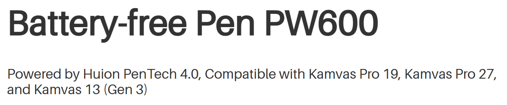
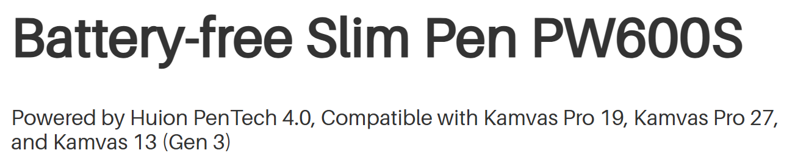
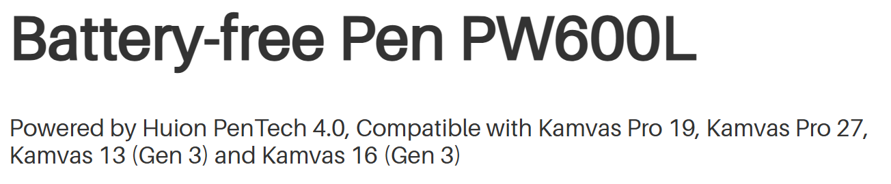
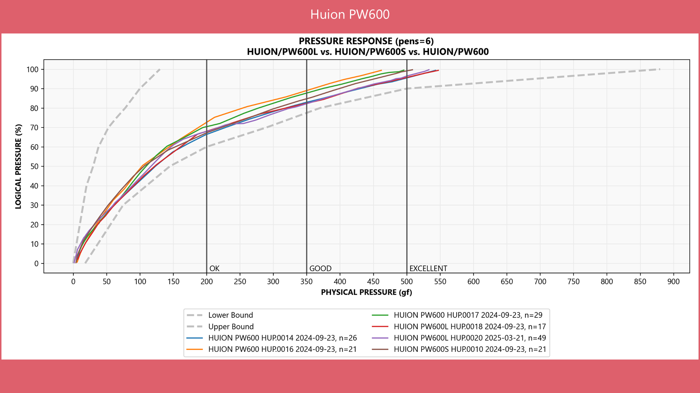

# Huion PW600 series pens

## **Overview**

As of July 2025, the Huion PW600 series is the best non-Wacom pen I've seen. It has good IAF, a wide pressure range, and comes very close to the Wacom Pro Pen 2.

## **Pen compatibility**

Pen Compatibility as of 2026-02-06 from Huion's website

<figure><figcaption></figcaption></figure>

<figure><figcaption></figcaption></figure>

<figure><figcaption></figcaption></figure>

## **Models**

* PW600
* PW600S
* PW600L

## **Pen buttons**

* PW600 has 3 buttons
* PW600S has 2 buttons
* PW600L has 3 buttons

## **Pen button feel**

GOOD. The buttons on these pens have a nicer, crisper click than the buttons on the PW517, which feel a bit soft and mushy in comparison.

## **Pen IAF**

GOOD. Huion says 2gf for these pens. Seems accurate. A little more sensitive than the PW517 pen which is at about 3gf.

## **Pen maximum pressure**

VERY GOOD.

Huion states 500 gf. I saw a little variance, but not much. Overall, the PW600 pens are very consistent.

<table><thead><tr><th width="150">Pen</th><th>7P Inventory ID</th><th>Max Pressure</th></tr></thead><tbody><tr><td>PW600</td><td>HU1014</td><td>~550gf</td></tr><tr><td>PW600</td><td>HU1017</td><td>~500gf</td></tr><tr><td>PW600</td><td>HU1016</td><td>~460gf</td></tr><tr><td>PW600S</td><td>HU1010</td><td>~510gf</td></tr><tr><td>PW600L</td><td>HU1018</td><td>~550gf</td></tr></tbody></table>

## Pressure response

<figure><figcaption></figcaption></figure>

## PW600 series compatibility with older tablets

The new pens are NOT compatible with older Huion tablets.

## Pen weight

I measured these with a digital scale:

* PW600 = 16g
* PW600S = 14g
* PW517 = 14g

## **Pen eraser**

The PW600 and PW600S pens do have an eraser. I don't use erasers, so I don't have any particular comment on it.

The PW600L does NOT have an eraser.

## Pen barrel texture

The older PW517 pen has a rubber grip around the barrel near the buttons.

The PW600 series pen is plastic, but the plastic has a slight texture and feels very slightly soft compared to a more traditional plastic barrel. I found it very pleasant to hold and easy to grip.
