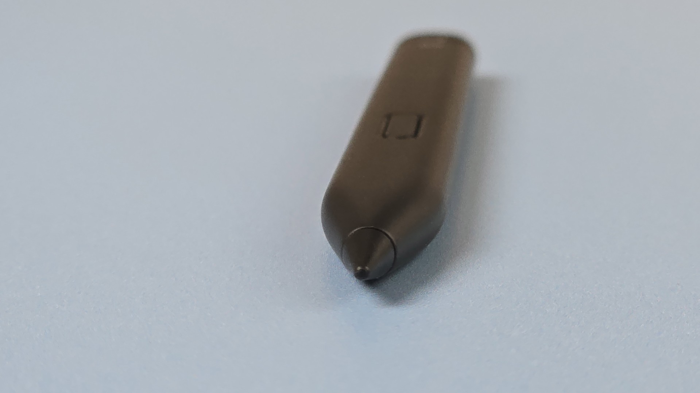
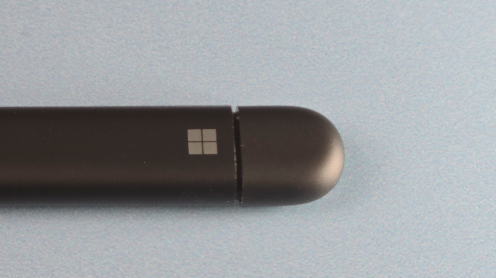
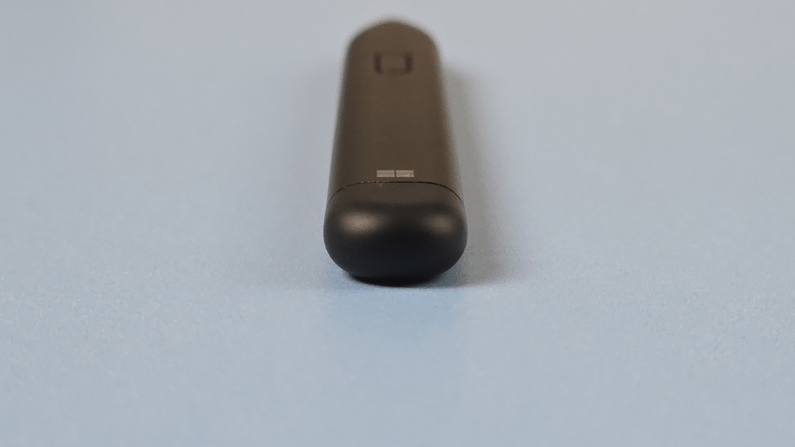

# Surface Slim Pen 2 notes

## Summary

An improvement over previous Surface pens with reduced but not eliminated diagonal wobble.&#x20;

* I find the shape awkward
* I still prefer EMR pens
* Works fine for note taking, whiteboarding, etc.&#x20;

Surface pen compatibility: [https://support.microsoft.com/en-us/surface/pen/surface-pen-compatibility-and-features](https://support.microsoft.com/en-us/surface/pen/surface-pen-compatibility-and-features)

## Links

* [Tablet Pro - SLIM PEN 2 - All The Problems after 6 months HEAVY use as an Artist. Is it still the BEST choice?](https://www.youtube.com/watch?v=0FiSkvrWWV4) 2022-05-19
* [Tablet Pro- The Slim Pen 2 vs the New Renaisser R530 stylus](https://www.youtube.com/watch?v=kJVmb4u5GJ4) 2022-02-25
* [Teoh on Tech - Artist Review: Microsoft Surface Pro 8 & Slim Pen 2](https://www.youtube.com/watch?v=wNtmOONAyxk) 2022-03-24

## Photos

<figure><figcaption></figcaption></figure>

<figure><figcaption></figcaption></figure>

<figure><figcaption></figcaption></figure>

<figure><figcaption></figcaption></figure>
