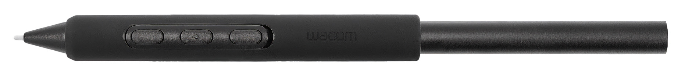
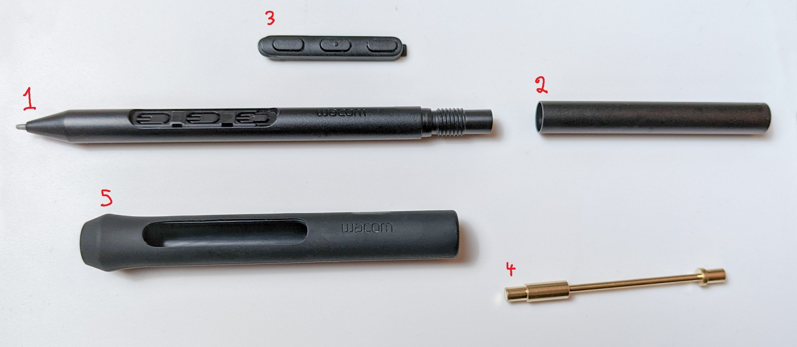
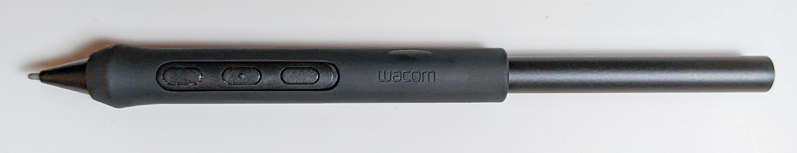
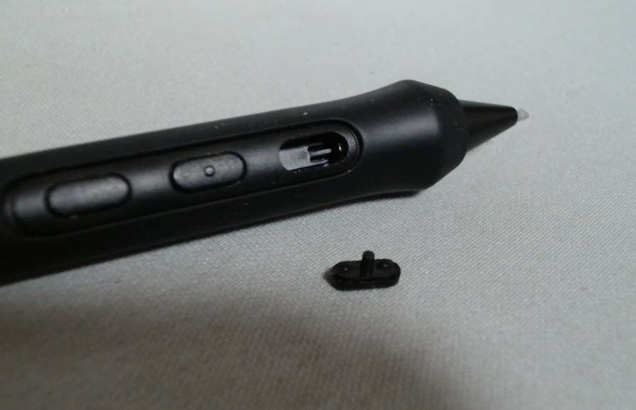
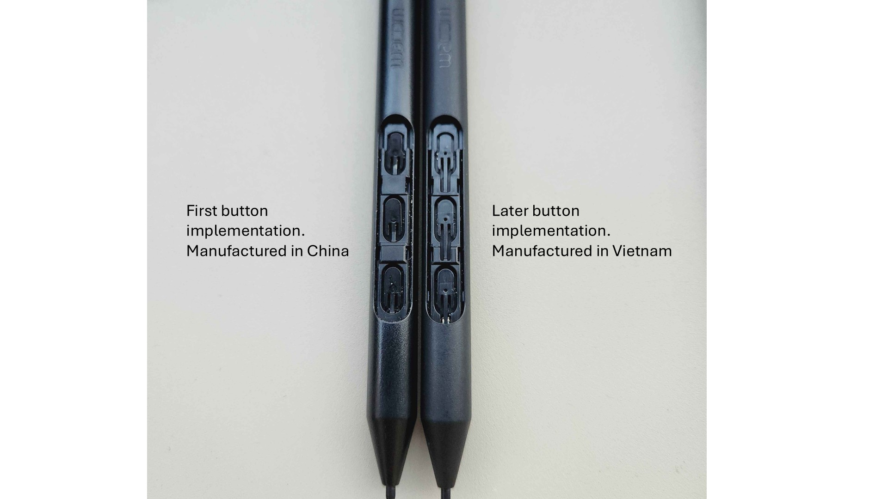
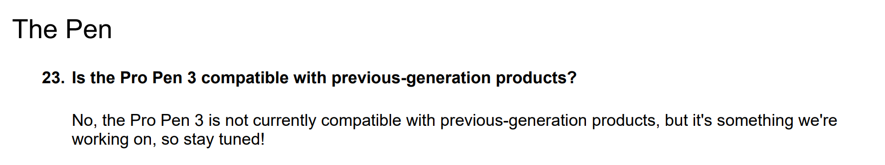
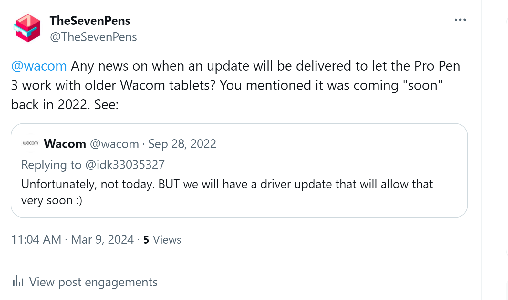
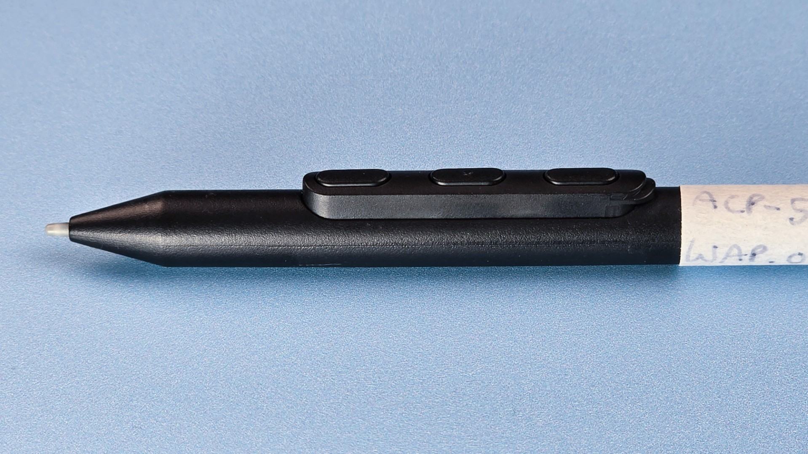

# Wacom Pro Pen 3 (ACP-500) notes

## Pro Pen 3

The Wacom Pro Pen 3 (ACP-500) is a very normal EMR pen that lives up to previous models in terms of quality and may be slightly better than the Wacom Pro Pen 2.

<figure><figcaption></figcaption></figure>

## General information

* [Wacom - "Igniting the creativity of professional artists! The pride of Wacom – Wacom Pro Pen 3"](https://community.wacom.com/en-pe/craftsmanship-wacom-pro-pen-3/) 2025-01-25 (archive)

## Links

* Teoh on Tech - [Wacom Pro Pen 3: All You Need to Know](https://www.youtube.com/watch?v=y0LJAcmI7aM) - 2026-04-14
* r/wacom - [The Chinese made Pro Pen3 (25B) vs the Vietnam made Pro Pen3 (25G)](https://www.reddit.com/r/wacom/comments/1rv3evg/the_chinese_made_pro_pen3_25b_vs_the_vietnam_made/) 2026-03-16

## Pressure

### Background

Before you continue, you should read this document because it clarifies what is meant by terms such as pressure and range. [Pen pressure](../../../core/pressure/)

### Pressure levels

* Pro Pen 3 supports 8192 pressure levels.
* Nothing special here. All modern tablets/pens say they support this number of pressure levels.
* I continue to maintain that 2048 levels is all you need for creative applications. Some say even fewer pressure levels are needed.

### Pressure response for drawing

RATING: EXCELLENT

Pressure response is how changes in pressure translate to drawing strokes in creative applications.

I tried it in these scenarios:

* Small pressure produces light strokes.
* It is easy to create many small, slight strokes quickly, such as hatch lines.
* Varying pressure as you draw changes stroke width very smoothly
* It is easy to maintain even pressure and line width.
* Nice tapering at beginning and end of strokes
  * How the beginning and end of strokes look depends heavily on the app and the brush settings.
    * For example, sudden flicks to end a line in Clip Studio Paint look a little different than the same motion in Photoshop. But this seems normal.
  * For the Pro Pen 3 with the Wacom Cintiq Pro 27, the beginnings and ends of strokes felt as good as they always have.

### Pressure range & maximum pressure

Rating: VERY GOOD maximum pressure

| Statistic | Pmax (gf) |
| --------- | --------- |
| Min       | 595.0     |
| Median    | 615.9     |
| Max       | 702.0     |

| Inventory ID | Driver | Highest measured (gf) | Pmax estimate (gf) |
| ------------ | ------ | --------------------- | ------------------ |
| WAP.0030     | WACOM  | 649.1                 | 646.4              |
| WAP.0031     | WACOM  | 634.9                 | 633.8              |
| WAP.0032     | WACOM  | 600.2                 | 597.2              |
| WAP.0033     | WACOM  | 707.4                 | 702.0              |
| WAP.0039     | WACOM  | 602.6                 | 598.0              |
| WAP.0040     | WACOM  | 597.5                 | 595.0              |

### Initial activation force

Rating: GOOD&#x20;

Tablet expert Kuuube is very good at measuring IAF, and his initial measurement for 1 PP3 unit is around 3gf or 4gf. Which is clearly higher than the <1gf he finds for the Pro Pen 2.

My numbers agree with Kuuube's data.

| Statistic | IAF (gf) |
| --------- | -------- |
| Min       | 3.0      |
| Median    | 3.6      |
| Max       | 4.5      |

| Pen             | Inventory ID | IAF (gf) | Source   |
| --------------- | ------------ | -------- | -------- |
| Wacom Pro Pen 3 | WAP.0040     | 3.0      | measured |
| Wacom Pro Pen 3 | WAP.0069     | 3.0      | measured |
| Wacom Pro Pen 3 | WAP.0030     | 3.5      | measured |
| Wacom Pro Pen 3 | WAP.0049     | 3.5      | measured |
| Wacom Pro Pen 3 | WAP.0032     | 3.5      | measured |
| Wacom Pro Pen 3 | WAP.0070     | 3.5      | measured |
| Wacom Pro Pen 3 | WAP.0072     | 3.8      | measured |
| Wacom Pro Pen 3 | WAP.0033     | 4.0      | measured |
| Wacom Pro Pen 3 | WAP.0053     | 4.0      | measured |
| Wacom Pro Pen 3 | WAP.0071     | 4.5      | measured |
| Wacom Pro Pen 3 | WAP.0031     | 4.5      | measured |
| Wacom Pro Pen 3 | WAP.0039     | 4.5      | measured |

### Comparing Initial Activation Force

* Wacom does not publish IAF numbers
* I don't know of any clear way to measure it.
* One benchmark used to evaluate IAF is whether the weight of the pen itself will trigger a pressure reading.
* I tried using this benchmark to get a feel for the IAF the Pro Pen 3 versus the Huion PW517
  * I dangled the pen on the surface from a piece of tape. This was to avoid my hand adding pressure.
  * I looked at the impact on the "pressure test region" of their respective driver apps
  * Result for Wacom Pro Pen 3: The weight of the Wacom pen itself consistently draws a stroke
* Result for Huion PW517: The weight of the Huion pen itself will inconsistently draw a stroke. Sometimes it draws. Sometimes it does not.

## Customizability

* Unlike previous Wacom pens, the Pro Pen 3 is very modular and customizable
* Grip options
  * No grip
  * flared grip - gives it the same basic shape as the Pro Pen 2
  * non-flared grip

## My pen configuration

<figure><figcaption><p>Components used in my pen configuration</p></figcaption></figure>

* 1 pen body with tip - the front
* 2 pen body rear
* 3 button strip with three buttons
* 4 metal weight. I placed the heavier end inside part 1
* 5 flared grip

When my pen is fully assembled it looks like this:

<figure><figcaption></figcaption></figure>

### 3 button strip

* I like buttons on my pens so I installed the 3 button strip
* Wacom expects you'll map the topmost button to erase
* Personally, I have difficulty distinguishing three buttons from two, so I often press the third button when I meant to press the second.
* So, in Wacom driver, I simply disable the third button.
* I was afraid the button strip would easily come out of the pen. It is securely in there and hasn't popped out even when I have dropped the pen to the floor accidentally.

## Drawing experience

* NOTE: This relates to the physical feeling of holding, moving, pressing the pen against the glass. This has nothing to do with how pressure works or how it works with apps.
* SUMMARY: The feeling is EXCELLENT
* I think it is an improvement over the Wacom Pro Pen
* However, I think there is a lot of subjectivity here. For example, I accidentally picked up the Pro Pen 2 and started drawing with it. I thought I was using the Pro Pen 3 and remarked on how good it felt. Only when I looked at the pen did I realize I was using the old one.
* To me the differences between the Pro Pen 3 and the Pro Pen 2 are slight and subtle.
* Other people feel that the difference is more obvious.

## Solidity

RATING: EXCELLENT

Because the pen is very modular, I was afraid that it would feel unstable. In practice, it feels incredibly solid.

## Grip feeling

* The grip is made of two pieces. Inside it is a plastic shell surrounded by the rubber grip material.
* Overall, the grip is much firmer than the grip on the Pro Pen 2.
* The grip doesn't feel rubbery
* It is very difficult to bend when the grip is installed.
* **The grip can be damaged with sufficient force.** If you squeeze the grip when it is not on the pen, you will initially find it hard to bend. Much of that rigidity comes from the plastic shell inside. If you keep exerting pressure, you will break the plastic and it will not fit as well when you place it back on the pen.

## Buttons

Compared to the buttons on the Pro Pen 2, the Pro Pen 3 buttons

* Are more easily felt/detected by the fingers
* Require noticeably more force to press

I like how the new buttons work, but they definitely feel different from the buttons on the Pro Pen 2 (KP-504E).

### Community feedback on the buttons

Since the launch of the tablet, I have seen some users complain about the buttons in online forums. Especially compared to the Pro Pen 2, some people find that:

* The buttons are irritating to use
* The buttons are too hard to push
* The buttons are painful to use.

Although my reaction to the buttons is not that strong, it is worth noting that some users do have these strong reactions.

Currently, as of July 2025, all Wacom tablets that support the Pro Pen 3 also support the Pro Pen 2 and many other pens. So if the Pro Pen 2 works well for you, you can use it.

## Issues people run into

### Button coming off

Some people have reported the pen buttons coming off of the button strip. This seems to be an issue with the early batches of PP3 models produced in China, but later models produced in Vietnam do not have this problem.

Examples

* [https://www.reddit.com/r/wacom/comments/1p3p2ba/round\_2](https://www.reddit.com/r/wacom/comments/1p3p2ba/round_2)

<figure><figcaption><p>Nib that came off from a Pro Pen 3 button strip</p></figcaption></figure>

<figure><figcaption><p>The physical implementation of the button strip is different depending on where the model was manufactured.</p></figcaption></figure>

### Tip breaking

Some people have reported that a little bit of the tip can break off, presumably because it is narrower than the Pro Pen 2.

## Compatibility with older Wacom tablets

Currently, the Pro Pen 3 can only be used with the Cintiq Pro 27.

**Possibility of future compatibility.** Wacom mentioned on Twitter and during its demo event that it would release an update to make the Pro Pen 3 work on select older tablets.

* After their pre-launch demo event on October 5, 2022, they published the Q\&A. This was the first time they were clear that they were working on some form of compatibility.

<figure><figcaption></figcaption></figure>

* Twitter post: [https://twitter.com/wacom/status/1575250917687169024?s=20\&t=87CfqjwwpUs92waOpEkcvA](https://twitter.com/wacom/status/1575250917687169024?s=20\&t=87CfqjwwpUs92waOpEkcvA)\
  \
  
*   On 2024-03-09 I asked Wacom again on twitter

    * [https://twitter.com/TheSevenPens/status/1766540705865072733](https://twitter.com/TheSevenPens/status/1766540705865072733)
    *

    ```
    <div align="left"><figure><figcaption></figcaption></figure></div>
    ```
* Wacom has not published that update
* Wacom has not identified which older tablets will be updated to be compatible with the Pro Pen 3

**What happens when you try using the Pro Pen 3 with an older tablet**

* With Wacom's latest drivers
  * Nothing happens
  * The drivers don't reveal that the pen even exists.
* With OpenTabletDriver
  * The tablet does sense the pen's position, but the cursor bounces around many times a second, so it is unusable for drawing.

## Barrel rotation

The Pro Pen 3 **DOES NOT support barrel rotation**. This was very disappointing. Even though I personally don't use barrel rotation, I know for some people it is very important. Learn more: [Pen barrel rotation](../../../core/barrel-rotation/)

## Eraser

The pen **DOES NOT include** an eraser at the other end. Instead, use one of the 3 buttons as the eraser.

## Using the thick button strip without the grip

In 2025, I started using the thick button strip without the grip.

It looks awkward, but it has some benefits:

* Reduces chance I will accidentally hit the buttons because the buttons are moved away from the pen barrel
* The button strip's thickness prevents the pen from rotating in my hand, which also reduces the chance that I will accidentally press the buttons.
* Prevents the pen from rolling away on the desk.

<figure><figcaption></figcaption></figure>
