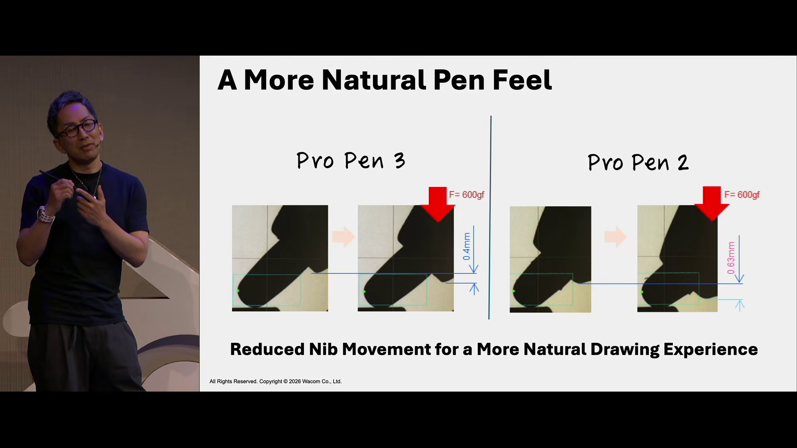

# Wacom Pro Pen 3 (ACP-500) vs Wacom Pro Pen 2 (KP-504E)

## Overview

This document summarizes the differences between the ACP-500 and the KP-504E.

For more details:

* [Wacom Pro Pen 3 (ACP-500) notes](wacom-acp500-notes.md)
* [Wacom Pro Pen 2 (KP-504E) notes](wacom-kp504e-notes.md)

## Summary

The Pro Pen 3 has similar drawing performance to the Pro Pen 2, with one notable difference. The ACP-500 seems to have a slightly higher IAF than the Pro Pen 2.

Overall, opinions seem to be very polarized. Some people strongly prefer the ACP-500, while many continue to feel that the KP-504E is clearly superior.

## Key differences

### Modularity

WINNER: ACP-500

The ACP-500 offers customizable weight, shape, and grips. The KP-504E has a single weight, shape, and grip.

### Ergonomics

WINNER: UNCLEAR

Personally I like the KP-504E in terms of how it feels in the hand. Others strongly prefer the ACP-500.

### Pressure Levels

WINNER: TIED

Both support 8,192 pressure levels.

### IAF

WINNER: KP-504E

In my measurements their median IAF is essentially equivalent but the ACP-500 has more consistency across units.

<figure><figcaption></figcaption></figure>

### MAX Physical Pressure

WINNER: KP-504E

Both the ACP-500 and KP-504E have maximum pressures in the excellent range. However, the KP-504E has an even higher maximum pressure on average.

<figure><figcaption></figcaption></figure>

### Number of buttons

WINNER: ACP-500

* The ACP-500 has 3 buttons.
* The KP-504E has 2 buttons.

### Eraser

WINNER: KP-504E

* The ACP-500 does not have an eraser.
* The KP-504E has an eraser.

### Nib travel

The nib of the ACP-500 retracts about 0.4mm into the pen body. This is less than the Pro Pen 2 which has a nib that retracts 0.63mm. The reduced distance is claimed to improve the feeling of the pen on the tablet - and I definitely agree with that - though admittedly the difference is subtle.

<figure><figcaption>
Wacom CEO Nobu Ide atg BCON26 talking about the nib travel of the Pro Pen 2 and Pro Pen 3
</figcaption></figure>

