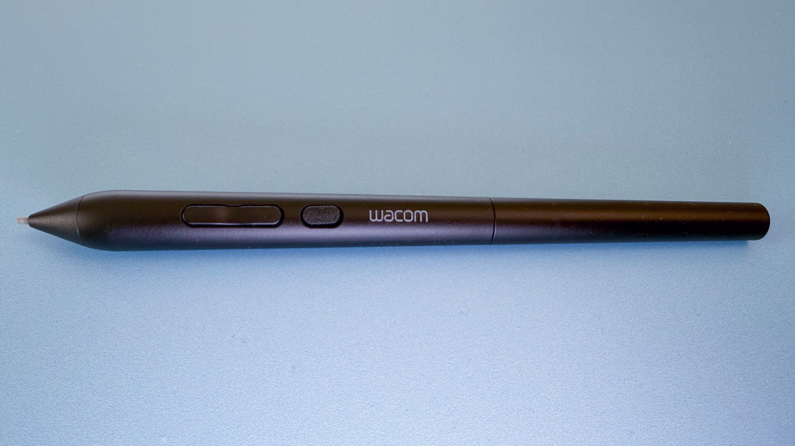
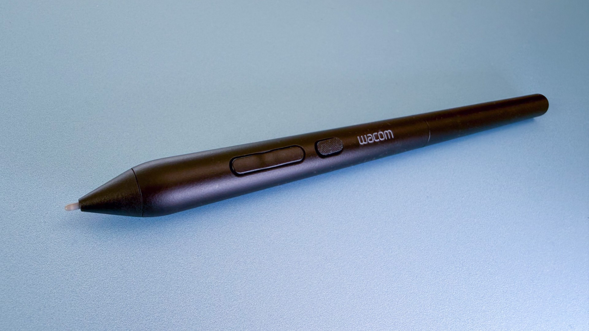
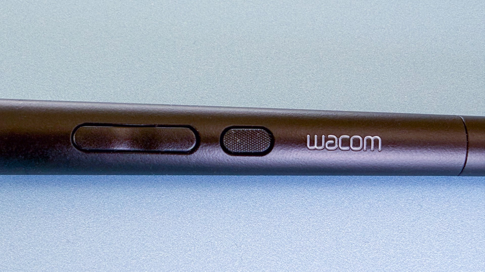
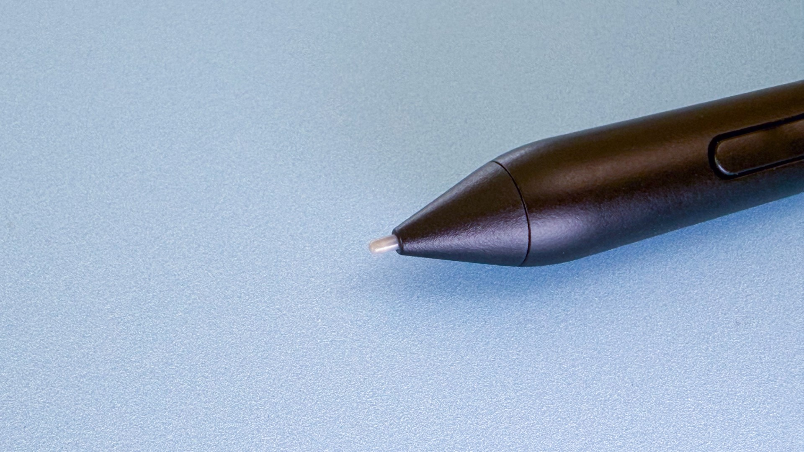
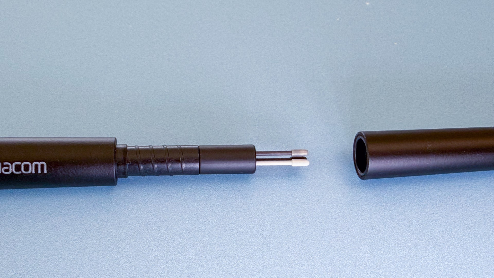
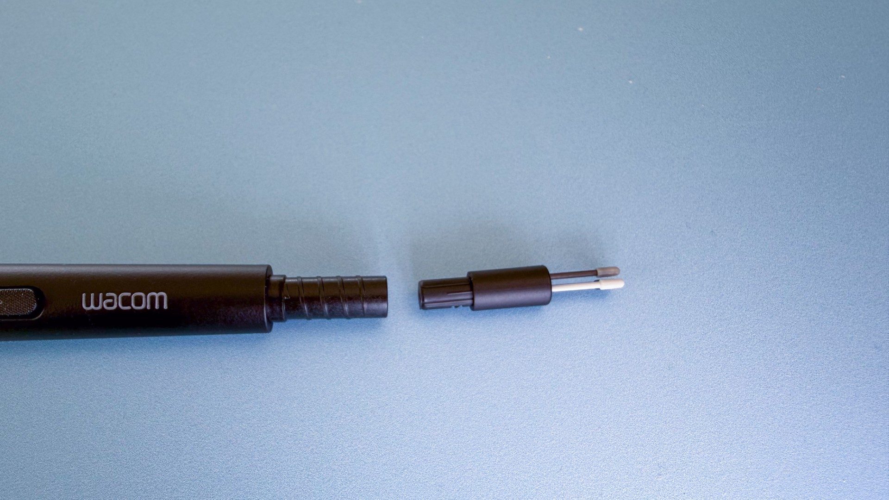
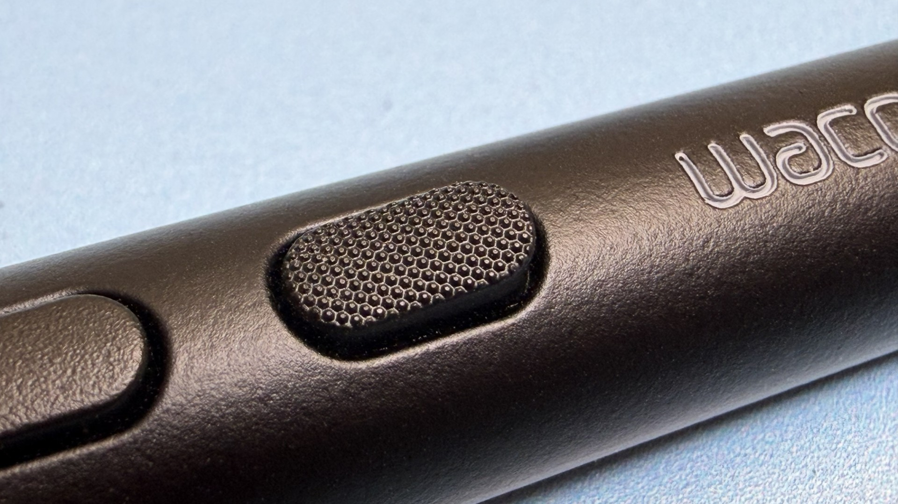
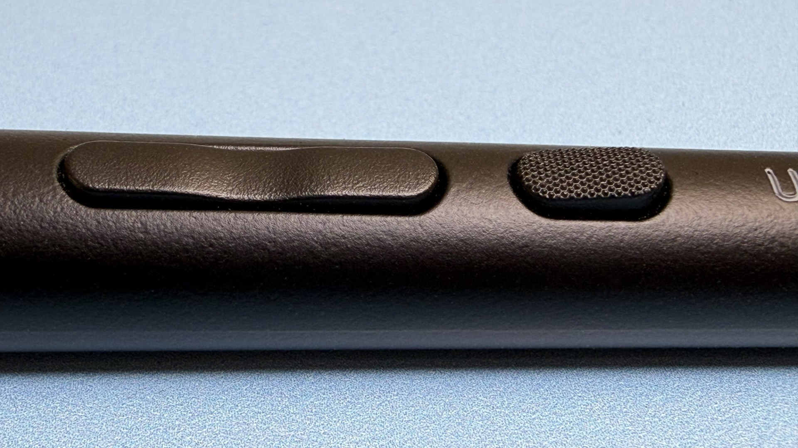
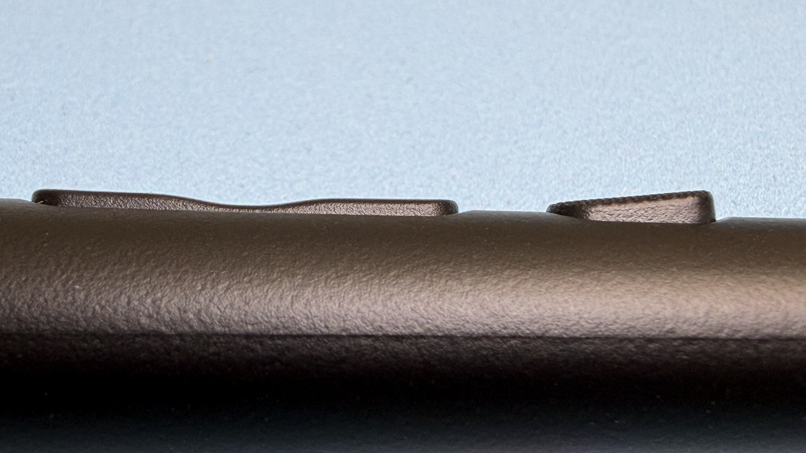

# Wacom Art Pen 2 (ACP-700) notes

## Overview

Released in May 2025, the Art Pen 2 (ACP-700) is the successor to the much-beloved Art Pen (KP-701E).

This is an EXCELLENT pen. I love how it feels and how it draws. It's even less expensive than the Pro Pen 3. I feel this is the true successor to the Pro Pen 2 (KP-504E). Be aware that only a few tablets support this pen. Some that do support it require a firmware update.

For a comparision to the old pen, see: [Wacom Art Pen 2 (ACP-500) vs Art Pen 1 (KP-701)](wacom-acp500-vd-kp701e.md)

## Driver version

Older versions of the driver do not recognize the pen.

The exact driver I used for testing was: 6.4.13-4

## Tablet firmware

For some of the compatible tablets, a firmware update will be needed. See: [Wacom firmware updates](../../drawtabs/wacom/wacom-firmware-updates.md)

The exact firmware installed at the time of testing is shown below:

<figure><figcaption></figcaption></figure>

## Links

* [Aaron Rutten - Wacom Art Pen 2 Review](https://www.youtube.com/watch?v=flw33WHaqJ8) 2026-07-18
* [Brad Colbow - Wacom Art Pen 2 Review](https://www.youtube.com/watch?v=gVBSL0GotZM) 2026-06-15
* [Teoh on Tech - Wacom Art Pen 2 (first impression)](https://www.youtube.com/watch?v=atE9QHINugE) 2026-06-14
* [JEEJON - Wacom Movink 13 review in 2026 with Art Pen 2](https://www.youtube.com/watch?v=LDgyKnX_Vao) 2026-05-22

## Specs

* Pressure levels: 8192
* IAF - Wacom does not specify
* MAX physical pressure - Wacom does not specify
* Buttons - 3
* Pressure Sensitive - YES
* Tilt - YES
* Barrel Rotation - YES
* Eraser - NO

## Tablet compatibility

* Compatibility list at time of product launch (May 2026)
  * Intuos Pro small (PTK470)
  * Intuos Pro medium (PTK670)
  * Intuos Pro large (PTK870)
  * MovinkPad Pro 14 (DTHA140)
  * Cintiq 16 2025 (DTK168)
  * Cintiq 24 (DTK246)
  * Cintiq 24 touch (DTH246)
* Tablets Wacom identified for future compatibility in 2026
  * Cintiq Pro 27
  * Cintiq Pro 22
  * Cintiq Pro 17
* Compatibility notes
  * Compatible Intuos Pro tablets needed a firmware update at the time of launch. I don't recall the Cintiq 16 2025 needing a firmware update.
  * I could not successfully get barrel rotation working with the MovinkPad Pro 14.

## Branding

Unlike most Wacom Pro Pens, the Wacom logotype is printed on the pen.

## Shape

Unlike the slim body of the Pro Pen 2, the ACP-700 has a more standard body that is wider near the tip and gets thinner toward the end.

## Screw top

* Top screws off just like Pro Pen 3
* Top is much less prone to loosening over time as you draw. Many people complained about that with the Pro Pen 3.

## Nib holder and storage

* Nib storage under the cap can hold 3 nibs
* The nib holder itself can be removed from the pen

## Pressure > IAF

My measurements are very simmilar to what I found with the Pro Pen 3

| Statistic | IAF (gf) |
| --------- | -------- |
| Min       | 2.9      |
| Median    | 3.3      |
| Max       | 3.5      |

| Pen             | Inventory ID | IAF (gf) | Source    |
| --------------- | ------------ | -------- | --------- |
| Wacom Art Pen 2 | WAP.0076     | 2.9      | estimated |
| Wacom Art Pen 2 | WAP.0077     | 3.3      | estimated |
| Wacom Art Pen 2 | WAP.0075     | 3.5      | estimated |

## Pressure > Maximum pressure

| Statistic | Pmax (gf) |
| --------- | --------- |
| Min       | 554.3     |
| Median    | 572.3     |
| Max       | 602.8     |

| Inventory ID | Driver | Highest measured (gf) | Pmax estimate (gf) |
| ------------ | ------ | --------------------- | ------------------ |
| WAP.0075     | WACOM  | 561.4                 | 554.3              |
| WAP.0076     | WACOM  | 612.0                 | 602.8              |
| WAP.0077     | WACOM  | 577.6                 | 572.3              |

## Buttons

* The first two buttons are connected as a rocker switch
* The third, higher button is separate, sticks out at an angle, and has a clearly different and noticeable texture.
* I prefer these buttons to the ones on the Pro Pen 2 because I seem to be able to detect them by feel more easily and do not accidentally click them.

## Nibs

* This pen uses different nibs than the Pro Pen 3 (ACP-500)
* Default nib installed: Art Pen 2 Carbon Shaft POM Nib
* Pen comes with 3 spare nibs in the nib storage
  * 1x Art Pen 2 Carbon Shaft POM Nib
  * 1x Art Pen 2 POM Nib
  * 1x Art Pen 2 Felt Nib

## Grips

The Pro Pen 3 comes with two accessory grips. The shape of the Art Pen 2 makes it impossible to use those Pro Pen 3 grips.

Currently, there are no Wacom-made grips for the Art Pen 2.

## Texture

Many people find that the ACP-500 feels a bit smooth and slippery in their hand. The ACP-700 has a softer plastic feel and seems more secure in the hand.

## Barrel rotation

* Worked great.
* Some people feel this pen has more barrel rotation lag than the KP-701E but I did not find that to be the case in my testing. They performed exactly the same.
* Keep these things in mind:
  * Not all tablets support barrel rotation
  * Not all apps support barrel rotation
  * Even if an app supports barrel rotation, you will normally have to specifically configure barrel rotation on a brush for it to have an effect. Different apps have different ways in which this configuration is done.
  * There are only 360 barrel rotation angles. This is normal for Wacom pens that support barrel rotation.

## IAF

The IAF is about 3.3gf in my testing - matching what tablet expert Kuuube found as well.

| Pen Model ID | Inventory ID | Date       | Tablet                           | Driver           | IAF (gf) | Source   | Defect |
| ------------ | ------------ | ---------- | -------------------------------- | ---------------- | -------- | -------- | ------ |
| ACP-700      | WAP.0075     | 2026-06-21 | Intuos Pro 2025 Medium (PTK-670) | OPENTABLETDRIVER | 3.3      | measured |        |
| ACP-700      | WAP.0076     | 2026-06-21 | Intuos Pro 2025 Medium (PTK-670) | OPENTABLETDRIVER | 3.2      | measured |        |
| ACP-700      | WAP.0077     | 2026-06-21 | Intuos Pro 2025 Medium (PTK-670) | OPENTABLETDRIVER | 3.3      | measured |        |

## Max Pressure

Wirth thee units the median max pressure I found was \~570gf.

| Pen Model ID | Inventory ID | Date       | Tablet                          | Driver | MAX (gf) | Source    | Defect |
| ------------ | ------------ | ---------- | ------------------------------- | ------ | -------- | --------- | ------ |
| ACP-700      | WAP.0075     | 2026-05-23 | Intuos Pro 2025 Large (PTK-870) | WACOM  | 554.3    | estimated |        |
| ACP-700      | WAP.0076     | 2026-05-23 | Intuos Pro 2025 Large (PTK-870) | WACOM  | 602.8    | estimated |        |
| ACP-700      | WAP.0077     | 2026-05-23 | Intuos Pro 2025 Large (PTK-870) | WACOM  | 572.3    | estimated |        |

## Photos

<figure><figcaption></figcaption></figure>

<figure><figcaption></figcaption></figure>

<figure><figcaption></figcaption></figure>

<figure><figcaption></figcaption></figure>

<figure><figcaption></figcaption></figure>

<figure><figcaption></figcaption></figure>

<figure><figcaption></figcaption></figure>

<figure><figcaption></figcaption></figure>

<figure><figcaption></figcaption></figure>
