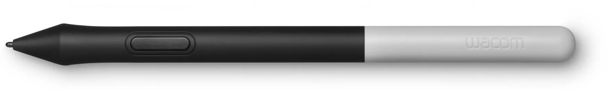
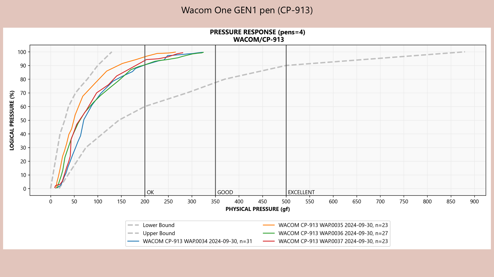

# Wacom One Pen (CP-913) notes

## Overview

The Wacom One Pen (CP-913) was released in 2019 and came with the Wacom One 2019 GEN1 (DTC-133), which was one of Wacom's consumer pen displays.

<figure><figcaption></figcaption></figure>

This is a very "consumer" pen, and it has **OK pressure performance**.

## Pressure > Initial Activation Force

The IAF you experience with the CP-913 depends on which device you use it with:

With a Wacom device, this pen has relatively high IAF for a Wacom pen. It requires more force to register a stroke.

With a Samsung Galaxy Tab S device, the IAF is GOOD and comparable to many other pens, but not as good as a Wacom Pro Pen.

| PEN                                                   | IAF   | NOTES     |
| ----------------------------------------------------- | ----- | --------- |
| Wacom Pro Pen 2                                       | <1gf  | EXCELLENT |
| Apple Pencil GEN2                                     | <1gf  | EXCELLENT |
| Typical non-Wacom EMR pen                             | 3gf   | GOOD      |
| CP-913 (when used with a Wacom tablet)                | \~5gf | OK        |
| CP-913 (when used with a Samsung Galaxy Tab S device) | \~3gf | GOOD      |

## Pressure > Maximum Pressure

I measured 4 CP-913 units. Their maximum pressures varied between 250gf and 350gf. This puts them in the OK range.

## Pressure response

<figure><figcaption></figcaption></figure>

## Buttons

This pen has only a single button.

## CP-913 versus Wacom's professional pens

This pen has OK performance, but it is not as good as Wacom's Pro Pens such as the Wacom Pro Pen 2 (KP-504E).

Two things separate this pen from Wacom's Pro Pens:

* IAF
* Buttons

## Wacom CP-923 pen

This successor pen, CP-923, is awful. See my notes: [Wacom One 2023 Standard Pen (CP-923) notes](wacom-cp923-notes.md).

## Tablet Compatibility

The CP-913 can be used with several Wacom and non-Wacom tablets:

* Wacom One (DTC133W0A)
* Wacom One 12 (DTC121W)
* Wacom One 13 touch (DTH134W)
* Wacom One S (CTC4110WL)
* Wacom One M (CTC6110WL)
* Samsung Galaxy Tab S series
