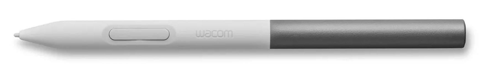
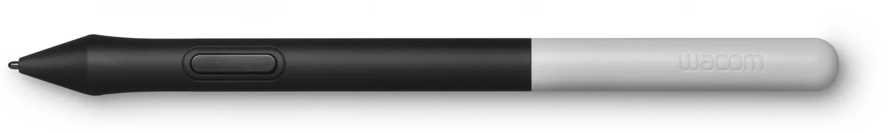
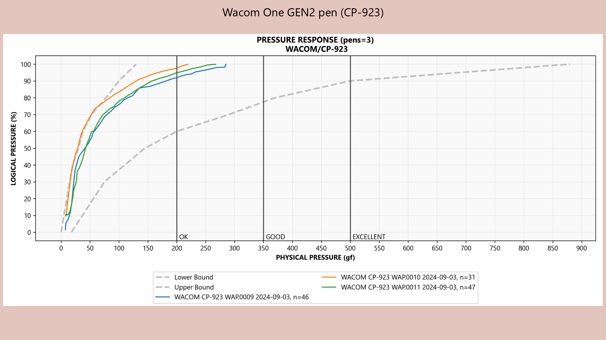

# Wacom One 2023 Standard Pen (CP-923) notes

## Overview

Wacom introduced this pen in 2023.

My overall verdict on both Wacom One pens - this one and the older Wacom One Pen (CP-913) - is that they are OK-ish. I don't typically recommend them for artists, but for non-creative use they may be fine.

Comparing the two:

* **Initial activation force (IAF)** - both pens have a high median IAF, around 9 to 10 gf. The CP-913 varies more from unit to unit: across the units I measured it ranged from about 5.5 to 12.7 gf, while the CP-923 ranged from about 8 to 9.6 gf. So some CP-913 units are much lower than the CP-923, but some are much higher.
* **Maximum pressure** - the CP-913 is clearly better. Across the units I measured, the CP-913 reached about 330 to 360 gf and the CP-923 about 200 to 310 gf.
* Many people I talk to slightly prefer the CP-913.
* In its favor, the CP-923 adds tilt and a second button.

<figure><figcaption></figcaption></figure>

Officially the name of the CP-923 pen is "Wacom One Standard Pen" but that name is confusing so I will call it one of the following names:

* Wacom One Pen GEN2 pen
* Wacom One 2023 pen
* CP-923 pen

### The Old Wacom One Pen (CP-913)

Below is the old Wacom One Pen (CP-913). It only has one button and no tilt, but it has a higher maximum pressure. More here: [Wacom One Pen (CP-913) notes](wacom-cp913-notes.md)

<figure><figcaption></figcaption></figure>

### **Pen support**

* All the Wacom One (Gen 2) tablets are compatible with the new Wacom One Pen (Gen 2).
* This is good. It eliminates a huge source of confusion around pen compatibility.

### **Pen evolution**

* One by Wacom (CTL-472, CTL-672) -> Wacom Pen 2K (LP-190K)
* Intuos (CTL-4100\*, CTL-6100\*) -> Wacom Pen 4K (LP-1100K)
* Wacom One Pen (Gen 1) -> CP91300B2Z
* Wacom One Pen (Gen 2) -> CP92303B2Z

### **Pressure levels**

This pen supports 4096 levels of pressure. Same as the CP-913 pen. As a reminder, all you really need are 2048 pressure levels and it is the pressure range that is more important.

### **Number of pen buttons**

* CP-923 -> 2 buttons
* CP-913 -> 1 button

### **Tilt**

* CP-923 -> supports tilt
* CP-913 -> does not support tilt

## Compatibility

### Backwards compatibility

Wacom lists these tablets as compatible with the CP-923

* Wacom One 12 (DTC-121)
* Wacom One 13 touch (DTH-134)
* Wacom One S (CTC-4110WL)
* Wacom One M (CTC-6110WL)
* Wacom One 2019 (DTC-133)

## Note on backwards compatibility with the DTC-133

I tested three units of the CP-923, and it works with the DTC-133.

* Note: the CP-923 pen has two buttons, however the Wacom Driver only lets you use 1 button with the DTC-133.

### Forwards compatibility

* The old pen (CP-913) does work with new Wacom One 2023 GEN2 tablets.

### Samsung Galaxy S compatibility

* I confirmed both pens (CP-913, CP-923) work with the Samsung Galaxy S8 Ultra.
* I confirmed that the Samsung S Pen works with both the Wacom One 2019 GEN1 tablet and the Wacom One 2023 GEN2 tablets

### Low pressure

* In my early testing, the CP-923 pen had issues with low pressure. See this video: [https://youtu.be/415ngQOHiME](https://youtu.be/415ngQOHiME)
* My later IAF measurements across more units are more mixed - see the comparison at the top of this page.

## Pressure response

<figure><figcaption></figcaption></figure>

## Max Pressure

<table><thead><tr><th width="124">BRAND</th><th width="121">PEN</th><th width="110">INVENTORY</th><th width="123">PHYSICAL</th><th width="120">LOGICAL</th></tr></thead><tbody><tr><td>WACOM</td><td>CP-923</td><td>WA0009</td><td>285.1gf</td><td>99.90%</td></tr><tr><td>WACOM</td><td>CP-923</td><td>WA0010</td><td>219.4gf</td><td>99.90%</td></tr><tr><td>WACOM</td><td>CP-923</td><td>WA0011</td><td>267.4gf</td><td>99.90%</td></tr></tbody></table>
