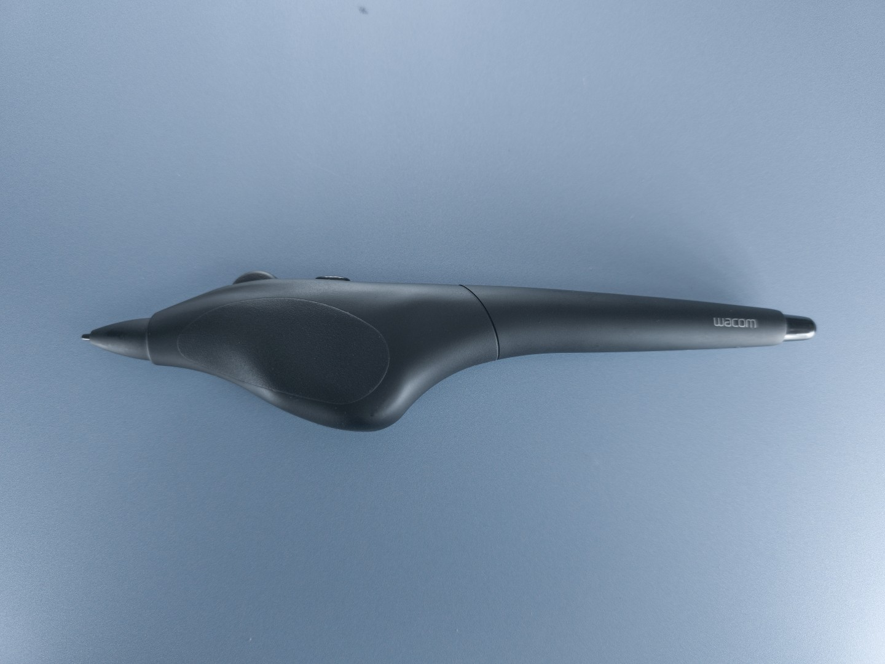
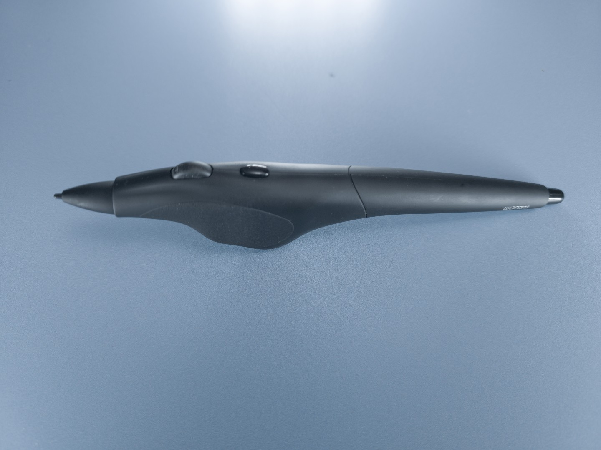
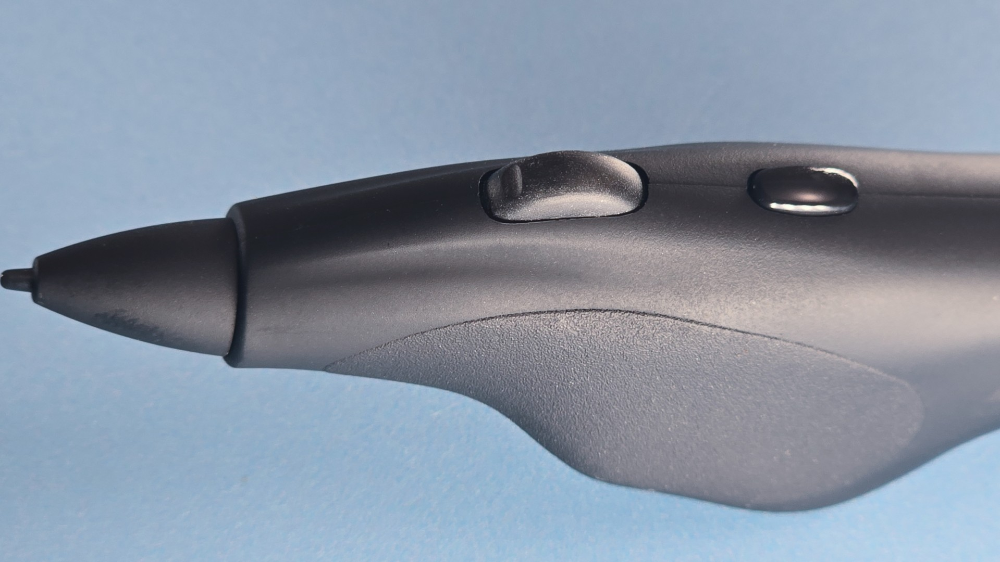
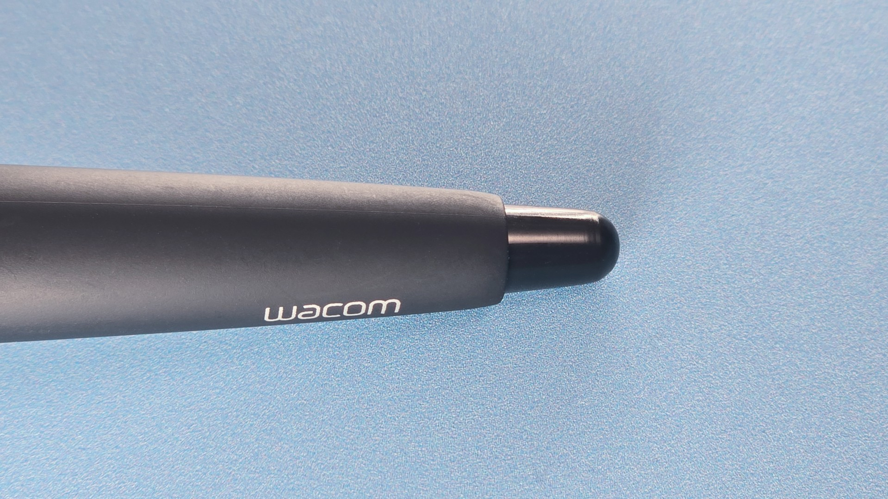

# Wacom Intuos4 Airbrush pen (KP-400E)

## Inputs

* 1 wheel
* 1 Button
* Eraser

## Wheel

* Rotation range: it does not spin freely. It seems to rotate only around 60 degrees.
* Detents: none
* Clickable: no
* Value range: 0 to 1024

## Photos

<figure><figcaption></figcaption></figure>

<figure><figcaption></figcaption></figure>

<figure><figcaption></figcaption></figure>

<figure><figcaption></figcaption></figure>

