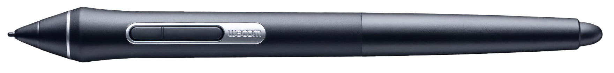

# Wacom Pro Pen 2 (KP-504E) notes

## Overview

The Wacom Pro Pen 2 is an INCREDIBLE pen. Despite the existence of the Pro Pen 3, I think the Pro Pen 2 is better. This is the standard against which I judge all other pens.

<figure><figcaption></figcaption></figure>

## Cost

Take care of your Pro Pen 2. A replacement typically costs $90 US.

## Pressure > Levels

* It supports 8192 levels of pressure

## Pressure > Initial Activation Force

* Like many other Wacom pro pens it has an very low IAF of <1gf as measured my Kuuube.
* IN my own measurements I have been unable to find IAF values of <1gf. My data is summarized below.

| Statistic | IAF (gf) |
| --------- | -------- |
| Min       | 2.5      |
| Median    | 3.3      |
| Max       | 4.0      |

Here are my readings for individual units

| Pen             | Inventory ID | IAF (gf) |
| --------------- | ------------ | -------- |
| Wacom Pro Pen 2 | WAP.0024     | 2.5      |
| Wacom Pro Pen 2 | WAP.0038     | 3.3      |
| Wacom Pro Pen 2 | WAP.0005     | 3.3      |
| Wacom Pro Pen 2 | WAP.0050     | 3.3      |
| Wacom Pro Pen 2 | WAP.0002     | 3.3      |
| Wacom Pro Pen 2 | WAP.0004     | 3.5      |
| Wacom Pro Pen 2 | WAP.0001     | 3.7      |
| Wacom Pro Pen 2 | WAP.0003     | 3.8      |
| Wacom Pro Pen 2 | WAP.0047     | 4.0      |

## Pressure Range > Maximum Pressure

The pressure response is remarkably consistent across multiple units tested. The maximum pressure ranges from about 700gf to 800 gf.

| Statistic | Pmax (gf) |
| --------- | --------- |
| Min       | 674.5     |
| Median    | 722.6     |
| Max       | 882.8     |

| Inventory ID | Pmax estimate (gf) |
| ------------ | ------------------ |
| WAP.0001     | 761.0              |
| WAP.0001     | 708.0              |
| WAP.0002     | 882.8              |
| WAP.0003     | 711.0              |
| WAP.0003     | 728.8              |
| WAP.0005     | 710.0              |
| WAP.0005     | 674.5              |
| WAP.0024     | 698.8              |
| WAP.0038     | 722.6              |
| WAP.0038     | 691.0              |
| WAP.0047     | 785.1              |
| WAP.0050     | 838.5              |
| WAP.0047     | 794.0              |

## Features

* Two buttons
* Eraser
