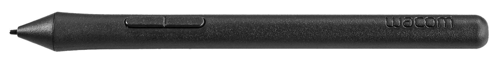
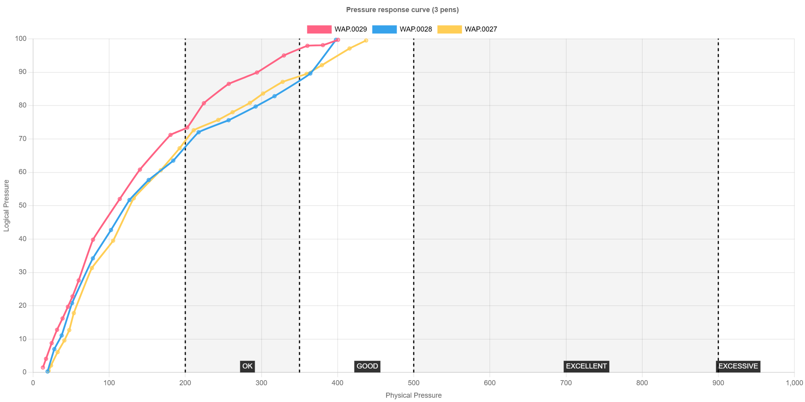

# Wacom 2K Pen (LP-190K)

## Summary

Very good pen. Although Wacom uses this pen for a consumer tablet, it has great drawing performance. In particular, it offers a good wide pressure range with low IAF.

This pen comes with the One by Wacom (CTL-x72) series of tablets. [One by Wacom (CTL-x72) notes](../../drawtabs/wacom/one-by-wacom/wacom-ctlx72-notes.md).

## Basics

* Low IAF + good max pressure
* Two buttons
* No eraser

<figure><figcaption></figcaption></figure>

## Initial Activation Force

* Tablet expert Kuuube measures the IAF of this pen to be under <1gf - which is excellent.
* Others have told me that, in practice, this pen has low IAF, but one that feels more normal at around 3gf.
* I am not very good at measuring IAF with my equipment, but I think the subjective IAF is good. To me, it does not quite match the Pro Pen 2.
* Keep in mind that even pens of the same model vary a little in IAF from unit to unit.

## Pressure response

Max pressure is good (>350gf) across the three units of this pen that I tested.

All three are very consistent in their pressure response.

**Ignore IAF** in chart below - my testing was not designed for accurate IAF measurements.

<figure><figcaption></figcaption></figure>

## **Feeling**

The One by Wacom pen feels a little more plasticky and less premium in the hand than Wacom's professional pens. That is not a big deal for a beginner.
