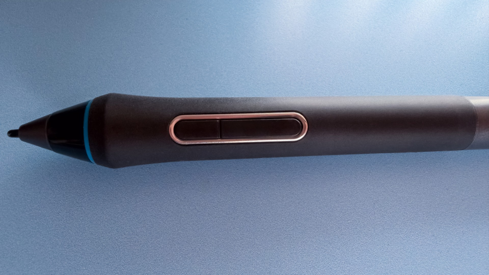
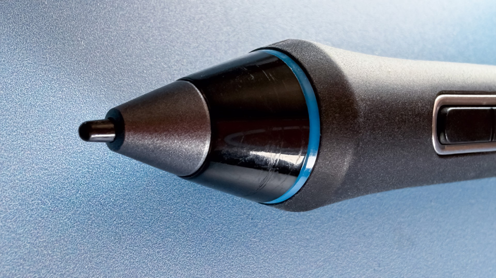
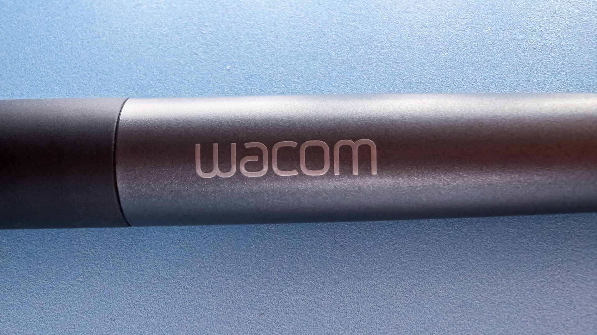
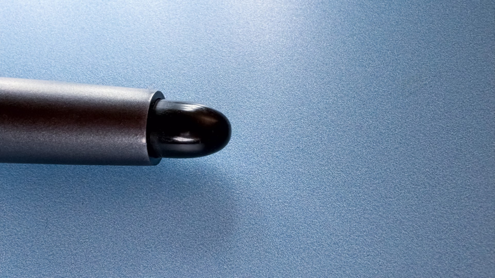
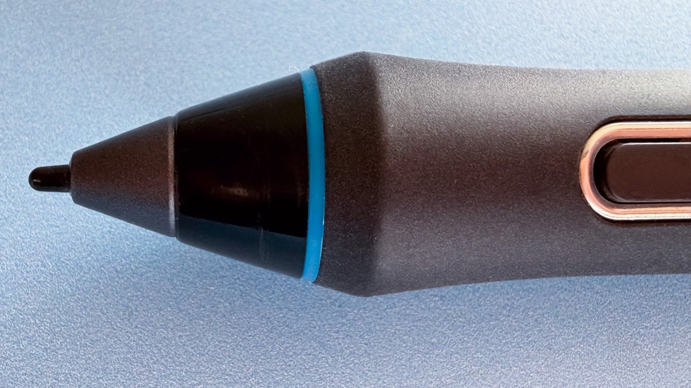
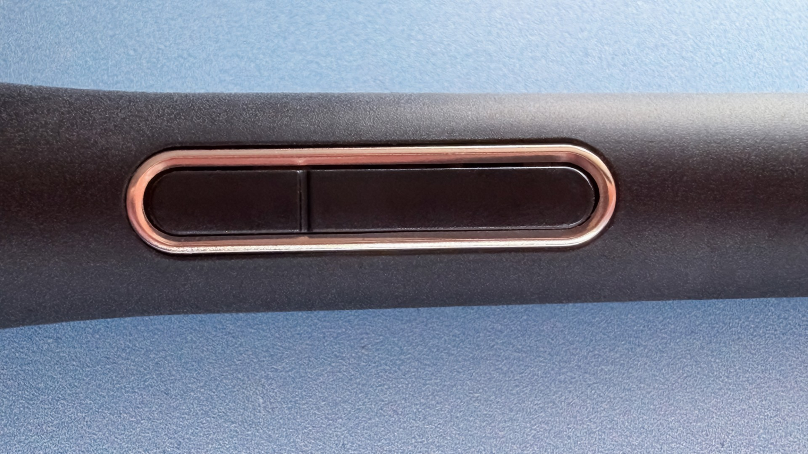

# Wacom Pro Pen 1 (KP-503E)

## Overview

The KP-503E was the first with the name "Pro Pen" in Wacom's KP series.

* Pressure levels: 2048
* Tilt: YES
* Barrel rotation: NO
* Buttons: 2

## IAF

Btewen 1.5 to 2.5 gf based on the two units I tested.

| Inventory ID | Date       | Tablet                                 | Driver | IAF (gf) |
| ------------ | ---------- | -------------------------------------- | ------ | -------- |
| WAP.0041     | 2026-06-16 | Wacom Intuos Pro 2017 Medium (PTH-660) | WACOM  | 2.5      |
| WAP.0042     | 2026-06-16 | Wacom Intuos Pro 2017 Medium (PTH-660) | WACOM  | 1.5      |

## Max pressure

Not tested yet

## Photos

<figure><figcaption></figcaption></figure>

<figure><figcaption></figcaption></figure>

<figure><figcaption></figcaption></figure>

<figure><figcaption></figcaption></figure>

<figure><figcaption></figcaption></figure>

<figure><figcaption></figcaption></figure>

