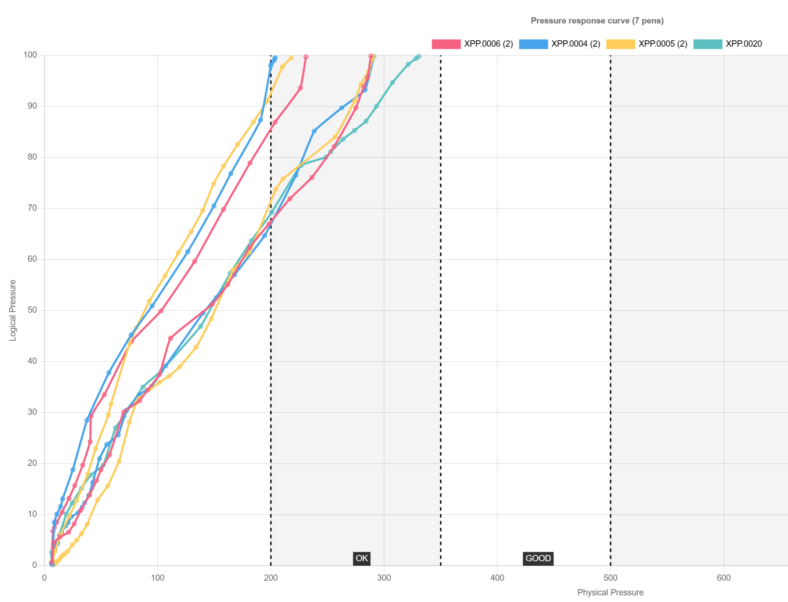
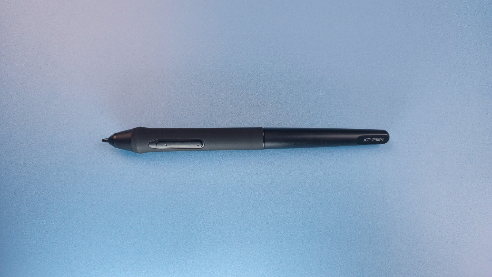

# XP-Pen P05 pen notes

## Overview

The pen is from an older generation of pen technology, with a higher IAF than modern EMR pens. If a tablet comes with this pen, you might be okay with it. In general, I would recommend a different tablet with a different pen.

## Pen tech

EMR

## Buttons

2

## Eraser

NO

## Included with these tablets (partial list)

* XP-Pen Deco 01 V2
* XP-Pen Deco 01 V3

## IAF

After testing 5 pens, I found the IAF to be high, varying from 6 gf to 8 gf.

It is not as good as newer pens such as the XP-Pen X3 Pro series.

## Max Pressure

I found the max pressure to be okay.

* Typical: 280 gf
* Range: 200 gf to 300 gf

## Pressure response

<figure><figcaption></figcaption></figure>

## Photos

<figure><figcaption></figcaption></figure>

<figure><figcaption></figcaption></figure>

<figure><figcaption></figcaption></figure>
