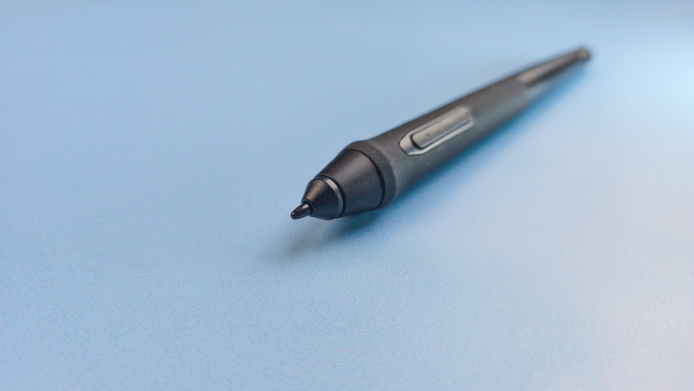

# XP-Pen P05 pen notes

## Overview

The pen is from an slightly older generation of pen technology, with a bit higher IAF than modern consumer EMR pens. if you need to draw with a really light touch, I would recommend a tablet with a different pen.

## Pen tech

EMR

## Buttons

2

## Eraser

NO

## Included with these tablets (partial list)

* XP-Pen Deco 01 V2
* XP-Pen Deco 01 V3

## IAF

Testing several units with the Deco 01 V3, I found their IAF to be around 7gf with some going as low as 6.0gf and one a bit higher at 9gf.

| Statistic | IAF (gf) |
| --------- | -------- |
| Min       | 6.0      |
| Median    | 7.0      |
| Max       | 9.0      |

| Inventory ID | Date       | Tablet            | Driver           | IAF (gf) | Source   |
| ------------ | ---------- | ----------------- | ---------------- | -------- | -------- |
| XPP.0004     | 2026-06-20 | XP-Pen Deco 01 V3 | OpenTabletDriver | 7.5      | measured |
| XPP.0005     | 2026-06-20 | XP-Pen Deco 01 V3 | OpenTabletDriver | 9.0      | measured |
| XPP.0006     | 2026-06-20 | XP-Pen Deco 01 V3 | OpenTabletDriver | 6.5      | measured |
| XPP.0020     | 2026-06-20 | XP-Pen Deco 01 V3 | OpenTabletDriver | 6.0      | measured |

## Max Pressure

I found the max pressure to be okay.

* Typical: 260gf
* Range: 250 gf to 340 gf

## Photos

<figure><figcaption></figcaption></figure>

<figure><figcaption></figcaption></figure>

<figure><figcaption></figcaption></figure>
