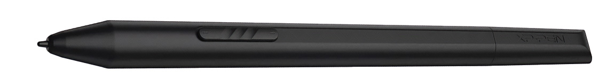

# XP-Pen X3 Elite pen notes

## Overview

Pretty good - surprisingly good for a consumer level tablet. IAF could be a little better but not a big problem for me.

<figure><figcaption></figcaption></figure>

## Buttons

Two buttons on pen. It looks like one button - but it is a rocker switch so acts like two buttons.

## Eraser

No eraser.

## IAF

Subjectively it is definitely higher IAF than a Wacom Pro Pen 2 (not surprising) and a little higher than a Huion PW517 pen. I would estimate around 3gf but maybe a little higher. It feels totally fine to draw with.

## Max Pressure

Clustered around 370gf - which is good

## Pressure response

<figure><figcaption></figcaption></figure>
