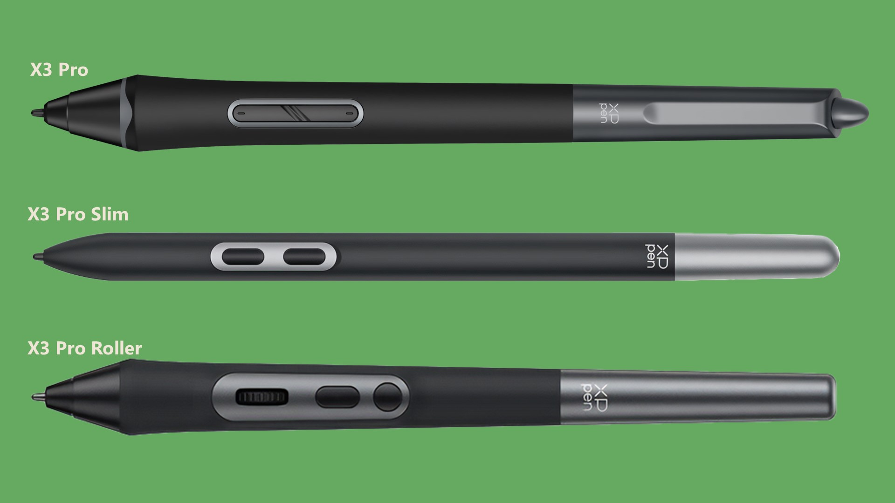
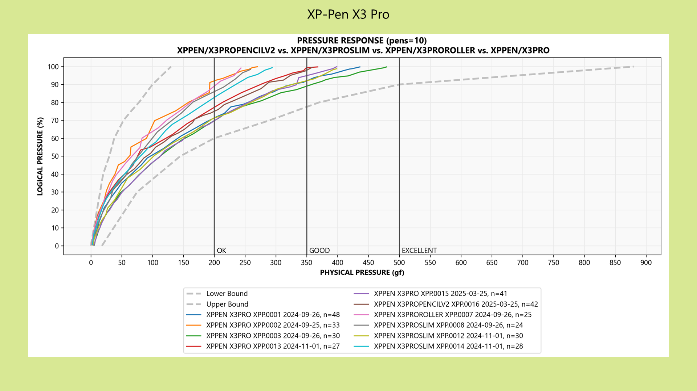
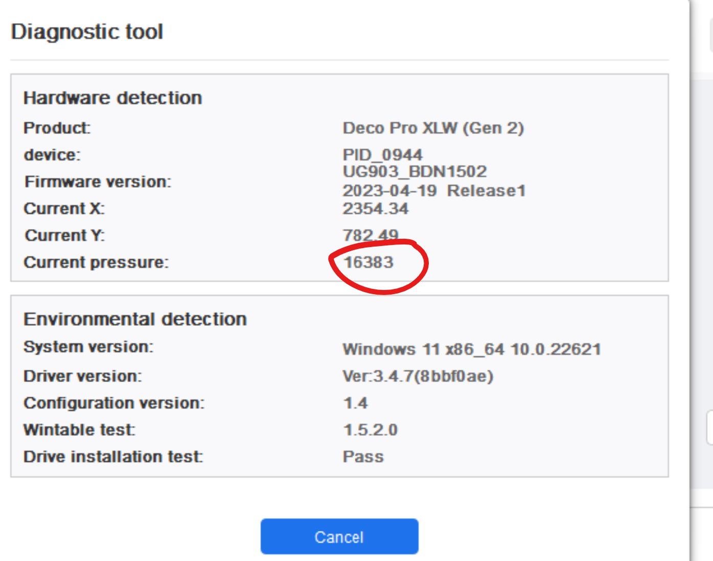

# XP-Pen X3 Pro pens

## O**verview**

The **XP-Pen X3 Pro** series of pens was introduced in 2023 to accompany XP-Pens new pro drawing tablets such Deco Pro GEN2 series and Artist Pro GEN2 series.

## Models

There are three models:

* X3 Pro
* X3 Pro Slim
* X3 Pro Roller

<figure><figcaption></figcaption></figure>

## **Eraser**

Only the X3 Pro has an eraser. the other models do not.

## Roller

The X3 Pro roller has a roller control on it. This could be used for example to control brush size.

However, many people find that they accidentally click it. So it is not unusual that people simply disable the roller.

## Pen pressure > IAF

XP-Pen states it should have an IAF of 3gf. Subjectively that felt accurate.

## Pen pressure > Max Pressure

XP-Pen says the X3 Pro pens should have a max pressure of 400 gf.

<figure><figcaption></figcaption></figure>

My testing shows that individual units can vary from \~250gf to \~450gf.

<figure><figcaption></figcaption></figure>

## **Pen pressure levels**

Specifications say 16K. Ignore this. it is hype. All you need is 2K pressure levels. More important than this is the wide pressure range (from IAF to Max pressure). More here: [Pen pressure](../../../core/pen-pressure/)

This is what it shows in the driver when pressure at full pressure.

## X3 Pro versus other pens

See: [2025 Professional pens compared](../../../recommendations/comparisons/2025-professional-pens-compared.md)
