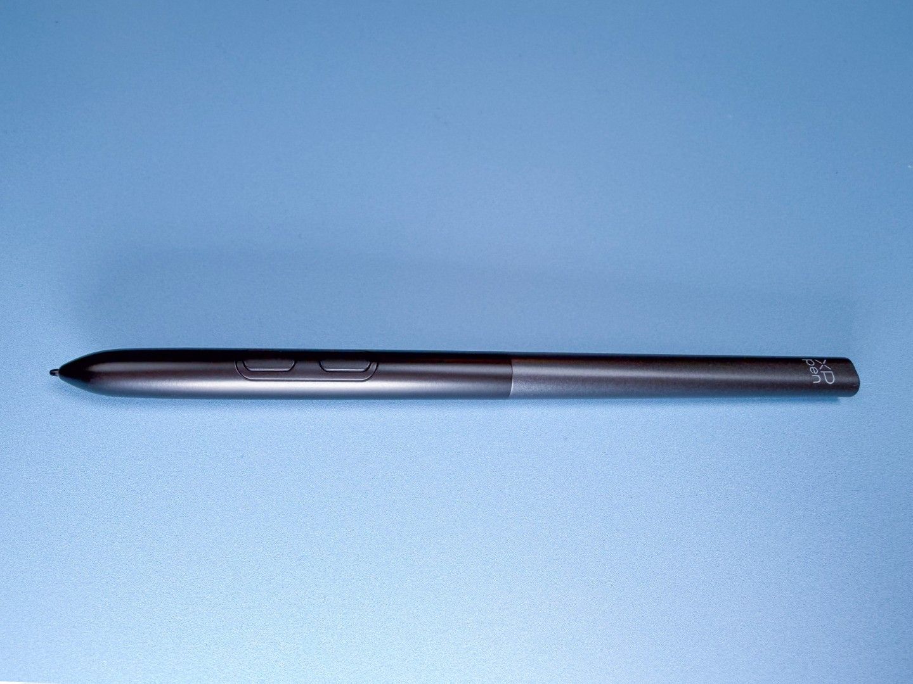
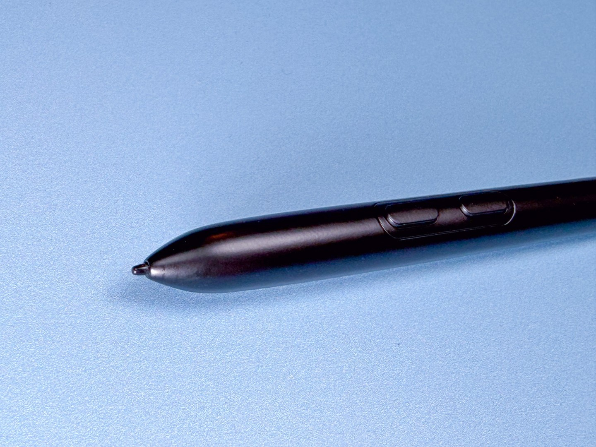
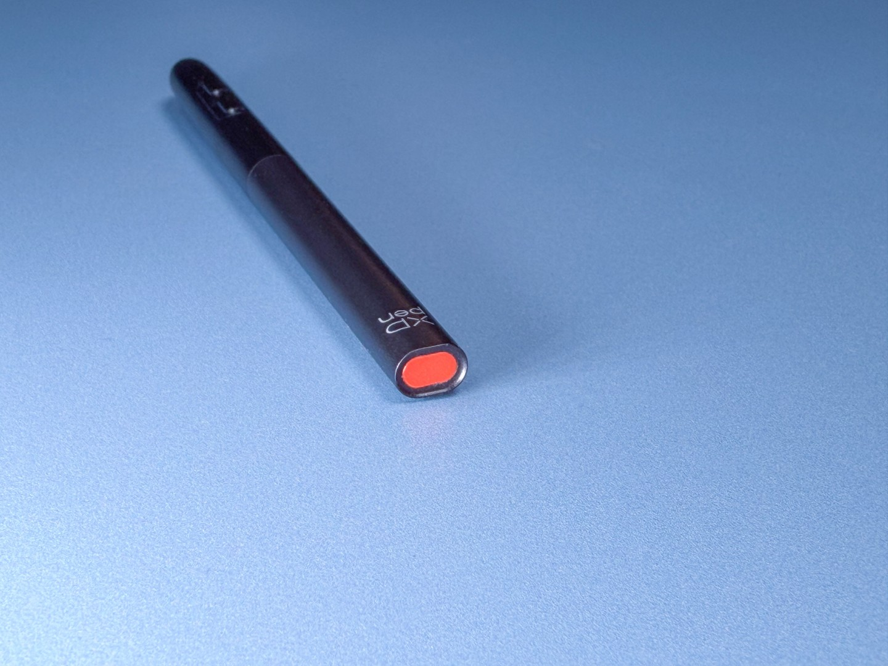

# XP-Pen X4 pen notes

## Overview

The X4 pen series was introduced with the X4 Smart Chip Stylus pen that came with the XP-Pen Artist 12 GEN3 released in 2025.

## Pressure range

XP-pen states:

* IAF: 2gf
* Max pressure: NOT STATED

My measurements:

* I have not measured it yet. When I get 3 of them I will measure.
* But subjectively, I would agree that IAF is close to what XP-Pen states, and the max pressure seemed to be in the GOOD range (>350gf).

## Photos: X4 smart chip stylus

<figure><figcaption></figcaption></figure>

<figure><figcaption></figcaption></figure>

<figure><figcaption></figcaption></figure>
