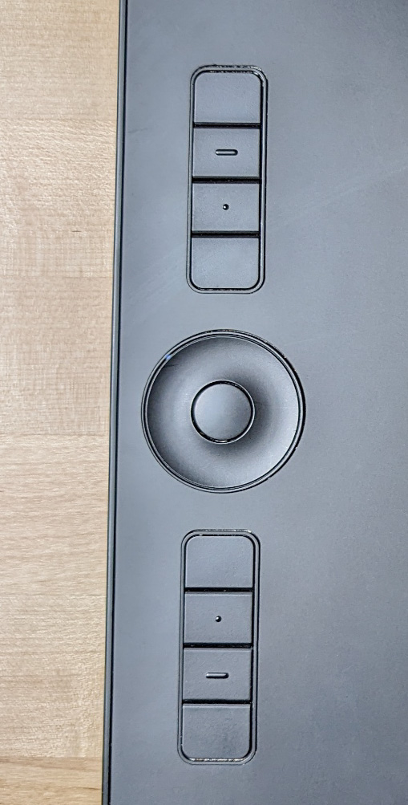
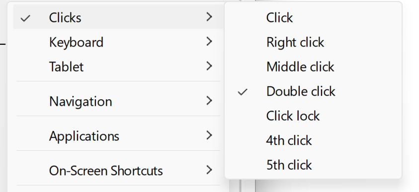
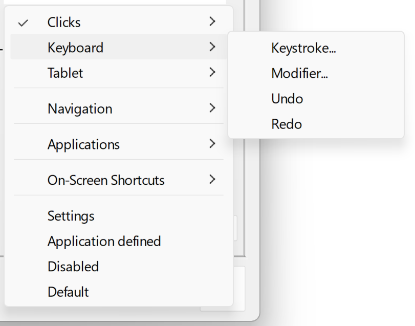
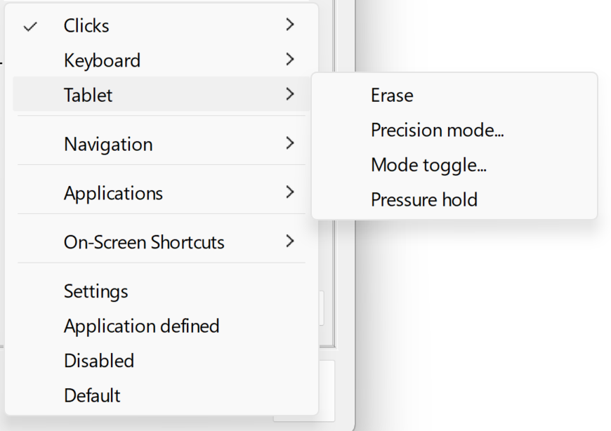
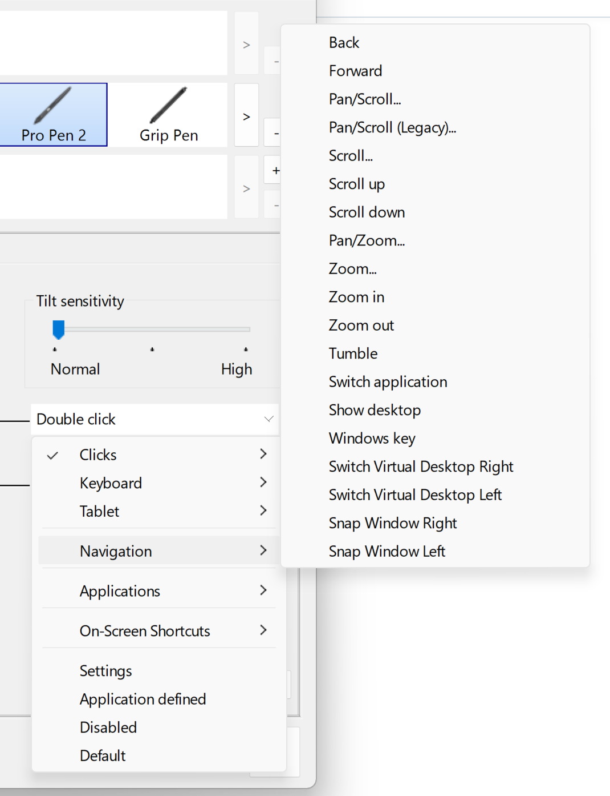
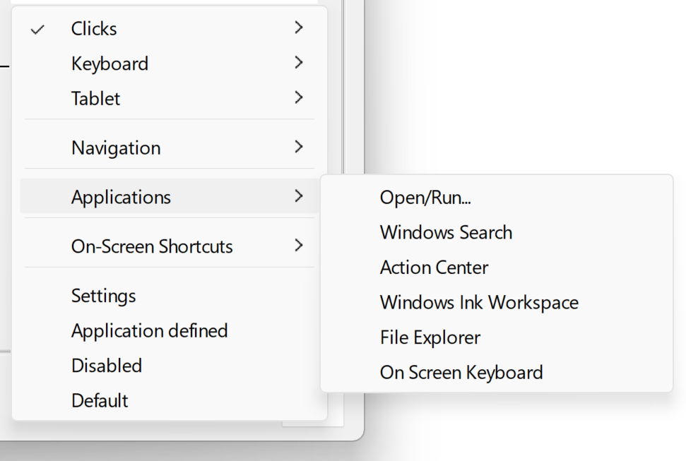
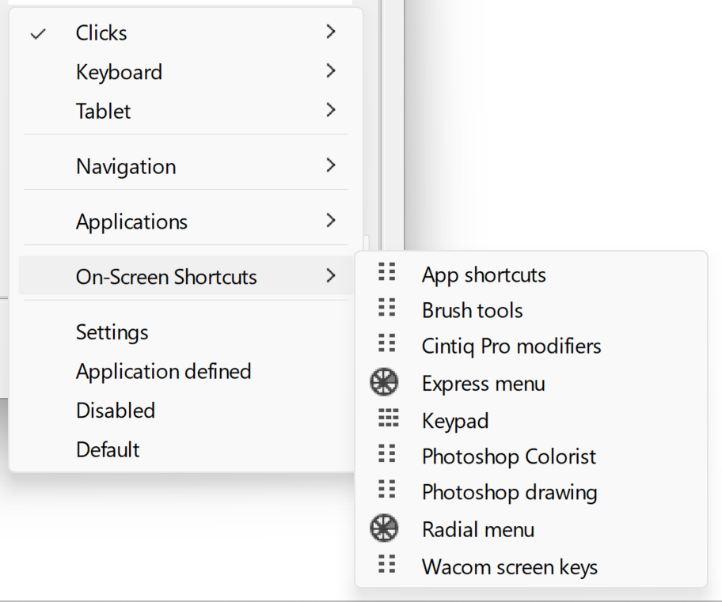

# Auxiliary inputs

## Overview

The primary way you provide input via the tablet is via the pen. However, some drawing tablets have other built-in ways of providing input.

* Buttons (both physical and capacitive)
* Dials
* Touch-sensitive strips and wheels

## Terminology: ExpressKeys

**ExpressKeys** is a Wacom-specific term for buttons on Wacom tablets. However, many people have adopted it as a term to describe use to describe buttons on tablets from all brands.

Huion calls buttons "Press Keys"

## Disabling auxiliary inputs

Some people love using these kind of inputs, but some people do not like them because either they

* take up space on the tablet
* are accidentally triggered
* or their workflow just doesn't benefit from them

For these cases, you should be aware that these inputs can often be configured in the tablet driver to "do nothing".

## Binding inputs to actions

You can bind the buttons to take a variety of actions. Broadly the categories are

* Mouse-related actions - right click, left-click, double click
* System navigation - scroll left, scroll right, zoom in/out, pan, switch applications
* System tasks - run application, open a file
* Keyboard - Press a key, hold down a modifier key

## Common useful bindings

You can make these auxiliary inputs to all sorts of useful things. Here are some popular examples I found: [Popular bindings for auxiliary inputs](popular-bindings.md)

## Global vs application configuration

Tablet drivers also let you configure how these auxiliar inputs work depending on the app you are using.

For example you can set a button to

* Increase brush size when you are using Photoshop
* Increase opacity when you are using Clip Studio Paint
* Increase the volume of your speakers under all other conditions

## Default settings

Wacom Intuos Pro PTH-660

<figure><figcaption>
Default ExpressKeys setting for Wacom Intuos Pro Medium (PTH-660)
</figcaption></figure>

## Examples

### Wacom Intuos Pro Large PTH-860

## Huion Inspiroy Dial2 (Q630M)

.jpg>)

## Example UI from Wacom Tablet Properties App

.png>)

