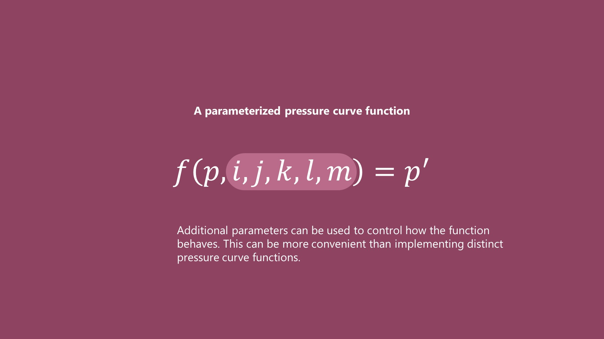

# Pen pressure curve

## Before you  begin

Before you read this section it would be good for you to read: pen pressure response. This document won't make a lot of sense without you understanding clearly what a pen pressure response is.

## Overview

A pressure curve is essentially a little bit of math that transforms a pressure response to another pressure response. In more everyday terms a pressure curve creates a new pressure behavior for the pen. 

## Pressure curve vs pressure response

It is important to distinguish the pressure curve from the pressure response because they describe different things completely. 

A pressure response describes the pressure behavior of a pen - and this is a description of physically happens in the world. It relates physical pen pressure to logical pen pressure.

A pressure curve is an abstract mathematical entity that transforms logical pressure values. A pressure curve is completely arbitrary and does not describe a relationship in the physical world. It is a purely logical construct.

## Popular coverage of pressure curves is highly misleading

So often in documents and YouTube videos you might encounter people describe the pressure curve as the pressure behavior of the pen. This is completely inaccurate. The pressure curve describes how the pressure behavior (the pressure response) is being modified. You cannot look at a pressure curve and understand the pressure behavior of your pen. The only way for you to understand the pressure behavior of pen is to physically measure it with the scale and start mapping physical pressure values to logical pressure values.

## Pressure curve fundamentals

<figure><figcaption></figcaption></figure>

Ultimately a pressure curve is a mathematical function that takes input logical pressure (p) and returns an output logical pressure (p’)

that is it maps logical pressure to logical pressure. The logical pressure comes in as a value between zero and one, and the output is a logical pressure between zero and one. The specifics of the mapping of the input to the output are completely arbitrary and we can make pressure curves do whatever we want.

<figure><figcaption></figcaption></figure>

In reality we wouldn't just have one pressure curve function with a single input logical pressure parameter like that. More typically we'd have a pressure curve function that accepts multiple parameters. By tweaking these additional parameters we can control what the pressure curve is actually doing in a dynamic way.

## Types of pressure curve shapes

There are a variety of pressure curve shapes - each of which can solve some problem or achieve some visual effect.

<figure><figcaption></figcaption></figure>

[Curve support in applications](pressure-curve-shape-support-in-applications.md)

## Pressure curves to explore

* [Null pressure curve](null-pressure-curve.md)
* [Pressure curves that constrain the output logical pressure range](pressure-curves-that-constrain-output.md)

