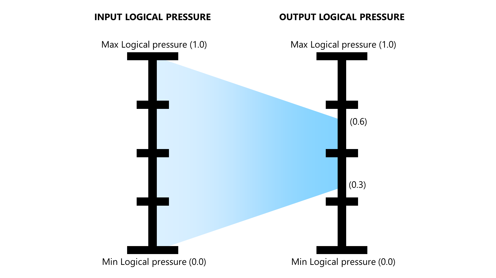

# Pressure curves that constrain output

Overview

Typically, a pressure curve function takes input logical pressure values in the range of \[0,1] and maps it to values in an output range of \[0,1]. This means that the full output range is used.

Some curves can limit their output range to achieve better control over brush strokes.

## Visual interpretation

The easy way to tell that a pressure cuve constrains the output range is to notice that the curve shape does not reach to the bottom or to the top of the pressure curve graph. Two examples are below.

<figure><figcaption></figcaption></figure>


<figure><figcaption></figcaption></figure>

Even though the shapes look a little diffrent, they both effectively take the input logical pressure values between \[0,1] and map that to an output region close to \[0.3, 0.6]


<figure><figcaption></figcaption></figure>

## Impact on brush strokes

Imagine the user's brush setting is 100px and the brush is set to change its size in response to pressure.  Then suppose the user draws a stroke that goes from the IAF value to the MAX physical pressure.

The stroke size is computer like this:

```
pressure = apply_curve( pressure )
brush_size = max( 1, 100 * pressure )
```

* With a null pressure curve - The stroke width will go from a size of 1px to 100px.
* With a the curves shown above - the stroke width will go from 30px to 60 pz. So the widht of the stroke does not vary as much.

<figure><figcaption></figcaption></figure>


## Use cases

* Helps give you more consistent brush strokes while still allowing some variability
* By avoiding the lower end of output logical prerssure, you can have your strokes start off a little thicker than normal. (Though there are other ways some apps have of accomplishing this goal.)

