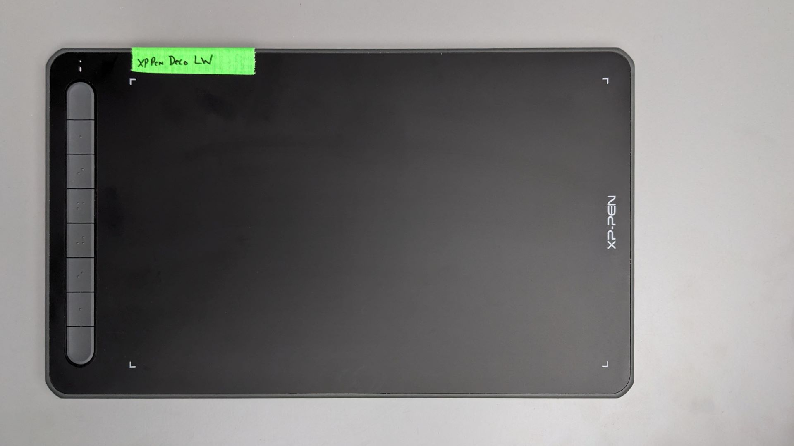
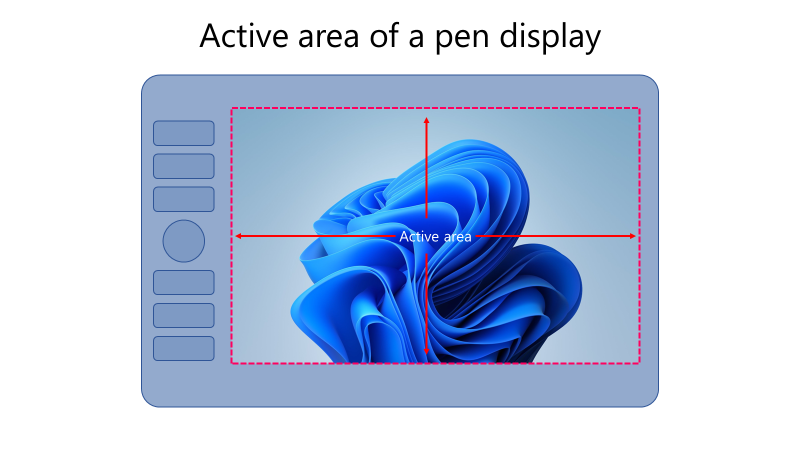

# Active area

## Introduction

The **active area** of a drawing tablet is the rectangular region of the tablet's surface that detects the EMR pen. Some manufacturers, such as Wacom and XP-Pen, use the term **active area**, while others, such as Huion, use the term **working area**.

When we talk about the "size" of the drawing tablet, we are referring to the active area.

## Active area of pen tablets

The active area is usually marked in some way on the surface. Sometimes it is marked at its four corners. Some tablets show a grid of dots.

<figure><figcaption></figcaption></figure>

 .jpg>)

## Active area of pen displays

The active area of a pen display is easy to identify because it is exactly the same area as the display panel.

<figure><figcaption></figcaption></figure>

## Size

Usually, when we discuss the size of an active area, we mean its diagonal length. Drawing tablets vary quite a bit in active area size. More here: [Active area size](active-area-size.md).

## Aspect ratio

The relationship between the width and height of the active area is its aspect ratio. More here: [Active area aspect ratio](active-area-aspect-ratio.md).
