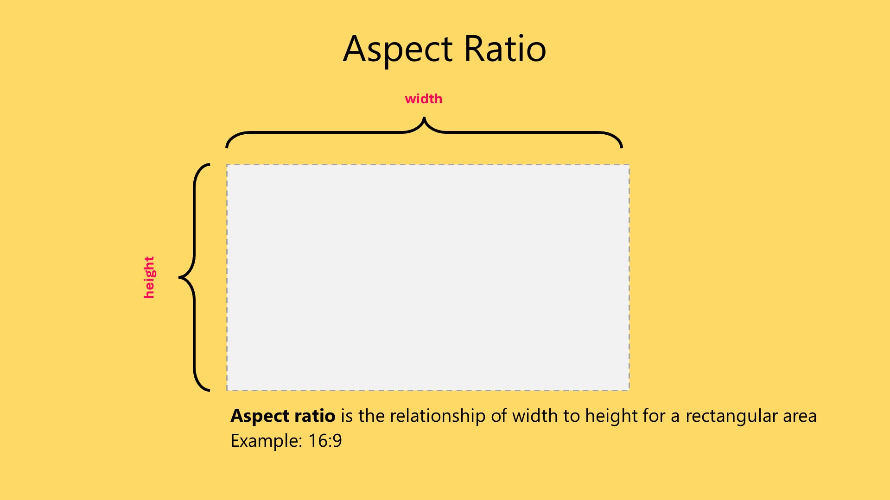
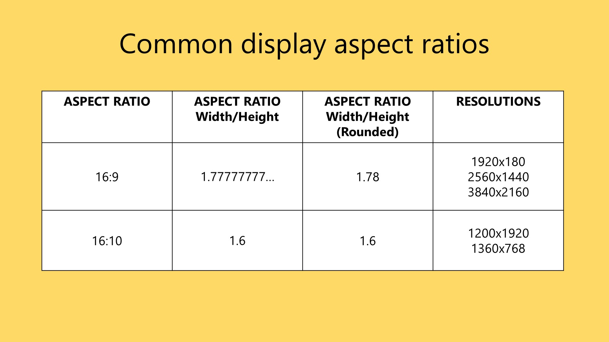
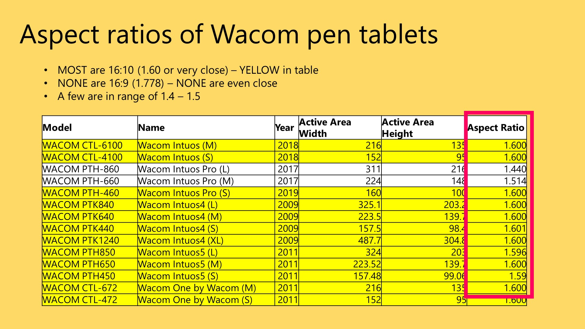

# Active area aspect ratio

## Introduction

The aspect ratio of your drawing tablet's [active area](./) can have a big impact on how good it feels to draw on.

## Basics

Any rectangular area has an aspect ratio, which is the relationship between its width and height. Usually, we express it as a ratio such as `16:9` or `16:10`.

<figure><figcaption></figcaption></figure>

Displays tend to have aspect ratios such as `16:9` and `16:10`. `16:9` is the most common.

<figure><figcaption></figcaption></figure>

## Aspect ratio mismatches with pen tablets (IMPORTANT)

If you are using a pen tablet, its aspect ratio most likely does not match your monitor's. This causes distortion when you draw.

This creates a weird and unpleasant drawing feel. You can fix it by forcing the aspect ratios to match. More here: [Matching aspect ratios with Force Proportions](../../guides/customizing/force-proportions.md).

## Pen displays and aspect ratios

The active area of a pen display and the display panel inside it are equivalent. So they always match.

## Reference

### A survey of aspect ratios of Wacom pen tablets

As of 2023, NONE of Wacom's pen tablets have an exact 16:9 aspect ratio.

<figure><figcaption></figcaption></figure>

##
