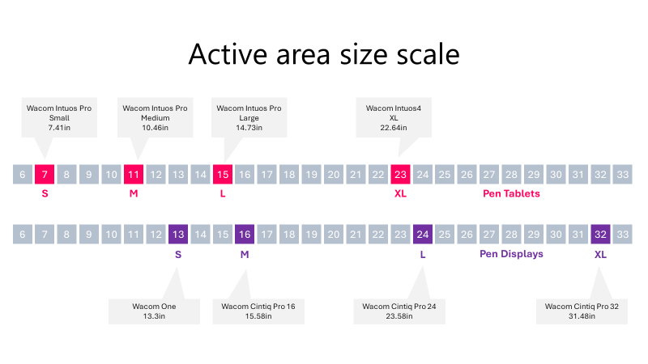
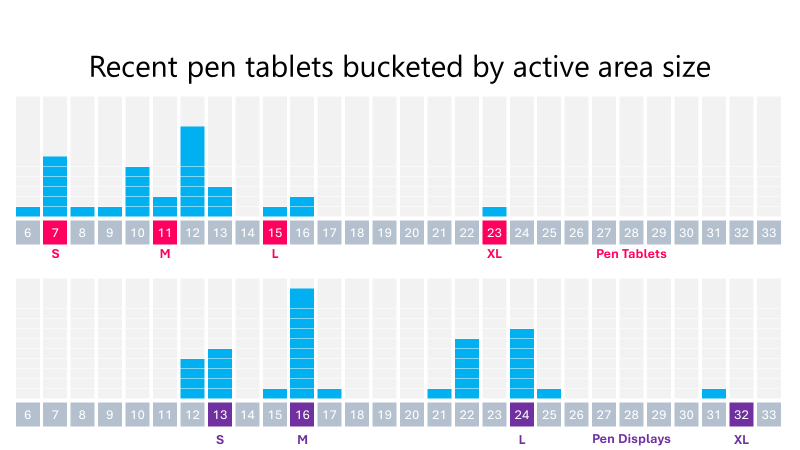
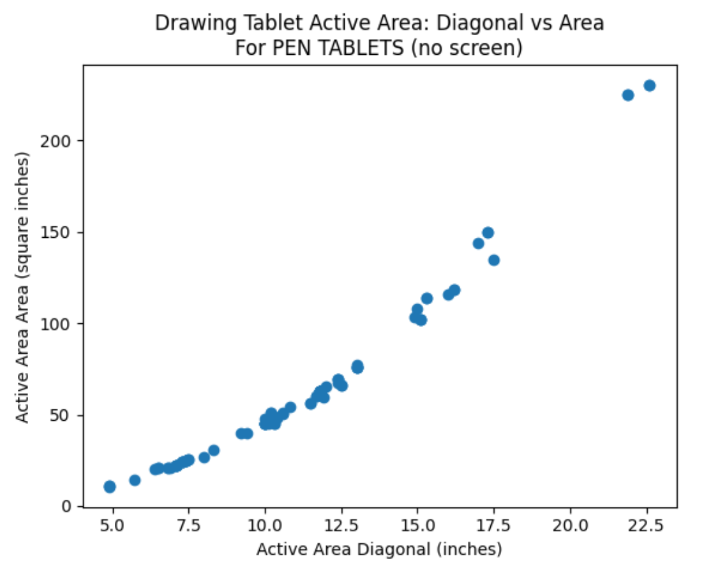
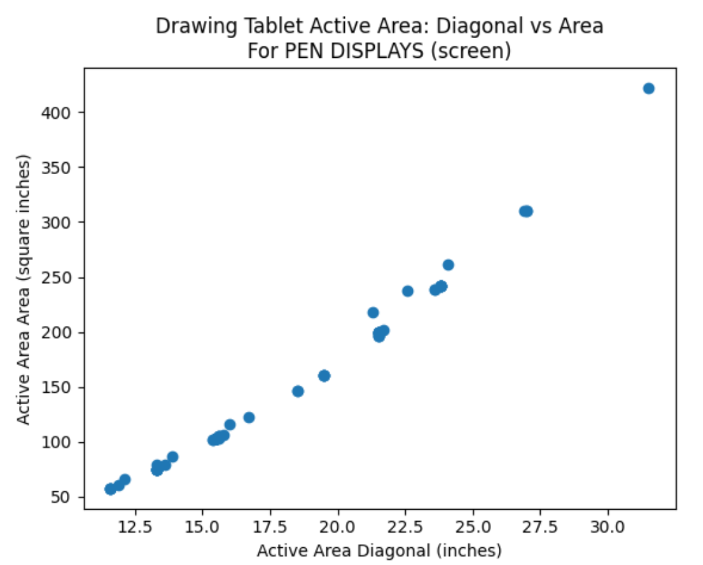

# Active area size

## Introduction

Because the active area is rectangular, we can describe its size in different ways.

* Width & Height
* Diagonal length
* Area

Most often, we describe active area size by its **diagonal length**.

If you need help picking the right size for your tablet, see [Choosing the right size for a drawing tablet](../../buying/choosing-size.md).

## Size in tablet names

You can often see the diagonal length in the names of pen displays. For example:

* Wacom Cintiq Pro **27**
* Huion Kamvas Pro **16** Plus 4K

For pen tablets, manufacturers often use descriptive names such as "small" and "large" instead of numbers.

* Wacom Intuos Pro Medium
* Wacom Intuos Pro Large

## Standard sizes

By looking at Wacom's product line and naming, we can build a useful framework for how descriptive words like "small" and "large" map to numbers. Note that the size names differ between pen displays and pen tablets.

<figure><figcaption></figcaption></figure>

## Distribution of active area sizes

If we look at how drawing tablet models are distributed along this scale, we can see a lot of variation.

<figure><figcaption></figcaption></figure>

## Diagonal vs Area

Is it reasonable to use the active area's diagonal length instead of its area?

I think it is, because diagonal length correlates reasonably well with area for drawing tablets.

Let's compare them by plotting the values for 180 different tablets.

For pen tablets:

<figure><figcaption></figcaption></figure>

And for pen displays:

<figure><figcaption></figcaption></figure>

Overall, I think using the diagonal is reasonable.
