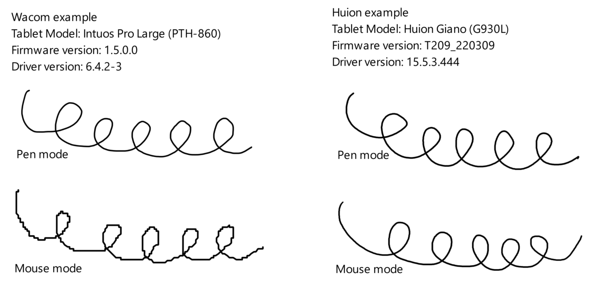
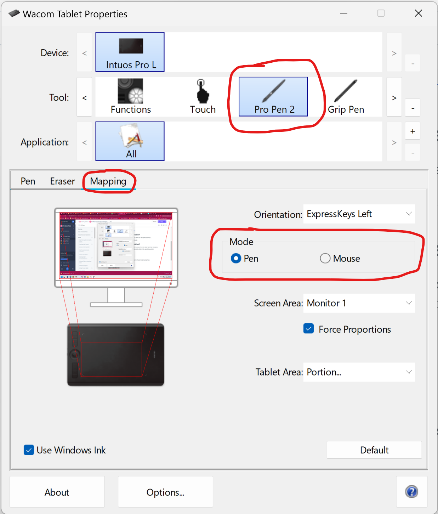
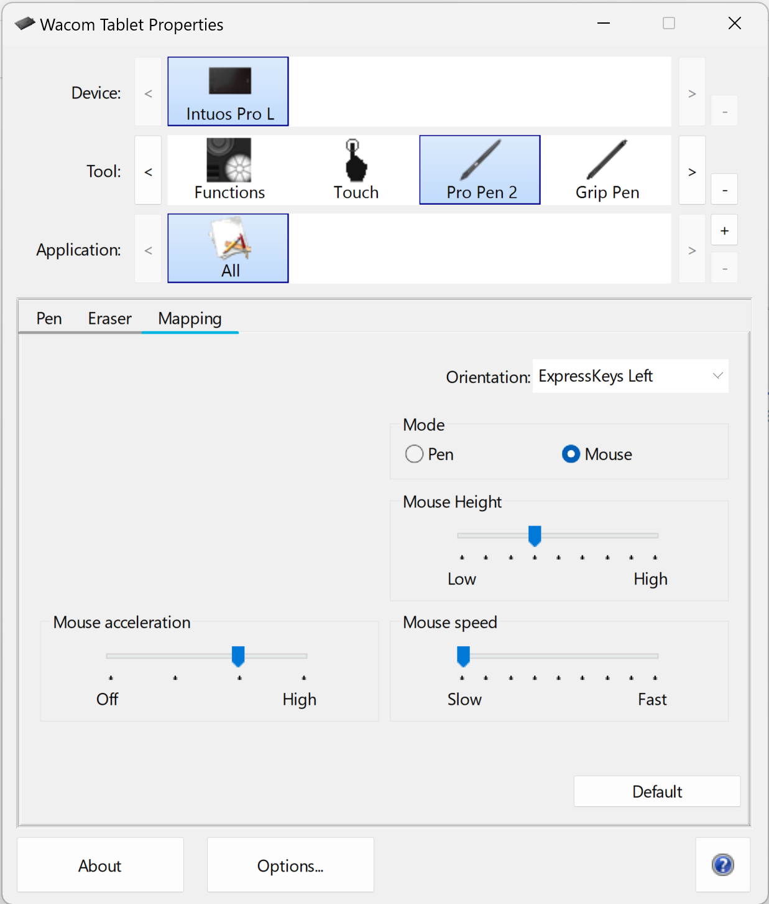
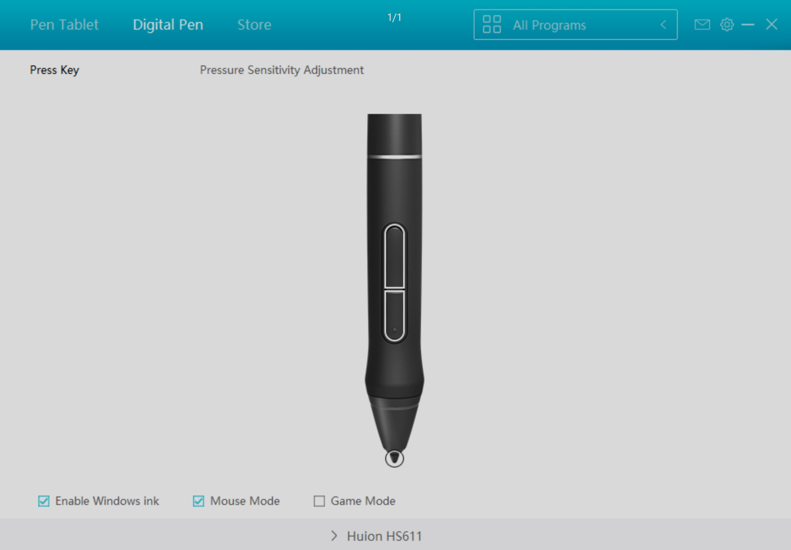

# Mouse mode

## Introduction

In some situations, some people prefer a drawing tablet pen to behave more like a mouse.

For this reason, drawing tablet drivers offer **mouse mode**.

## Mouse mode uses relative positioning

Drawing tablets are absolute positioning devices. Enabling mouse mode makes them behave like a relative positioning device, like a mouse.

Learn more here: [Absolute versus relative positioning](absolute-versus-relative-positioning.md)

## How does mouse mode affect the tablet?

Mouse mode is implemented in the tablet driver. It has no effect on the tablet hardware.

The tablet continues to use absolute positioning internally.

## How does mouse mode affect the driver?

The driver takes the absolute positioning information it receives from the tablet and translates it into relative positioning data before sending it to the operating system.

## How does mouse mode affect drawing quality?

In theory, it should not affect drawing quality.

In practice, it depends on what the driver is doing exactly.

Here's an example of the Wacom driver vs Huion driver in Krita on Windows.

<figure><figcaption></figcaption></figure>

As you can see, the Wacom driver creates very jerky position data when mouse mode is enabled. It does not have to be like this. It could behave more like Huion's implementation.

Also, this difference is not due to hardware. I tested the same Wacom tablet with OpenTabletDriver set to mouse mode too. OTD calls this "Relative mode," and the lines were smooth.

## How mouse mode affects pen features

This section is incomplete

* XP-Pen (ver 3.4.7): Enabling Mouse Mode loses pressure sensitivity on Windows
* Wacom: TBD
* Huion: TBD

## Windows Ink

On Windows, mouse mode in some drivers may disable Windows Ink.

You may need to restart a drawing application if you change the mouse mode setting.

## Configuring mouse mode

### Wacom

In the **Wacom Tablet Properties** app, select your pen, open the **Mapping** tab, and then switch the **Mode** setting between **Pen** and **Mouse**.

<figure><figcaption></figcaption></figure>

Once you enable mouse mode, you'll see some new configuration options.

<figure><figcaption></figcaption></figure>

### Huion

In the Huion driver, click **Digital Pen**, then enable or disable **Mouse Mode** at the bottom.

<figure><figcaption></figcaption></figure>

## Restarting apps after mouse mode

Some drawing applications may get confused if they are running while mouse mode is switched on or off. So you may need to restart them.

## Mouse mode on pen displays

Most often, tablet drivers do not offer a mouse mode option for a pen display.

There is no technical limitation. In theory, pen displays could support mouse mode just as well as pen tablets. It is usually not offered because most users would be confused by the mismatch between the mouse pointer on the screen and the physical position of the pen tip.

Nonetheless, some people do want mouse mode for their pen displays. If you really want it, consider using OpenTabletDriver instead of your manufacturer's driver.

More here: [OpenTabletDriver](../../guides/drivers/opentabletdriver/)
