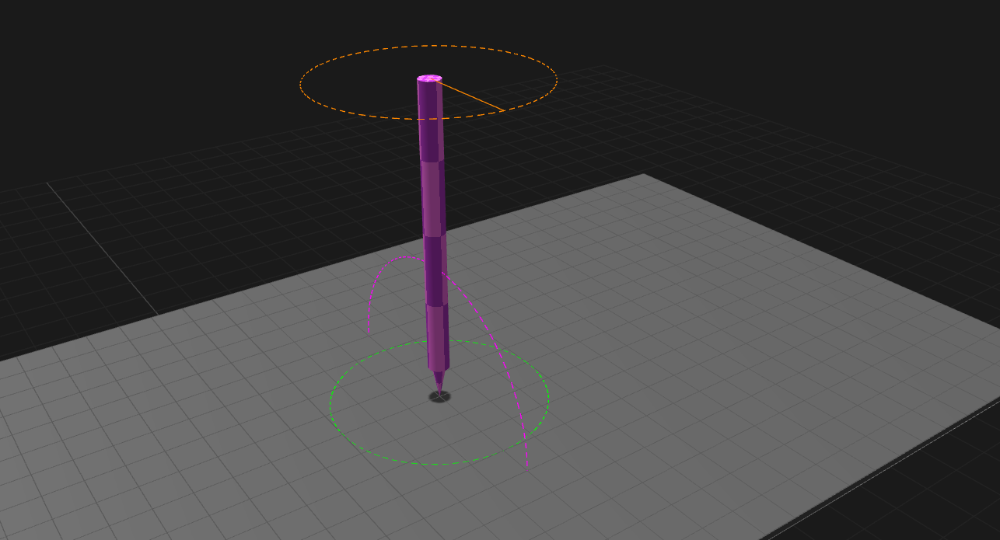
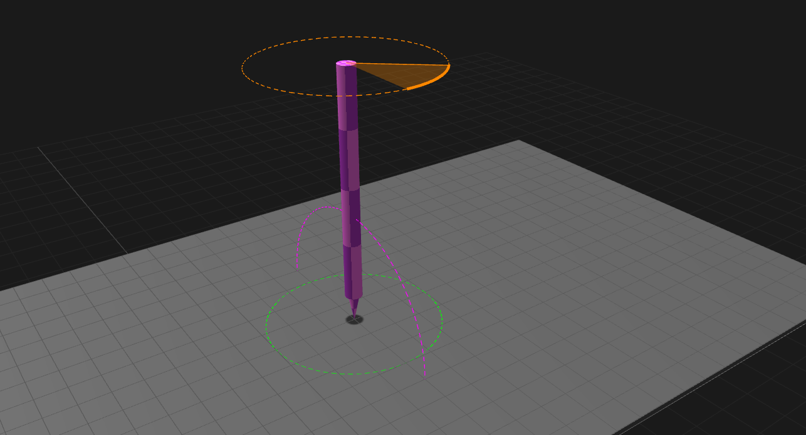
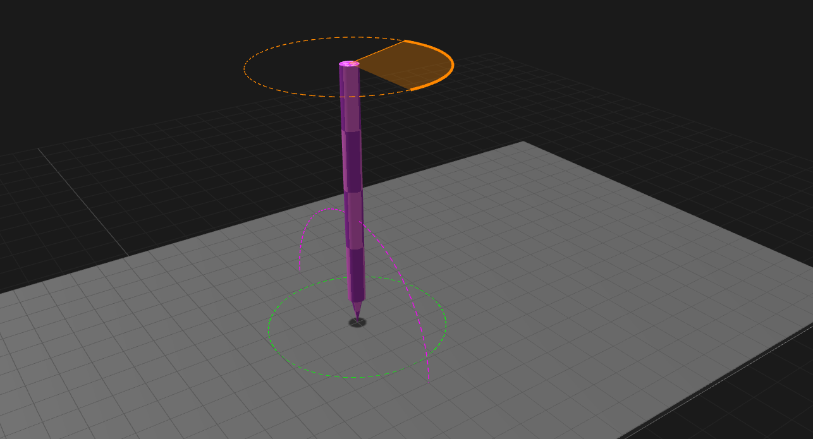
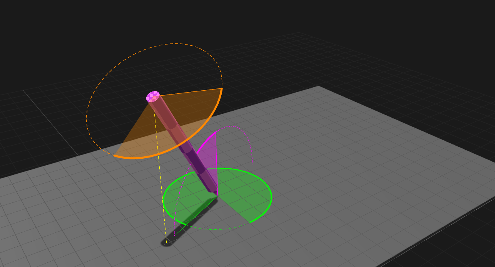
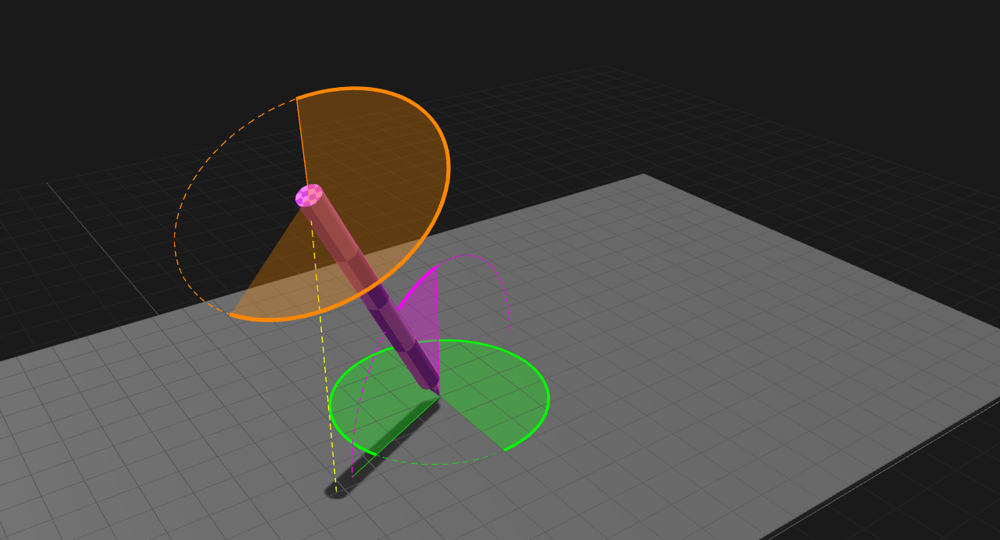

# Barrel rotation

## Introduction

Barrel rotation is very easy to understand. It's just a rotation of the pen along its long axis - it is when the pen spins.

The photos below represent an untilted pen. The orange circle will indicate the barrel rotation.

<figure><figcaption></figcaption></figure>

<figure><figcaption></figcaption></figure>

<figure><figcaption></figcaption></figure>

Below are diagrams showing both tilt and barrel rotation. Tilt and barrel rotation are independent. People often confuse them, so it's useful to compare a tilted pen with barrel rotation.

The green circle shows the tilt azimuth. The purple circle shows the tilt altitude.

<figure><figcaption></figcaption></figure>

<figure><figcaption></figcaption></figure>

In the diagram below, barrel rotation is indicated by the arrows that go around the long axis of the pen (as indicated by the dotted line).

This video demonstrates tilt. I highly recommend you watch it.



## Benefits of barrel rotation

Barrel rotation is intended to help brushes mimic traditional media, where rotating the brush around its long axis rotates the brush on the canvas.

## Popularity

I don't think barrel rotation is widely used, but absolutely some people have an art style that requires it. And for them, barrel rotation is critical.

## Pens that support barrel rotation

Barrel rotation is a **very rare feature** on pens. I know of only three pens that support it.

* Wacom Art Pen (KP-701E)
* Wacom 6D Art Pen (ZP-600)
* Apple Pencil Pro
* Huawei M Pencil Pro

Keep in mind that these pens only work with specific tablets. You cannot buy these pens and assume they will work with the tablet you have.

## Will barrel rotation ever be adopted more widely?

We don't know. We don't have any information about other brands adopting barrel rotation.

## Turning on barrel rotation

See: [Using barrel rotation with your brush](using-barrel-rotation.md)

## Videos

* [Revels Atelier - Hurry! Get the Wacom Art Pen before it's gone!](https://www.youtube.com/watch?v=TgHw40QTV9s) 2024-04-25
