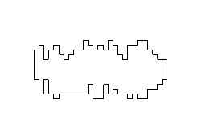
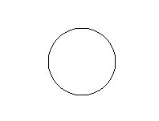
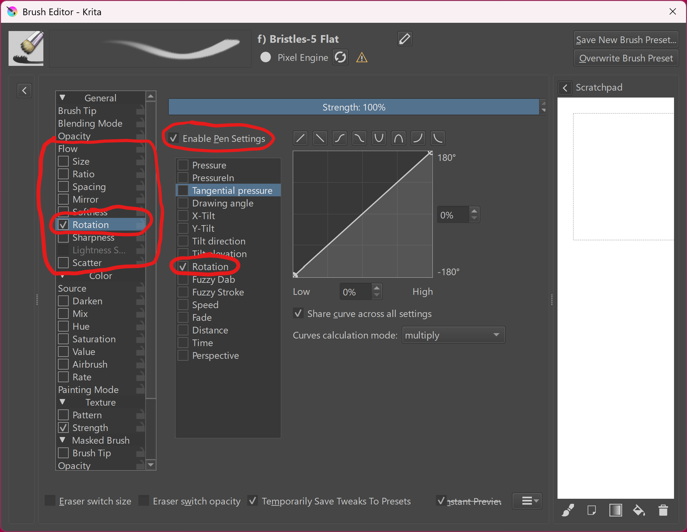
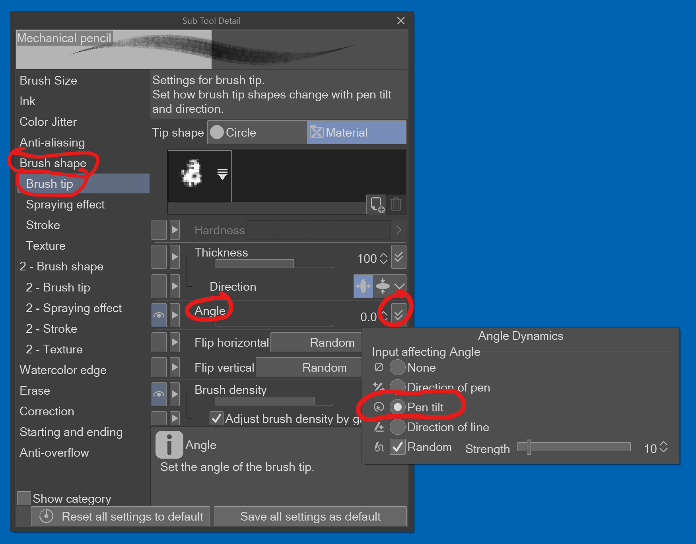
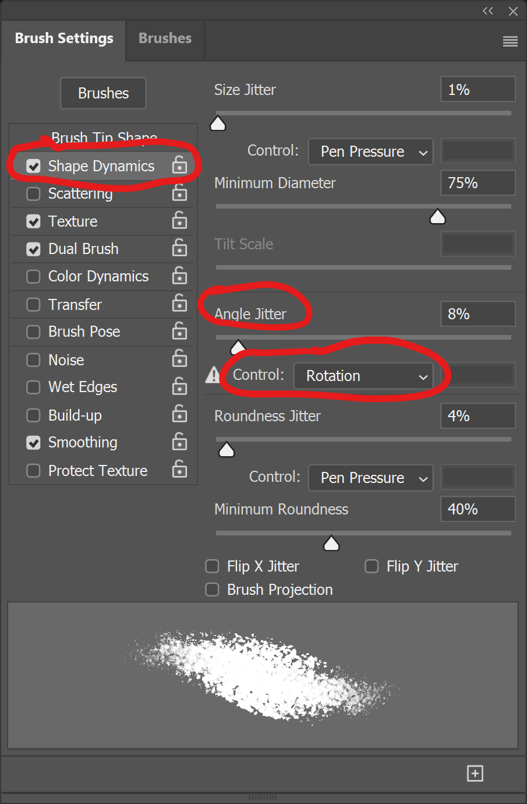

# Using barrel rotation with your brush

## Overview

If you are using a pen that supports barrel rotation and a tablet that supports barrel rotation, the tablet will always send barrel rotation information to the computer.

## Getting started

However, your app's brushes may not be configured to use the barrel rotation data.

So, make sure your brush is correctly configured so barrel rotation has some effect on your brush. Typically, this means having barrel rotation control the rotation of the brush shape.

Make sure your brush shape is something that would show barrel rotation clearly.

A shape like this would work

<figure><figcaption></figcaption></figure>

whereas a shape like this would not demonstrate barrel rotation because it is symmetric about its center.

<figure><figcaption></figcaption></figure>

## Krita: enabling barrel rotation

* Launch Krita and open the brush editor
* Under **Flow**, enable **Rotation**
* Check **Enable Pen Settings**
* Uncheck all the options under **Enable Pen Settings**, but check **Rotation**.
* Then go to the canvas of your document and try rotating the pen around its long axis

<figure><figcaption></figcaption></figure>

## Clip Studio Paint

* Open the **Sub Tool Detail** UI for your brush
* Navigate to **Brush shape > Brush tip**
* Next to **Angle**, click the button with two chevrons
* Choose **Pen tilt**

<figure><figcaption></figcaption></figure>

## Photoshop 2026

* Open the **Brush Settings** window
* Navigate to **Shape Dynamics**
* Under **Angle Jitter**, set **Control** to **Rotation**

<figure><figcaption></figcaption></figure>
