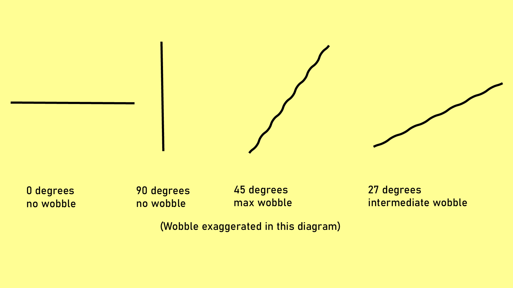

# Diagonal wobble

## Overview

Diagonal wobble is a regular displacement of the tablet's interpretation of the pen's position.

You might also see this referred to as "jitter."

## Companion video

I covered wobble extensively in this video about pen display accuracy: [https://youtu.be/M4rEk\_RNBrM](https://youtu.be/M4rEk_RNBrM)

## Appearance

If you slowly draw a line on a tablet with a ruler, the wobble will be apparent on diagonal lines. The diagram below exaggerates the wobble.

<figure><figcaption></figcaption></figure>

## Characteristics

* The wobble can happen with any kind of pen movement, whether straight lines or curves.
* As the name suggests, the wobble is most apparent when the pen moves at an angle.
  * A 45-degree angle exhibits the most wobble.
  * A 0-degree or 90-degree angle exhibits no wobble.
  * Angles between 0 and 90 exhibit more wobble as they approach 45 degrees.
* Wobble is more obvious with straight lines, even though the same amount occurs with curves.
* Generally, wobble becomes more visible the slower the pen is traveling.
* Some tablets exhibit the wobble even when moving the pen fast. This is less common.

## Prevalence

* Diagonal wobble is present in all drawing tablets in varying amounts.
* There is no correlation between price and wobble.
  * Some expensive tablets have noticeable wobble.
  * Some inexpensive tablets have very little wobble.
* Test each tablet for wobble rather than relying on its price or specifications.
* Review videos can help identify wobble.
  * Slow recorded strokes often reveal wobble, even when the reviewer does not mention it.
  * Verify "no wobble" claims against the visible strokes.
* Pen displays tend to have slightly more wobble than pen tablets.
* Wacom generally minimizes wobble well, especially in its Pro line.
  * Some Wacom tablets still have noticeable wobble.
  * Even expensive Wacom pen displays can show a small amount of wobble.

## Causes

* The wobble is not caused by the nib moving in the pen.
  * The nib can be perfectly fixed, and you would still observe wobble.
  * The tablet senses the inductor coil deeper inside the pen, not the nib.
* The wobble comes from the tablet and how it senses the pen position.
* The wobble is due to how the tablet senses and interpolates the pen's position.
* Wobble is present in multiple digital pen technologies.
  * It is present with EMR pens.
  * It is also present with non-EMR technologies such as MPP, AES, and the Apple Pencil.

## Pen velocity

Wobble often appears only at **slow speeds**. It can go completely unnoticed during normal drawing.

For many tablets, you only see wobble when specifically looking for it.

Some tablets show obvious wobble even at **fast speeds**. This is less common.

## Tilt

Tilt **could** affect the wobble.

Most often, I have not seen tilt affect wobble. However, one tablet shows massive wobble at an extreme tilt angle. This angle would not be used for drawing. I have not tested every tablet at extreme tilt, so I am unsure how common this is.

## How much does wobble matter?

All tablets have wobble.

For most tablets, you would only notice wobble when trying to find it. In other words, it will not affect normal drawing.

The real problem starts when wobble creates stroke changes you did not intend.

It also depends on what you are doing. You might notice wobble more in line art, but not notice it at all with an airbrush.

## Mitigating diagonal wobble

**Option 1: Turn on smoothing**

Applications have different brush smoothing options. Explore those to see if they eliminate or reduce the wobble.

**Option 2: Zoom in**

Try zooming in on the canvas, for example by 2×, and drawing the same stroke. The wobble is still present, but zooming in by 2× halves its visible effect on the stroke.

**Option 3: Draw faster**

Wobble often appears when you draw slowly. Try drawing the stroke faster. On most tablets, this eliminates the wobble.

If your strokes are small and drawing faster would reduce control, try zooming in more. This makes your physical stroke longer while keeping it the same size on the canvas.

**Option 4: Use vector tools and brushes**

Instead of drawing your stroke manually, if your application supports it, use vector strokes.

## Diagonal wobble samples

These are my wobble samples across a number of tablets.

[https://1drv.ms/f/s!Aml8i4Jd6crChTjTXo89k5jO8mb8?e=t3ijPC](https://1drv.ms/f/s!Aml8i4Jd6crChTjTXo89k5jO8mb8?e=t3ijPC)

All were created using my standard testing process: [Measuring diagonal wobble](../process/measuring/measuring-diagonal-wobble.md). Many samples record strokes at three speeds to reveal wobble that only appears during slow movement.

## Examples to learn from

**Two different results from two units of the same model**&#x20;

* See at 8:06 in this Brad Colbow video: [https://youtu.be/0VaH-UTRL7A?t=486](https://youtu.be/0VaH-UTRL7A?t=486)&#x20;
  * There is some wobble in that segment of the video.
  * However, in my own testing of a unit, I did not find much wobble at all: [XP-Pen Deco LW (IT1060B) notes](../catalog/drawtabs/xppen/xppen-it1060b-notes.md)
  * Why do these results differ? A couple of theories
    * Normal variance between units
    * Brad is drawing freehand, I use a ruler
    * Brad places the tablet on top of a laptop. I have seen many cases where a laptop can create electromagnetic interference and cause weird effects in a tablet. Though I have not specifically tested diagonal wobble.

**Some obvious wobble examples**

* XP-Pen Artist 16 (Gen 2) at 7:04 in this video: [https://youtu.be/0VaH-UTRL7A?t=424](https://youtu.be/0VaH-UTRL7A?t=424)
* XP-Pen Artist 12 (Gen 2) at 5:45 in this video: [https://youtu.be/O6OzBT7BLsA?t=345](https://youtu.be/O6OzBT7BLsA?t=345)

## Discussions

* [Huion Kamvas Pro 13 diagonal wobble discussion](https://www.reddit.com/r/huion/comments/9x3qwg/huion_kamvas_pro_13_regarding_the_infamous_line/)
