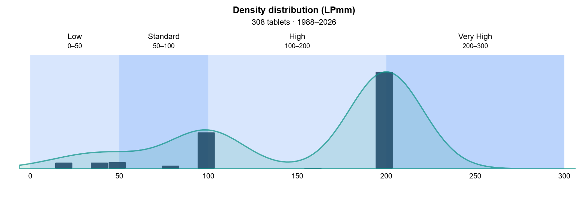
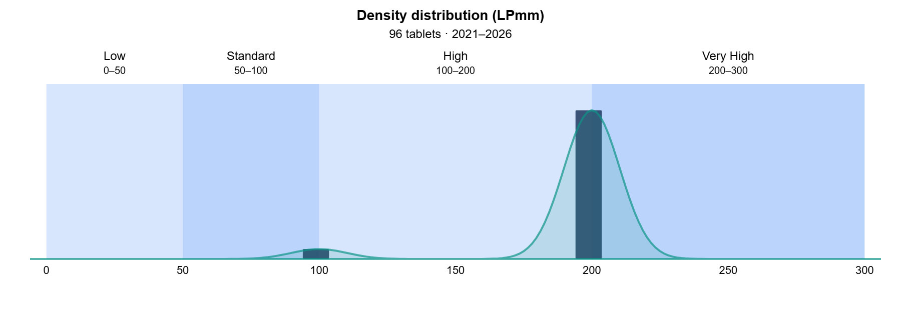

# Digitizer resolution and density

## Background on tablet digitizers

The digitizer is the mechanism inside all EMR drawing tablets that:

* Sends power to the pen through an electromagnetic signal
* Senses a returning electromagnetic signal from the pen

From the returning electromagnetic signal, the digitizer can get information about:

* The pen position
* The amount of pen tilt
* How much pressure is being applied
* The status of the buttons

Digitizers are capable of distinguishing the position of the pen with **very high precision**.

## Terminology

When dealing with this topic, it is helpful to clarify two terms. Not everyone uses these terms as defined below. However, we will use these definitions throughout this document.

For any rectangle that is composed of or can be decomposed into smaller elements:

* **Resolution** refers to the dimensions - the width and height of an area in a given unit. For example, 1920 pixels by 1080 pixels.
* **Density** refers to how many elements are packed into a given length. For example, pixels per inch or lines per inch.

## Digitizer density

You will often see a tablet digitizer's density given in LPI (lines per inch).

A typical modern value is 5080 LPI. For every inch on the digitizer, the tablet can detect 5080 distinct positions.

This density is easier to work with in centimeters or millimeters.

So, 5080 LPI = 200 LPmm.


It is very common to see density labeled as resolution.


<figure><figcaption></figcaption></figure>

<figure><figcaption></figcaption></figure>

* Densities <100 LPmm were for very tablets.
* Modern tablets have been at >=100 LPmm for a long time now.
* Almost all contemporary tablets have 200 LPmm

## Digitizer resolution

Digitizer resolution is almost never listed. However, you can calculate it from the active area's dimensions and density.

For example, the Wacom Intuos Pro 2025 M has the following specifications.

| Spec              | Imperial      | Metric       |
| ----------------- | ------------- | ------------ |
| Dimensions        | 10.4 × 5.8 in | 263 × 148 mm |
| LPI (aka Density) | 5080 LPI      | 200 LPmm     |

The digitizer resolution is 52,600 × 29,600 addressable elements.

In practice, nobody discusses digitizer resolution in these units.

## Relation to a display

All drawing tablets use some form of display. This can be a separate monitor or a display embedded in the drawing tablet.

Displays have their own native resolution and size, so they have a pixel density.

Here are some common examples:

| Display                           | PPI   |
| --------------------------------- | ----- |
| 27" 4K display                    | 166   |
| 27" 8K display                    | 326   |
| 16" 4K display                    | 283   |
| Samsung Galaxy S21 series         | \~500 |
| 6th and 7th generation iPad minis | 326   |

Overall, drawing tablet digitizers are 10 times denser than the best available displays. Even very old digitizers have a density of 2540 LPI (100 LPmm).

## Implications for buying a drawing tablet

You don't need to worry about this LPI specification when selecting a drawing tablet. You will not be able to tell the difference between 2540 LPI and 5080 LPI.

My advice: Do not consider LPI or LPmm when making a purchase decision.

## Position data sent to the computer

Even if a digitizer has an incredibly high resolution, you may wonder what data it sends to the computer.

The answer is simple: the digitizer sends its coordinates using the highest resolution available.

## Somewhat related but very important: Force proportions

Resolution and density are not important when discussing tablets. However, another topic involves both the tablet's digitizer and a display. You should pay close attention to it. It affects your drawing quality and feel.

Enable Force Proportions in the tablet driver. See [Matching aspect ratios with Force Proportions](../guides/customizing/force-proportions.md).
