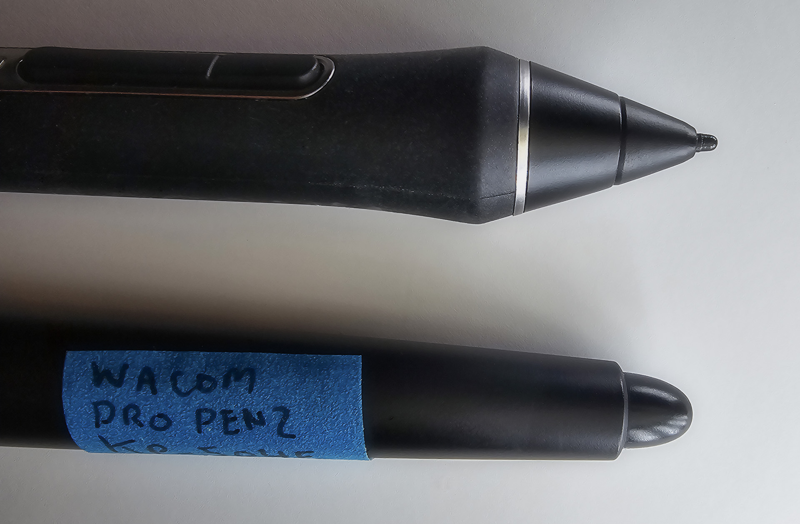

# Erasing

## Overview

Besides drawing, pens have varying support for erasing. This is typically done either with an eraser on the pen or by using the pen buttons to erase.

## Erasers

Below you can see the nib and the eraser for the Wacom Pro Pen 2 (KP-504E). As you can see, the eraser is quite a bit larger than the nib.

The eraser is also pressure sensitive and retracts into the pen. The eraser has a much bigger retraction distance than the nib.

<figure><figcaption></figcaption></figure>

### Pens that have erasers

Erasers are relatively uncommon for EMR pens.

| Brand  | Pens                                                                                                                                                                                                                                                                                                                                           |
| ------ | ---------------------------------------------------------------------------------------------------------------------------------------------------------------------------------------------------------------------------------------------------------------------------------------------------------------------------------------------- |
| Wacom  | 
This is a partial list of Wacom's more recent pens.
<ul><li>Wacom Pro Pen 2 (KP-504E)</li><li>Wacom Pro Pen Slim (KP-301E)</li><li>Wacom Pro Pen (KP-503E)</li><li>Wacom Grip Pen (KP-501E)</li><li>Wacom Art Pen (KP-701E)</li><li>NOTE: Wacom's most recent professional pen, Wacom Pro Pen 3, no longer features an eraser.</li></ul> |
| Huion  | <ul><li>Huion PW600</li><li>Huion PW600S</li></ul>                                                                                                                                                                                                                                                                                             |
| XP-Pen | <ul><li>XP-Pen P06</li><li>XP-Pen X3 Pro</li></ul>                                                                                                                                                                                                                                                                                             |

### App support for erasers

Drawing apps have to explicitly support erasers. Some do. Some do not.

## Usage of erasers

Lots of people use the eraser and find it critical. Lots of people never use it. I am in the latter group.

For me, flipping the pen around to use the eraser disrupts my flow. Sometimes I am also clumsy enough to drop the pen while rotating it. I also think it is faster to use a keyboard shortcut or my TourBox.

### Pen compatibility with tablets


Remember that a specific tablet is compatible with only specific pens. Avoid buying a pen that has an eraser and assuming it will work with your tablet. Always check with the manufacturer.


## Using the side buttons to erase

Another option is to map the side buttons to switch to the eraser tool in the app you are using. You can do this in the tablet driver app.
