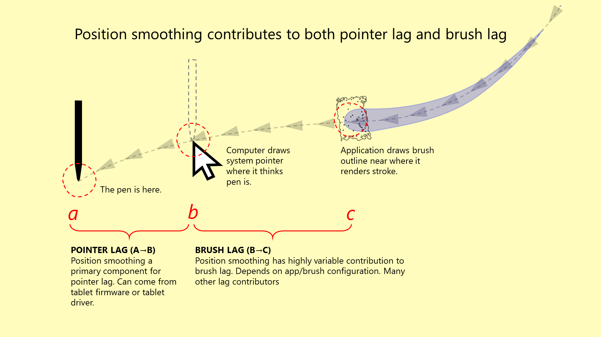

# Pointer lag

## Overview

* For a more general introduction to lag, see [Lag](./).
* If you are "painting", there is a separate kind of lag called [Brush lag](lag.md).

<figure><figcaption></figcaption></figure>

## What is it

The position your computer's operating system thinks the pen is at always lags slightly behind where the pen actually is. The difference in these two positions is called **pointer lag**.

## How to demonstrate it

It's most easily seen by opening your computer desktop and just moving the pen around. You'll see the pointer lag behind your pen slightly.&#x20;

The faster you move the pen, the more lag you will see.

## Which drawing tablets are affected

Pointer lag is inherent; all drawing tablets are affected.

* Pen tablets (screenless) have a little less. Also, it's harder to notice since your eyes can't directly compare the pointer position to the pen position.
* Pen displays (screen) have a little more. And of course, your eyes see the lag directly.
* Standalone - it varies how much lag is visible in standalone tablets depending on the device type. I have noticed that mobile devices (iPad, Samsung Tab S, etc.) have a little less pointer lag than pen displays. It's also just harder to notice because these mobile devices are not very large compared to pen displays.

## "Somebody told me X tablet has zero lag"

This is imprecise communication.

* ALL tablets have pointer lag.&#x20;
* ALL PEN DISPLAYS easily show the lag.

Watch any video review where "no lag" is stated and you will almost always see the lag. Remember that a slowly moving pen shows very very little lag. You have to look for faster strokes.

If you watch my videos on YouTube, you will see the lag all the time on pen displays.

There is no "magic" pen display that you can buy that has zero lag.

## **OS vs App**

If your OS thinks the pen is at a certain position, that's the position that will be reported to all applications.

So pointer lag shows up in all applications. And applications, in this sense, cannot have less pointer lag than what the operating system has (as shown on the desktop).&#x20;

## How much variance is there between tablet models

* **Pen tablets (screenless)** - There is a little bit of variance. Some tablets have very little lag, some a little more. Most people don't notice. Someone who switches from one pen tablet to another might notice that the pointer feels slightly "floaty," but the difference is rarely a major concern.&#x20;
* **Pen displays (screen)** - There is more lag in general and it varies a bit more. In my experience, as a pen display gets smaller, the less lag you will generally perceive.

## What technically contributes to pointer lag?

There are three fundamental sources to lag and the perception of pointer lag:

* Position smoothing - used to stabilize the reported position of the pen.
* Latencies - the time it takes to transmit data from one part of the system to another.
* Rates - how many times a second something happens. There are lots of rates involved in using a drawing tablet.

## Real lag versus perceived lag

**Position smoothing and latencies** contribute to a "real" lag of the pointer. The more position smoothing is done and latency increases, the more distance the pointer will lag behind the pen.  &#x20;

**Rates** - In a technical sense, lower rates don't make the pointer any slower - they don't increase the distance the pointer is following - but most people will find that lower rates will contribute to the "feeling" or "perception" that lag is increasing. You can try this for yourself: with a pen display, set the display's refresh rate to 30Hz and check what the pointer lag looks like. You most likely will be very unhappy with the experience in just a few seconds.&#x20;

## Specific contributors (not a complete list)

* **Position smoothing done in the tablet firmware**. The position smoothing is intended to combat electromagnetic noise.&#x20;
* **Position smoothing done in the tablet driver**. Some drivers add a little bit of position smoothing.&#x20;
* **Tablet report rate**. How many times a second the tablet updates the computer with the pen position.
* **Display refresh rate.** How many times a second the display updates. A 30Hz display will have more perceivable lag than 60Hz. A 120Hz display will have about 10% to 20% less perceivable lag than 60Hz.

## Can pointer lag be reduced?

YES - in theory and to some degree. But it is not a trivial thing to do.

### Display refresh rate

* Try a higher refresh rate in your display. It might feel like there is less lag.

### Tablet hardware options

* You cannot change the behavior of the tablet hardware you already have. There is no "special firmware hack" for this.
* You could buy a different tablet.
  * Wacom Intuos Pro tablets do not do any position smoothing.
  * Non-Wacom brands have a little bit. In most cases the average person would never be able to detect the difference.

### Driver options

* Eliminate pointer smoothing in the driver. Your tablet driver may be doing some smoothing. As an alternative, you can use OpenTabletDriver.
* I've tried this with both an Intuos Pro and a Cintiq Pro. My results:
  * **Intuos Pro** - Noticeable reduction in lag (at the cost of a little more imprecision in the tracking of the pen).
  * **Cintiq Pro** - Slight reduction in lag, but mostly stays exactly the same. From that, I think the Cintiq Pro lag is primarily caused by the tablet firmware - probably to deal with the electromagnetic noise caused by the embedded display panel.
* The pointer lag in the firmware cannot be removed because essentially it is impossible for a user to modify the tablet firmware.

### Application options

* No. Applications cannot remove or reduce pointer lag at all.&#x20;

## Is there a specific way to measure lag?

No.&#x20;

We know the physical separation of pointer and pen depends on how fast the pen is moving. This means lag theoretically is a function of speed.&#x20;

* Zero speed -> zero lag
* Slow speed -> a little bit of lag
* Fast speed -> a lot of lag

Thus, there's no single number that can represent lag. Instead, lag is likely more like a "lag curve" that shows how lag increases as speed increases.

## Lag measurement futures

I am working on a way of measuring pointer lag for pen displays so that I can establish at least a technical basis for determining a "lag curve". I started researching this in early 2026.

## Drawing tablet (EMR) pointer lag vs. Apple iPad pointer lag

With the Apple Pencil, the iPad has lag, but the overall perceivable lag is very low compared to an EMR drawing tablet. I **suspect** the lower lag is due to some of these factors:

* Very tight and optimized integration between the pen subsystem and the operating system. It makes sense Apple can do this because they own the entire tech stack.
* In a normal drawing tablet, the EMR pens have a coil that is detected by the tablet. This coil is deeper inside the pen, while the equivalent Apple Pencil component is closer to the tip of the pen and thus the tablet surface. This smaller distance should result in less electromagnetic interference. In turn, this should require less position smoothing to remove the interference, which then shows up as reduced lag.
* Relating to the previous point about distance: just based on the visual parallax, it seems like there is less physical distance between the tip of the Apple Pencil and the display panel compared to other EMR-based pen displays I have used. So, again, this should reduce the amount of electromagnetic interference and thus require less smoothing and result in less lag.
* From some things I've read, iPads do some position prediction with the Apple Pencil, resulting in a reduction in lag at the cost of reduced accuracy with abrupt changes in direction. I've even seen one video showing that iPads also can predict contact with the surface of the iPad so that they can start drawing just a moment before physical contact is made.

