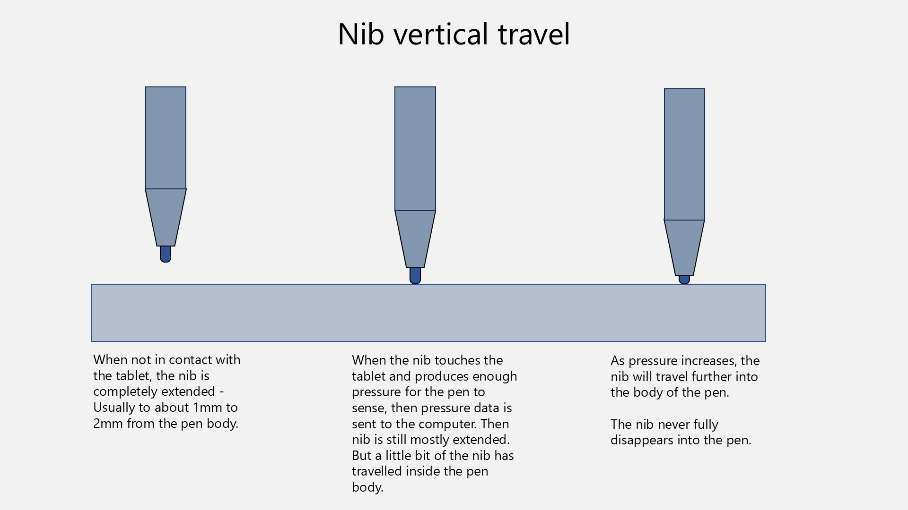
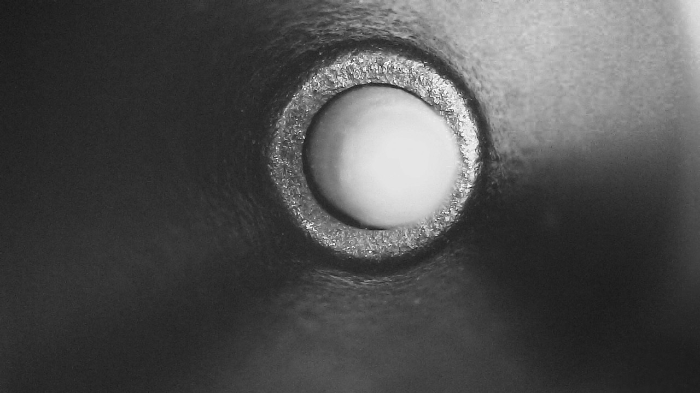
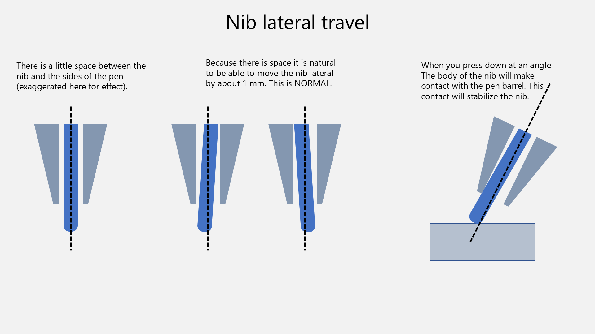

# Nib travel

## Overview

An EMR pen's nib can exhibit more vertical (into the pen) and lateral (towards the side of the pen) physical movement. This is NORMAL and EXPECTED and how the nib is SUPPOSED TO WORK.

## Vertical travel

When you press down on the nib they travels (or retracts) a little bit into the pen. This is NORMAL. If the nib didn't travels at least a little, the pen would not be able to detect pressure.

Some people may refer this as the "nib retraction distance"

<figure><figcaption></figcaption></figure>

How much the nib travels depends on the specific pen involved.

The general consensus is that most people don't want too much retraction because it "feels funny" to use the pen.

A typical nib travel distance for Wacom's pens is about 1mm.

## Lateral travel

The nib has a little extra space in the pen to move laterally (side-to-side) movement.

<figure><figcaption></figcaption></figure>

As you are drawing with a normal tilt, you will push the nib a little to one side depending on how you are pressing down. If you aren't drawing you can use your finger to just play with the nib a little to see this movement.Typically the lateral travel a the tip is about 1 mm.

This is a normal aspect of EMR pens and all pens with nibs have a little lateral movement.

<figure><figcaption></figcaption></figure>
