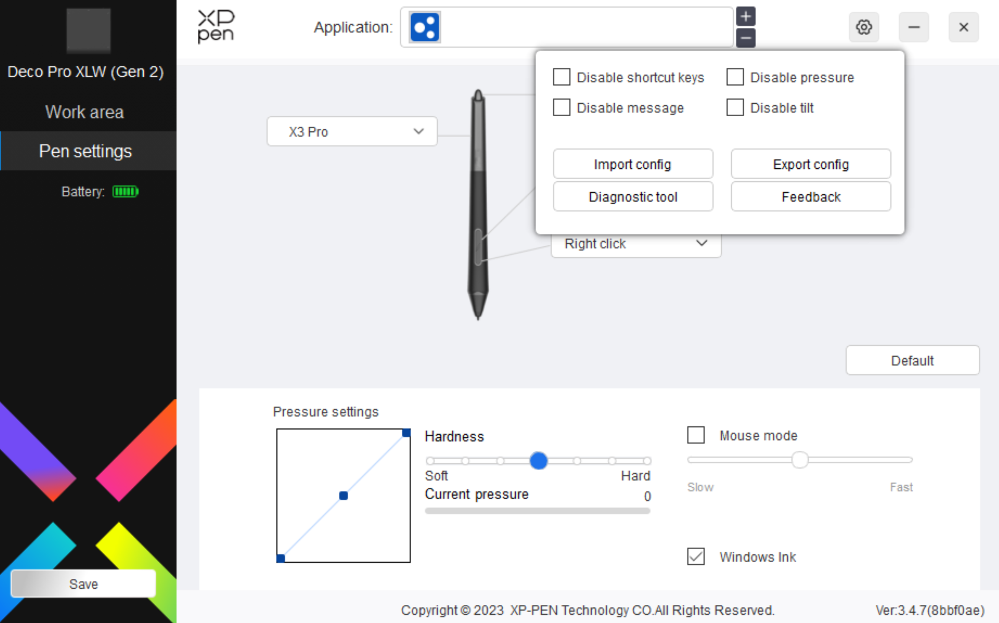

# Disabling pen tilt

## Overview

Pen tilt information is always sent from the tablet to the tablet driver, then to the operating system, and then to pen-aware applications.

Sometimes, when drawing, it can be useful to turn off tilt. There are two options.

### Option 1: Use brush settings

Drawing apps that use brushes may let you control how tilt affects the brush. So, you can configure specific brushes to ignore tilt. Examples of applications that support this are Clip Studio Paint and Krita.

### Option 2: Turn tilt off in the driver

Some tablet drivers let you simply turn off tilt so that it is not reported to your operating system or applications.

XP-Pen drivers have this feature.

<figure><figcaption></figcaption></figure>

