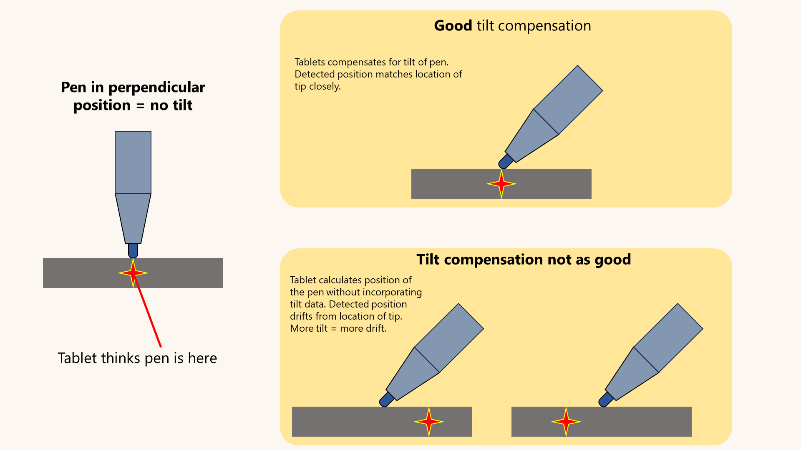

# Pen tilt compensation

## Overview

To correctly represent the position of the pen, the tablet has to perform something called tilt compensation. This means adjusting the pointer position depending on how much the pen is tilted.

One point to stress: tilt compensation is performed by the tablet, not the pen.

<figure><figcaption></figcaption></figure>

## A peek inside tilt compensation

Tilt compensation is very important in general for any digital pen technology.

The first thing you should realize is that the tablet does not actually sense where the nib touches. The tablet detects something inside the pen. From the position and orientation of that deeper element, the tablet predicts where the tip is.

If the pen is vertical, this is straightforward. But if the pen is tilted, the tablet must apply some math.

Drawing tablets use EMR technology, which detects an inductor inside the pen. That inductor is not close to the tip. It is deeper inside the pen.

Some other pen technologies do not have as much separation. For example, the Apple Pencil does not have as much separation as EMR tablets.

## Tilt azimuth and altitude

Tilt is broken down into two angles: altitude and azimuth.

**Altitude** is how high the far end of the pen is above the tablet. An altitude of 90 degrees is vertical. Most EMR pens can practically tilt to 30 degrees, giving a range of 60 degrees.

If you picture your tablet as a map with compass directions (N, S, E, and W), **azimuth** is the direction in which the pen points.

So tilt compensation drift will tend to increase as the altitude decreases.

Azimuth should not affect drift in practice, but certain directions often cause more drift. You might notice this in right-handed versus left-handed usage. You might also notice very little drift when the pen points exactly at N, S, E, and W, but much more drift when it points at NE, SE, SW, and NW.

## Expectations

**No tablet performs tilt compensation perfectly.** As you tilt the pen further, the pointer inevitably drifts slightly. You may notice this if you look carefully.

## Older tablets

I have seen some very old tablets do this very badly, almost as if they do not compensate for tilt at all. Even some very old Wacom professional tablets can struggle with this.

## Brands

Modern drawing tablets generally handle tilt compensation very well. Wacom is clearly the best across its models. I would rate every modern Wacom tablet as **excellent** for tilt compensation. Other brands are usually good, but some models may exhibit more tilt compensation issues.

## Tablet models

In my experience, not every tablet model from a given brand has the same tilt compensation issues. Tilt compensation appears to be model-specific. Even if Model X from a brand exhibits perfect tilt compensation, Model Y from the same brand may behave differently.

## Right-handed versus left-handed usage

With non-Wacom tablets, tilt compensation may work well when you hold the pen in your right hand. You may experience more tilt compensation issues when using your left hand. See the [Calibration](pen-tilt-compensation.md#calibration) section.

Differences in right-handed versus left-handed tilt compensation behavior mean that, for some reason, the tablet does not correctly handle tilt azimuth.

## Calibration

Pen displays offer a pointer calibration process to help align the pen tip with the pointer you see on screen.

When you perform this calibration, do **not** hold the pen vertically. Hold the pen in the natural position you use while drawing.

If you hold the pen vertically, the calibration will likely be less accurate.

## Pen displays vs pen tablets

Tilt calibration is important for both pen displays (screen tablets) and pen tablets (screenless tablets).

However, inadequate tilt compensation is much more obvious with pen displays than with pen tablets. With a pen display, you can see whether the pointer drifts from the pen tip as you tilt.

## Definition of EXCELLENT tilt compensation

Ideally, there is no cursor drift regardless of the tilt. More specifically, no combination of tilt altitude and azimuth should cause the pointer to drift.

In practice, this ideal is impossible. Here is a more reasonable definition of **excellent** tilt compensation: no combination of tilt altitude and azimuth should result in cursor drift of ≥ 1 mm.

