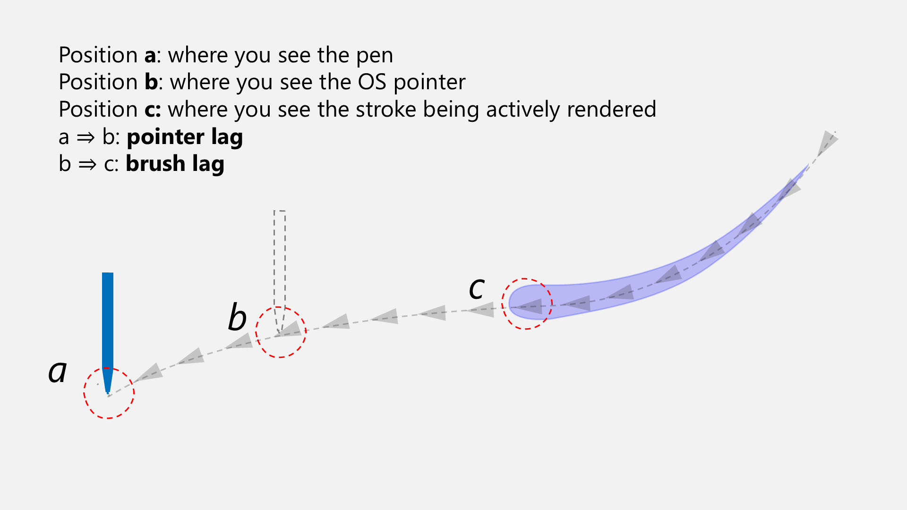

# Pointer lag

## Overview

**Pointer lag** is the delay between the physical position of the pen and the position reported by the operating system. It manifests as the cursor trailing behind the physical pen tip.

Pointer lag is most apparent when moving the pen across the desktop. The faster the pen moves, the greater the trailing distance (lag) becomes.


For lag specifically related to stroke rendering, see [Brush lag](lag.md).


<figure><figcaption></figcaption></figure>

## Affected tablets

All drawing tablets exhibit pointer lag to some degree; it is an inherent property of digital input systems.

* **Pen tablets (screenless):** Generally have lower latency. Lag is also less noticeable because there is no direct visual comparison between the pen tip and the cursor.
* **Pen displays:** Often have slightly higher latency. The lag is highly visible because the cursor and pen tip are on the same plane.
* **Standalone tablets:** Mobile devices (e.g., iPad, Samsung Galaxy Tab) often exhibit lower pointer lag than desktop pen displays due to highly integrated hardware and software stacks.

## "Zero Lag" does not exist

Claims of "zero lag" are incorrect.

* **"zero lag" is impossible**
* **All tablets have pointer lag.**
* **All pen displays show visible lag during fast movement.**

Review videos claiming "no lag" often demonstrate slow movements where lag is hard to see. During faster strokes, the gap between the pen and cursor is visible.

## OS vs. Application lag

Applications receive pen data from the operating system. So an application cannot sense the pen position faster than the OS itself. If lag is visible on the desktop, it will persist in every application, though some apps use techniques such as position prediction to mask it.

## Variance between models

* **Pen tablets (screenless):** Variance is minimal. While some models may feel slightly more "floaty" than others, the difference is rarely significant to the user.
* **Pen displays:** Variance is more obvious between pen display models. Generally, smaller pen displays tend to have less perceived lag than larger models. No pen display has "no lag."

## Technical contributors

Three things contribute to pointer lag:

* **Position smoothing:** Position stabilization, usually to reduce jitter.
* **Latency:** The time required to transmit and process data between components.
* **Sampling rates:** How frequently the action takes place in the system. In the context of drawing tablets, the two most common rates we discuss are:
  * Tablet report rate - how often the tablet reports the pen position.
  * Display refresh rate.

## Specific contributors

* **Firmware smoothing:** Done on the tablet hardware to combat electromagnetic noise.
* **Driver smoothing:** Some drivers apply additional filtering for stability.
* **Report rate:** The frequency at which the tablet sends data to the PC.
* **Display refresh rate:** A higher refresh rate (e.g., 120Hz) significantly reduces perceived lag compared to standard 60Hz displays.

## Real vs. Perceived lag

**Real lag** is the physical distance the pointer trails behind the pen.

**Perceived lag** is the user's subjective experience of that delay. For example, lower refresh rates, such as 30Hz versus 60Hz, do not necessarily increase the physical trailing distance, but they make the movement appear choppier, which the brain interprets as increased lag.

## Reducing pointer lag

Reduction is possible but limited by hardware constraints. You can NEVER achieve zero lag. But you might be able to change enough that the experience feels subjectively better for you.

### Display settings

* **Increase refresh rate:** If your display supports higher refresh rates (e.g., 144Hz), enabling it will reduce perceived lag.

### Hardware smoothing in tablets

Based on extensive original research by tablet expert Kuuube, here is what we know. You can see Kuuube's results in [his tablet buying guide for osu players](https://docs.google.com/spreadsheets/d/1DYVfiSpQqdpa4sWWYUALPmliOIuGyKog7B7LJJdmlhE/edit?gid=2077726645#gid=2077726645).

* **Wacom**
  * **Wacom Intuos Pro:** These tablets do not apply firmware-level smoothing, resulting in very low latency.
  * **One by Wacom (CTL-472 and CTL-672):** These models do not perform firmware-level smoothing.
  * **Wacom Intuos (CTL-4100, CTL-4100WL, CTL-6100, CTL-6100WL):** These models do not perform firmware-level smoothing while pressing with the pen, but they do apply it while the pen is hovering. This will not affect most artists, but serious osu players may notice the transition.
* **Non-Wacom brands:** Based on the tablets Kuuube has tested, non-Wacom tablets tend to use hardware-level smoothing. For most artists, this will likely be imperceptible. But experienced tablet users or serious osu players may notice it.

### Driver options

* **OpenTabletDriver:** This third-party driver does not apply position smoothing by default. When I tried it with several Wacom tablets and compared the pointer lag against the Wacom driver, this is what I noticed:
  * **Intuos Pro:** Shows a noticeable reduction in lag, though tracking may become a bit noisier.
  * **Cintiq Pro:** Shows minimal improvement, maybe 10% to 15%, because most of the lag is baked into the hardware firmware to compensate for display-induced noise.

### Application settings

* Applications cannot reduce pointer lag, as they are dependent on the data provided by the OS.
* However, some applications implement **position prediction**, which can hide pointer lag. Procreate on iPad does this very well. I am not sure which Windows apps do it.

## Measuring lag

The lag, meaning the visual separation you see, is not constant. It depends on speed. The faster the pen moves, the farther behind the pointer trails.

* **At rest:** Zero lag.
* **Slow movement:** Low lag.
* **Fast movement:** High lag.

## Research and future measurement

I am currently researching methods to objectively measure pointer lag and establish "lag curves" for various pen displays. This work began in early 2026.

## EMR vs. Apple Pencil (iPad)

The Apple Pencil on iPad typically exhibits lower perceived lag than desktop EMR tablets. This is likely due to:

* **Vertical integration:** Apple optimizes the entire stack (hardware, firmware, OS).
* **Sensor proximity:** The Apple Pencil's active components are closer to the tip than in most EMR pens, potentially requiring less aggressive smoothing.
* **Reduced parallax:** A thinner stack between the digitizer and the display panel reduces visual interference.
* **Prediction algorithms:** iPads use predictive tracking to "guess" where the pen will be, reducing the visual gap at the cost of slight inaccuracy during sudden direction changes.
