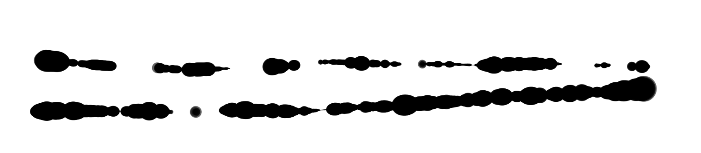
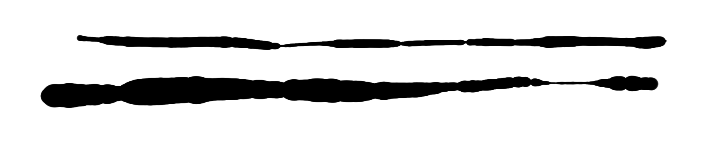
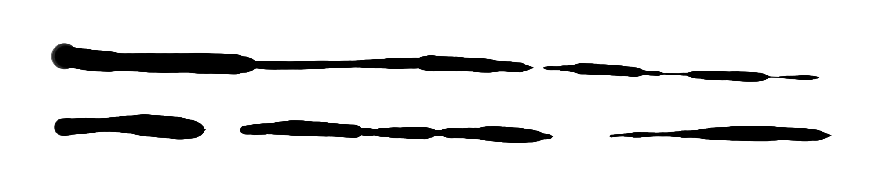

# Drawing at low physical pressure

## Overview

Ideally when you're drawing with an EMR pen, smooth changes to physical pressure are translated to smooth changes in the pressure data the computer is getting from the tablet.

In reality, at low pressure near the IAF, you can experience instability where pressure readings do strange things. This produces odd artifacts in your strokes.

Often, this instability is present in your strokes but may not be noticeable, especially if your brush size is small, such as `10px`. If you are using very large brush sizes such as `100px` or `500px`, it may be much more obvious.

## Prevalence

All drawing tablet pens have some pressure instability near their initial activation force. The amount of this instability, and the way it appears, varies a bit between pen models. However, even the best drawing tablet pen on the market, the Wacom Pro Pen 2, can be made to exhibit these issues.

## Examples

All of the examples below were created with the Wacom Intuos Pro 2017 M (PTH-660) with the Wacom Pro Pen 2 (KP-504E).

* Application: Krita
* Brush: Ink3 Gpen, null pressure curve, 500px brush

<figure><figcaption></figcaption></figure>

<figure><figcaption></figcaption></figure>

<figure><figcaption></figcaption></figure>

## Causes

* The pressure detection mechanism in an EMR pen is almost always hypersensitive as pressure gets close to the IAF.
* The texture of the tablet surface, as the pen travels over it, can get picked up by the pressure sensor.
* The movement of your wrist or elbow on the tablet or the desk as your hand moves or rotates can get picked up by the pressure sensor.
* It's very hard for a human to hold a consistent physical pressure.
* Pens are more sensitive to pressure as they come closer to a vertical position.
* Depending on the direction of pen travel, the physical tilt of the pen can create odd interactions between the nib of the pen and the surface of the pen tablet.

## Addressing these problems

See [TSG: Low pressure drawing problems](../../troubleshoot/tsg-strokes-quality-at-low-pressure.md).
