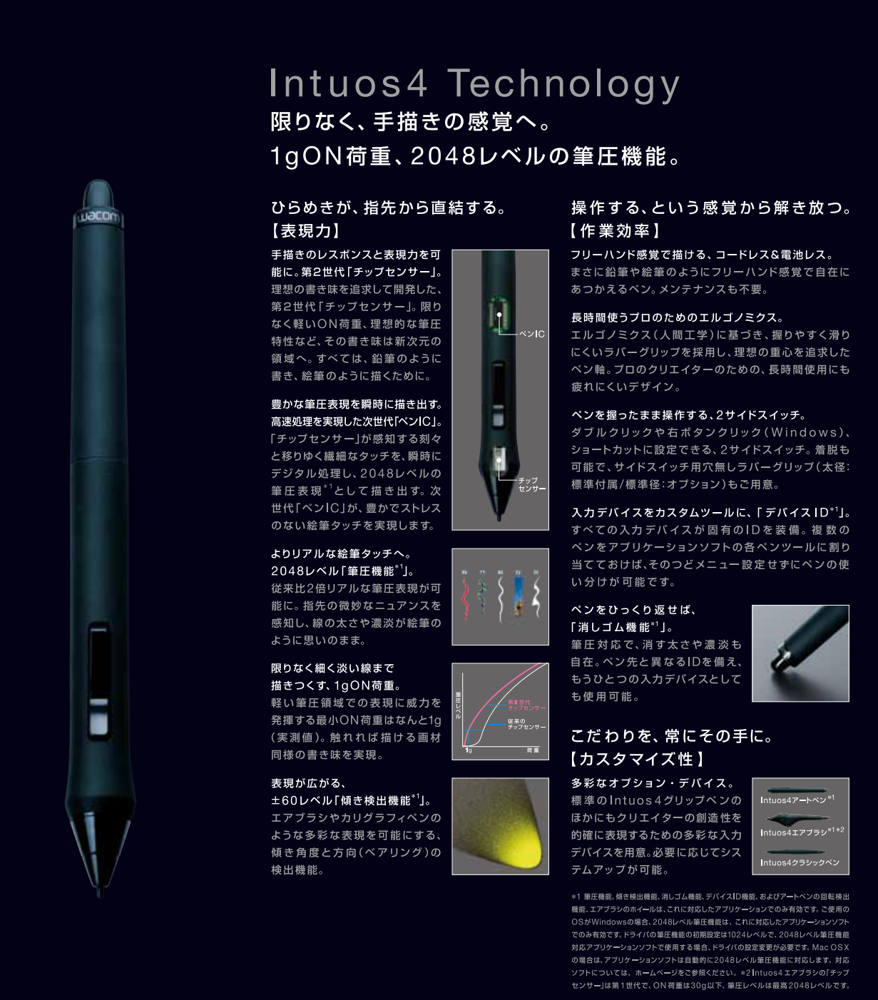
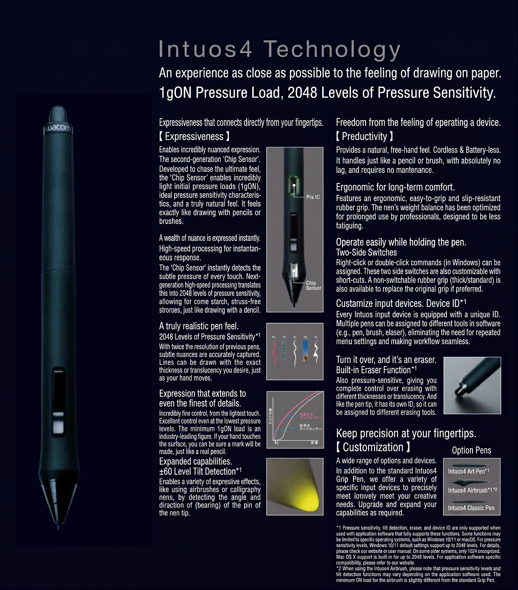

# IAF

## Overview

The **initial activation force** (IAF) is the smallest amount of pressure an EMR pen detects.

In simpler terms, IAF is how hard you need to press to draw. High IAF means you need to press harder. Low IAF means you can draw with lighter pressure.

In general, people want lower IAF.

## Details

* IAF is measured in gram-force units (`gf`). You will often see it described as grams.
* IAF is determined by the pen hardware, not the tablet.
* More info: [Pen pressure](./)

## Video



## Initial activation force (IAF)

A lower IAF is good because it makes fine details easier to draw. To give you a better sense of these values, I have ranked IAF below based on feedback I have received and what works for me.

<table><thead><tr><th width="154.5999755859375">IAF Rating</th><th width="134.79998779296875">IAF Range</th><th>Comments</th></tr></thead><tbody><tr><td>EXCELLENT</td><td>&#x3C;=1gf</td><td>Many modern Wacom pens have an IAF of &#x3C;= 1gf</td></tr><tr><td>GREAT</td><td>1gf to 2gf</td><td>Only a couple of pens are in this range</td></tr><tr><td>GOOD</td><td>2gf to 3.5gf</td><td>Most modern EMR pens have an IAF of around 3gf.</td></tr><tr><td>OK</td><td>3.5gf and 5gf</td><td>This is tolerable. Something that would be typical of a consumer-level pen.</td></tr><tr><td>BAD</td><td>≥ 5gf</td><td>Most people would not enjoy using such a pen.</td></tr></tbody></table>

Note that some people have much stronger opinions about IAF. For example, some people think any IAF greater than 2gf is bad.

## IAF through the years

Very low IAF is not new. Wacom has been making pens for decades that have excellent low IAF. Their professional pens have had low IAF for a long time.

Here are some examples from Kuuube's measurements (using Open Tablet Driver) from his [Wacom Tablet Mastersheet](https://docs.google.com/spreadsheets/d/125LNzGmidy1gagwYUt12tRhrNdrWFHhWon7kxWY7iWU/edit?gid=1134075895#gid=1134075895).

<table><thead><tr><th width="315.79998779296875">Pen</th><th width="92.2000732421875">IAF</th><th>Tablet launch year</th></tr></thead><tbody><tr><td>Wacom Pro Pen 2 (KP-504E) IAF</td><td>&#x3C;1gf</td><td>2017</td></tr><tr><td>Wacom Pro Pen Slim (KP-301E) IAF</td><td>&#x3C;1gf</td><td>?</td></tr><tr><td>Wacom Intuos4/5 Grip Pen (KP-501E)</td><td>&#x3C;1gf</td><td>2009 and 2012</td></tr><tr><td>Wacom Intuos3 Grip Pen (ZP-501E)</td><td>&#x3C;1gf</td><td>2004</td></tr><tr><td>Wacom Intuos2 Grip Pen (XP-501E)</td><td>&#x3C;1gf</td><td>2001</td></tr><tr><td>Wacom Intuos1 Grip Pen (GP-300E)</td><td>&#x3C;1gf</td><td>1998</td></tr></tbody></table>

## The importance of low IAF

Some people really need an excellent IAF of <1gf.

Others, myself included, work fine with a 3gf IAF. I definitely notice the difference, but it does not affect the kind of art I create.

## Changing the IAF

* Lowering IAF - see [Decreasing IAF](../../guides/customizing/lowering-iaf.md)
* Increasing IAF - see [Increasing IAF](../../guides/customizing/increasing-iaf.md)

## A higher IAF can be useful

Given how much focus there is on low IAF, it is natural to think that lower is always better. That is generally true, but there are some exceptions.

### False pressure detection

As the pressure sensing mechanism in a pen becomes more sensitive to enable very low IAF, it can have unintended effects. For example, pens with super-low IAF may report pressure even when they are clearly not touching the tablet. Sometimes this appears as spurious pressure readings. In other cases, the pen can effectively draw while hovering.

### Effectively increasing IAF with pressure curves

The IAF of a pen cannot be lowered, but it can be effectively increased with a pressure curve. See [Increasing IAF](../../guides/customizing/increasing-iaf.md).

Sometimes tablets are preconfigured to raise the IAF artificially. If that is the case, you can remove the artificial increase to get back to the native IAF. More here: [Pressure curve dead zones](pressure-curves/pressure-curve-deadzone.md)

## Is Wacom <1gf IAF real?

It is commonly accepted that some of Wacom's pens have the lowest IAF in the industry: <1gf.

But how sure are we that this is real? There are two pieces of evidence.

1. Wacom has explicitly mentioned this before. Below is the original Japanese version and an English AI-translated version.

<figure><figcaption></figcaption></figure>

<figure><figcaption></figcaption></figure>

The phrase "1gON" indicates that 1 gf of physical force will trigger the pen to draw or click.

<figure><figcaption></figcaption></figure>

2. Tablet expert Kuuube has measured many Wacom pens and found that they have an IAF of <1gf.

## Wispy tails on strokes

Another effect of very low initial activation force is that it can affect the shape of strokes at the very beginning or end. For example, it can leave little wispy tails at the beginning or end of a stroke. In some cases, you may want to create a small dead zone in your driver to avoid those wispy tails.

I have also noticed that, in some pens, an extremely low IAF can cause the pen to register pressure for a moment longer after you lift it off the tablet. I suspect this happens because the moving nib still has to overcome some friction. As you lift off the tablet, the very sensitive pressure mechanism may still detect the nib pushing into it. This can create the same wispy-tail effect.

## How IAF is measured

This video from XP-Pen demonstrates it: [https://www.youtube.com/watch?v=QLmkI2vgfBg](https://www.youtube.com/watch?v=QLmkI2vgfBg)
