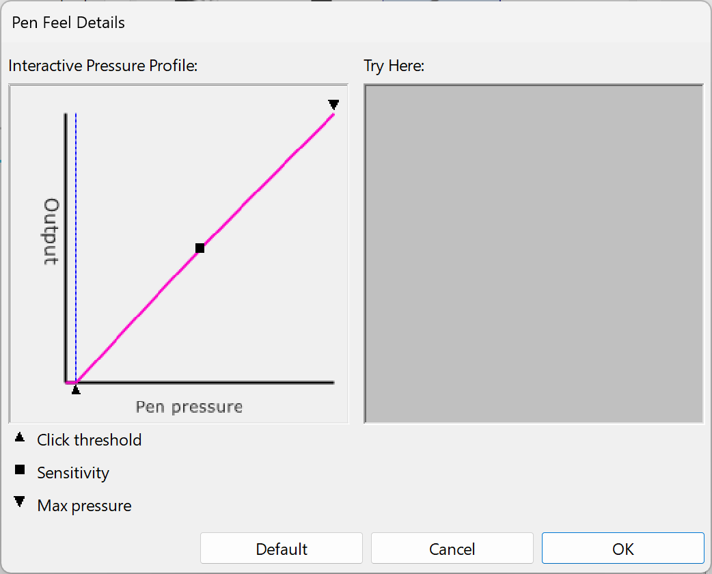

# Misc pressure curve notes

## Misc notes: Wacom pressure deadzone

**Some** of Wacom's Pro Pens are so sensitive that Wacom, by default, configures the pen pressure curve in the driver to have a small "deadzone" at the low end of pressure. This means the very lowest pressure readings are ignored.

Here is a screenshot showing that pressure deadzone in the default pressure curve the Wacom driver uses for the Wacom Pro Pen 2 (KP-504E).

<figure><figcaption></figcaption></figure>

Resources

[Devid Revoy - Calibrating stylus pressure (for Krita)](https://www.davidrevoy.com/article182/calibrating-wacom-stylus-pressure-on-krita)\
[https://www.davidrevoy.com/article182/calibrating-wacom-stylus-pressure-on-krita](https://www.davidrevoy.com/article182/calibrating-wacom-stylus-pressure-on-krita)
