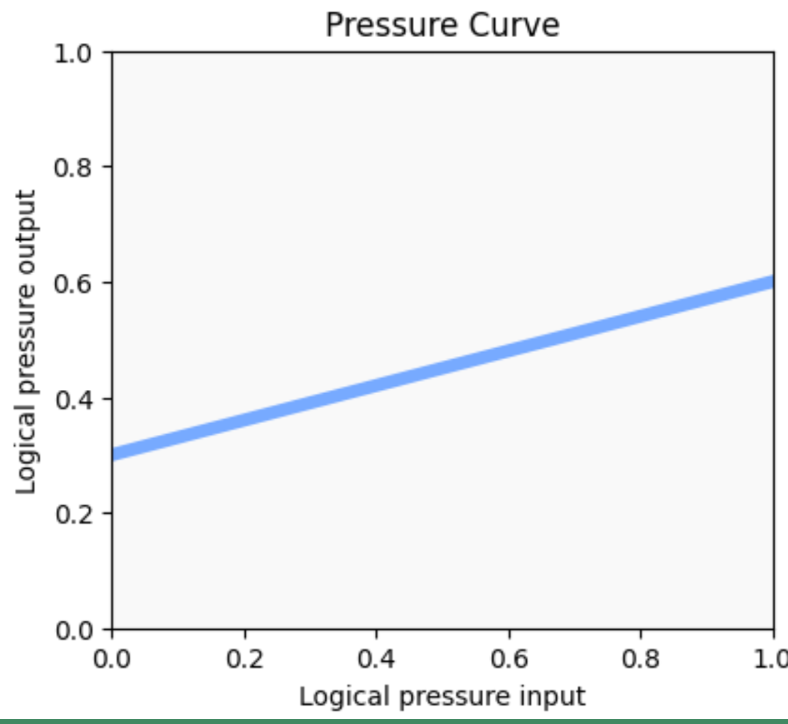
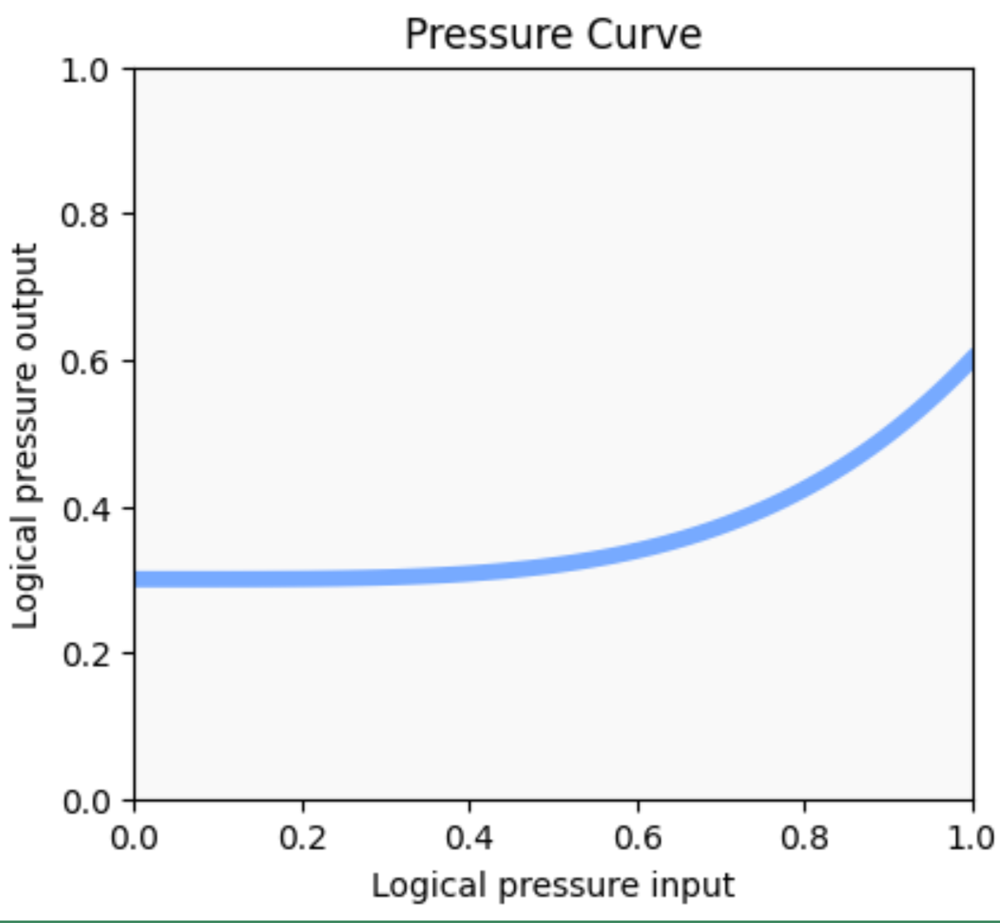
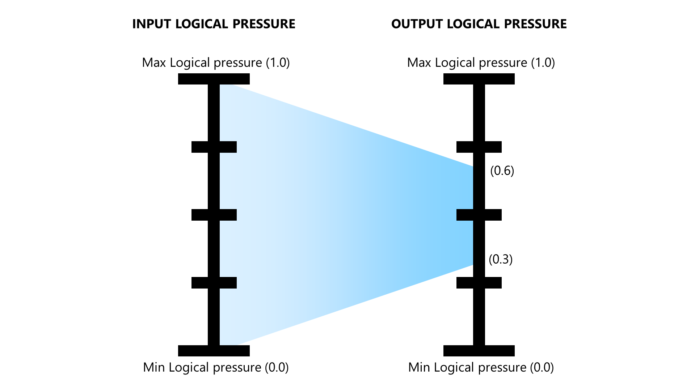
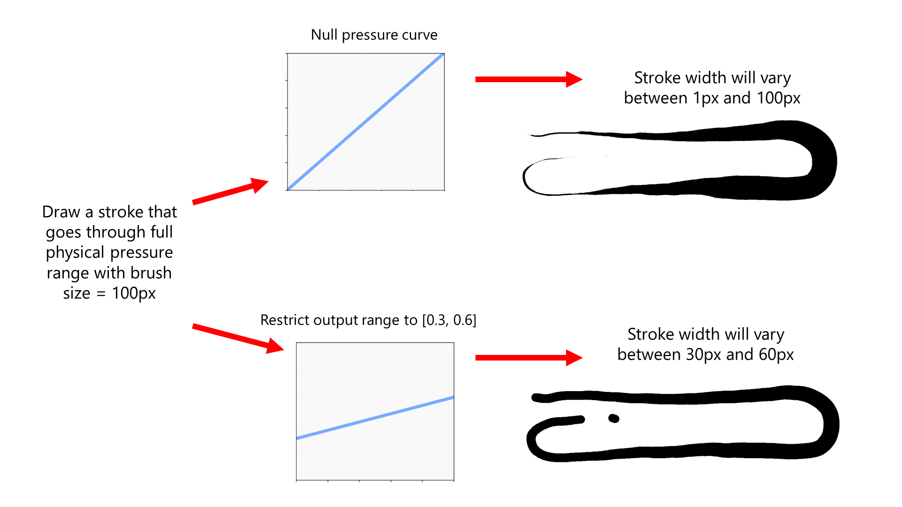

# Constraining pressure curve output

## Overview

Typically, a pressure curve function takes input logical pressure values in the range of \[0,1] and maps it to values in an output range of \[0,1]. This means that the full output range is used.

Some curves can limit their output range to achieve better control over brush strokes.

## Visual interpretation

The easy way to tell that a pressure curve constrains the output range is to notice that the curve shape does not reach the bottom or the top of the pressure curve graph. Two examples are below.

<figure><figcaption></figcaption></figure>

<figure><figcaption></figcaption></figure>

Even though the shapes look a little different, they both effectively take the input logical pressure values between \[0,1] and map them to an output region close to \[0.3, 0.6].

<figure><figcaption></figcaption></figure>

## Impact on brush strokes

Imagine the user's brush setting is 100px and the brush is set to change its size in response to pressure. Then suppose the user draws a stroke that goes from the IAF value to the MAX physical pressure.

The stroke size is computed like this:

```
pressure = apply_curve( pressure )
brush_size = max( 1, 100 * pressure )
```

* With a null pressure curve, the stroke width will go from a size of 1 px to 100 px.
* With the curves shown above, the stroke width will go from 30 px to 60 px. So the width of the stroke does not vary as much.

<figure><figcaption></figcaption></figure>

## Use cases

* Helps give you more consistent brush strokes while still allowing some variability
* By avoiding the lower end of output logical pressure, you can have your strokes start off a little thicker than normal. (Though some apps have other ways of accomplishing this goal.)
