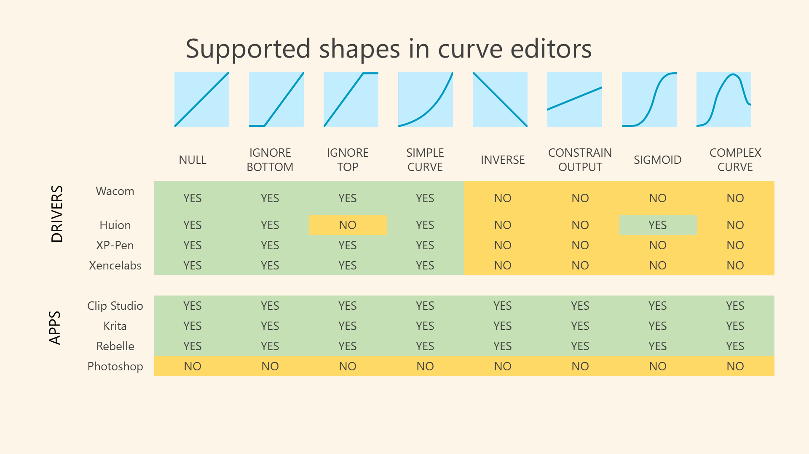

# App pressure curves

## Overview

Applications may offer pressure curves.

* Drawing applications - almost ALL have pressure curves.
* Note-taking applications - almost never have pressure curves.

## Pressure curve shape support

Not all pressure curve shapes are possible in all cases.

* Drivers usually offer only simple pressure curves
* Applications are generally very flexible

<figure><figcaption></figcaption></figure>
