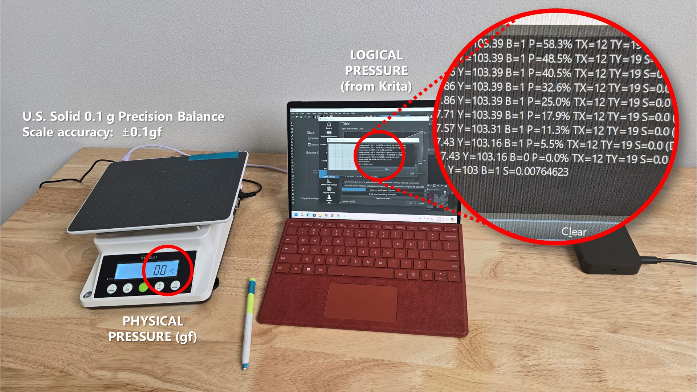
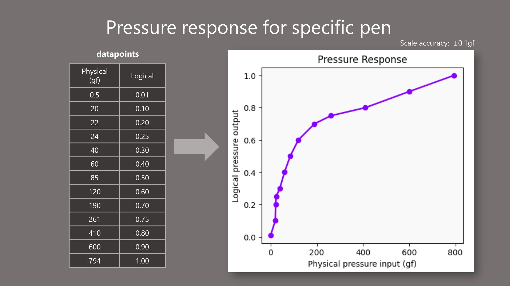
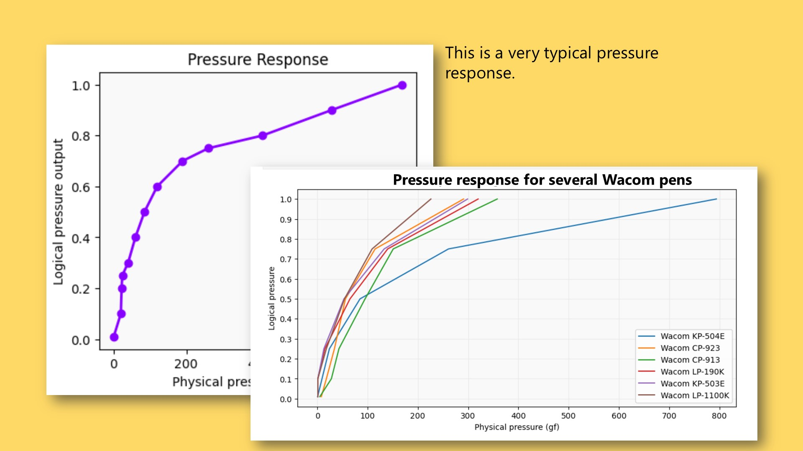
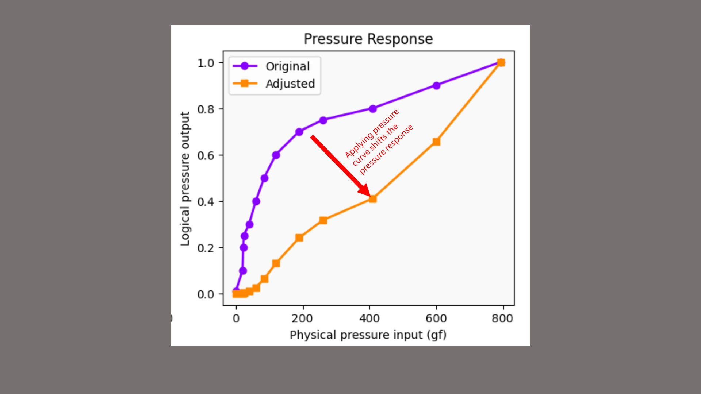
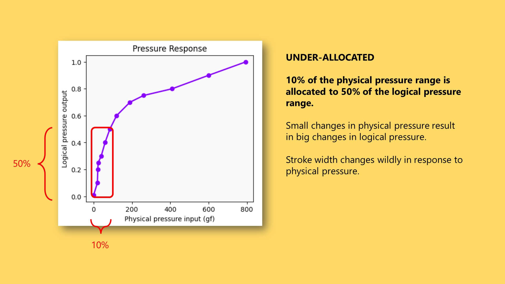
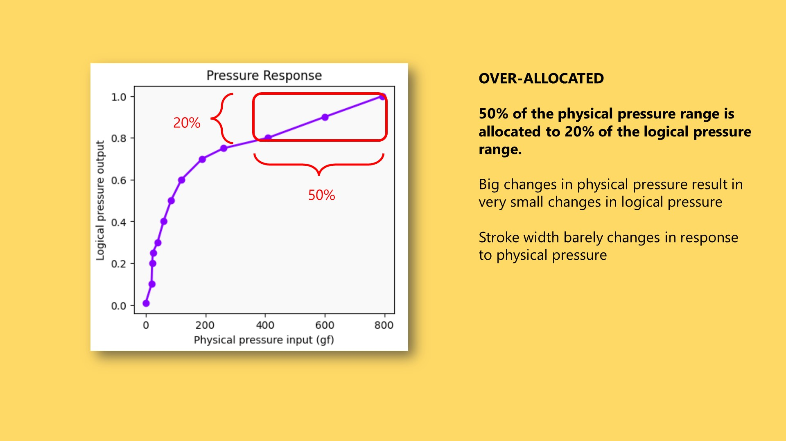
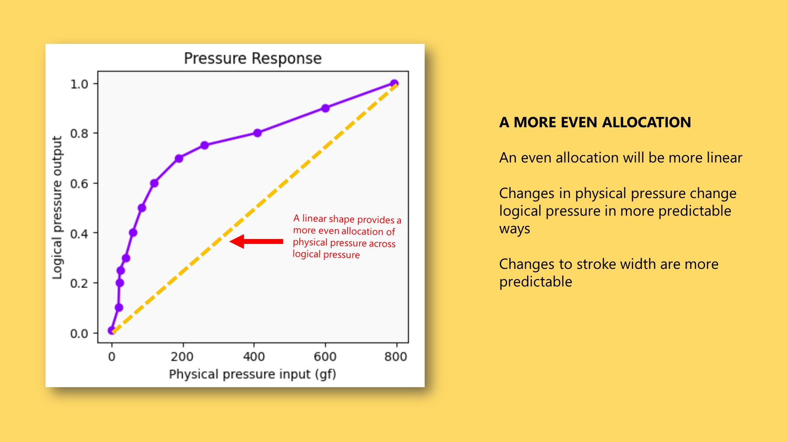
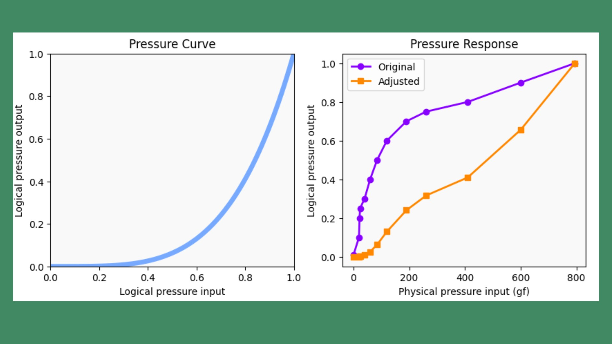

# Pen pressure response

The pressure response of a pen describes how the pen behaves with respect to pressure.

The pen measures physical force at its tip. Information about that force is sent to the tablet and then translated into a logical pressure value. The pressure response is the relationship between physical pressure and logical pressure.

<figure><figcaption></figcaption></figure>

In numerical terms, it can be expressed as a simple set of data points. If we graph those data points with physical pressure on the X axis and logical pressure on the Y axis, we get a chart that visualizes the pressure response.

<figure><figcaption></figcaption></figure>

All pens come out of the box with a specific pressure response. Keep in mind that the response is unique to each pen. Even pens of the same model will differ at least a little.

One thing that is generally true for EMR pens is that the shape of the pressure response is often bowed upward quite a bit.

<figure><figcaption></figcaption></figure>

If we need to change the pressure response of a pen, we have to apply a pressure curve.

<figure><figcaption></figcaption></figure>

A pressure curve modifies a pressure response. You can think of it as creating a new pressure response. In the example above, the pressure curve applied to the original pressure response creates a new response that is much more linear.

I like to think of pressure responses and pressure curves as a game of resource allocation, where we try to distribute the physical pressure range in useful ways across the logical pressure range.

We want to think about this allocation intentionally because it can give us three things:

* a better drawing experience
* a way to solve problems while drawing, or even address some hardware limitations
* a way to get creative effects in brush strokes

This pressure response is similar to that of a Wacom Pro Pen 2 (KP-504E). It has that typical bowed-up shape. What separates it from many other pens' pressure responses is that it extends very far on the X axis because it has an extremely wide pressure range.

There are two interesting things about how physical pressure is allocated in this specific pressure response.

For the purposes of this discussion, I'm only going to talk about how pressure affects stroke width. That is simply the easiest way to visualize it in this document. Everything I am saying also applies when, for example, pressure is mapped to opacity or even color.

<figure><figcaption></figcaption></figure>

The first is that the shape of the response indicates under-allocation at lower physical pressure. Only about 10% of the physical pressure range is allocated to about 50% of the logical pressure range.

This means that small changes in physical pressure result in large changes in logical pressure. In turn, that means large changes in stroke width.

This can make it feel like it's hard to control the width of your stroke when you're drawing very lightly.

<figure><figcaption></figcaption></figure>

At the higher end of this pressure response, we encounter over-allocation of physical pressure to logical pressure. About 50% of the physical pressure range is allocated to only about 10% of the logical pressure range.

This means that large changes in physical pressure produce small changes in logical pressure, which then produce small changes in stroke width.

This can make it seem like you're pressing very hard but you aren't seeing your stroke size increase or decrease by much.

<figure><figcaption></figcaption></figure>

In general, I think we want a more even allocation of the physical pressure range across the logical pressure range. A more evenly allocated pressure response looks much more linear.

To be clear, I am not saying that linear is the best shape for a pressure response. I'm saying it is a good starting point. Ultimately, you will have to use pressure curves to shape the response into something that works for you.

<figure><figcaption></figcaption></figure>

Here you can see how a specific pressure curve takes the original pressure response and shifts it to a more linear shape. This example helps show how much you may need to bend the pressure curve to get a linear response.

And keep in mind again that the pressure response shown is for a specific pen. This pressure curve may not have the same effect on different pens.
