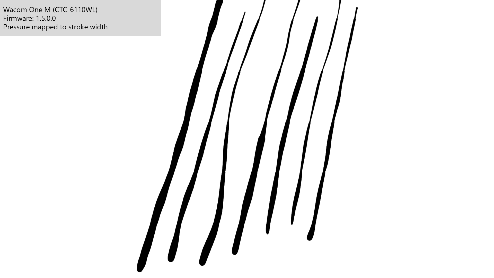
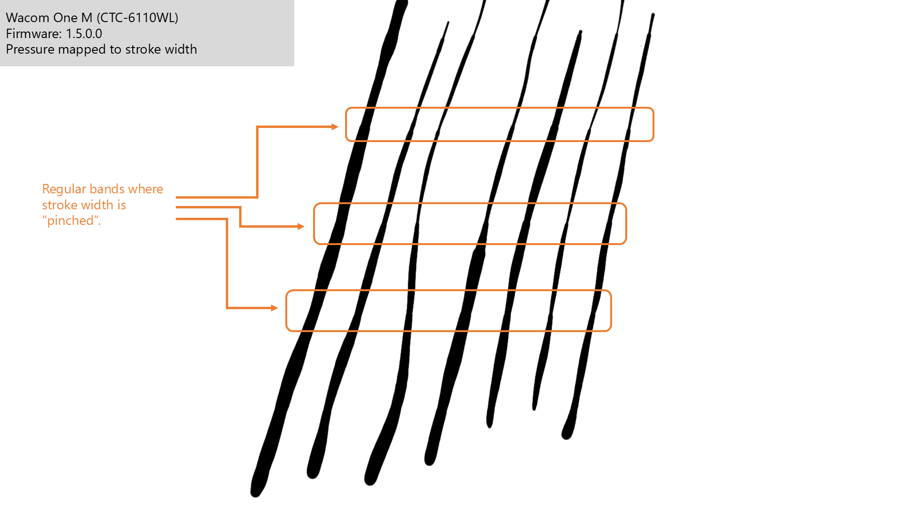
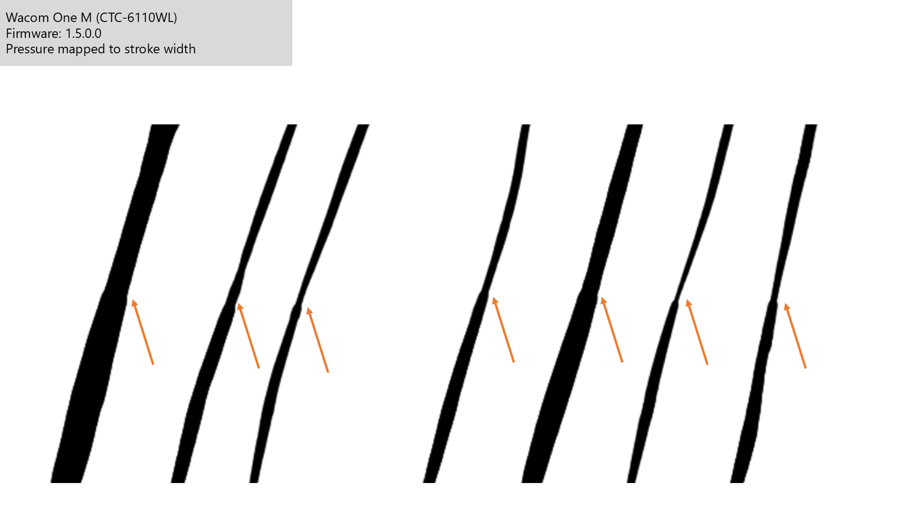
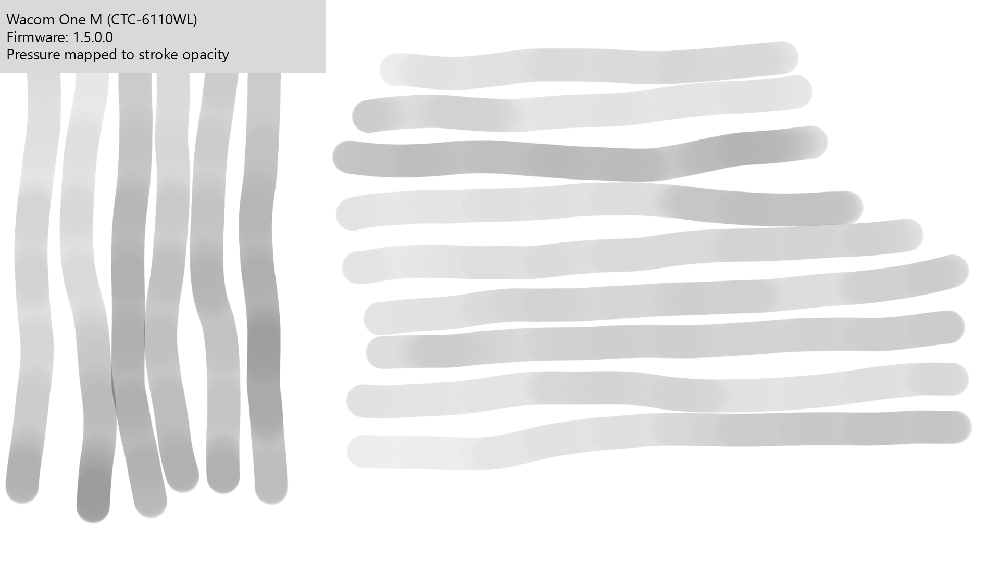
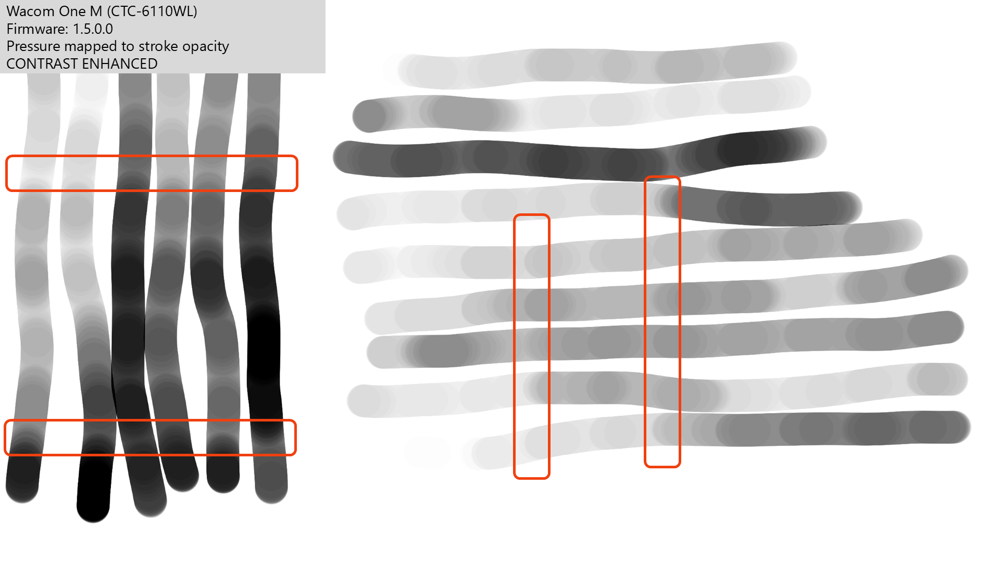
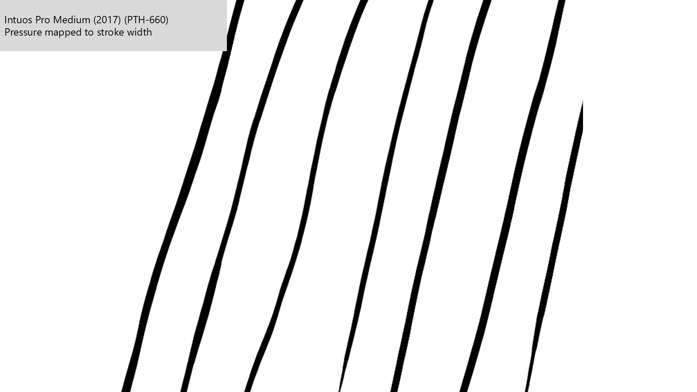
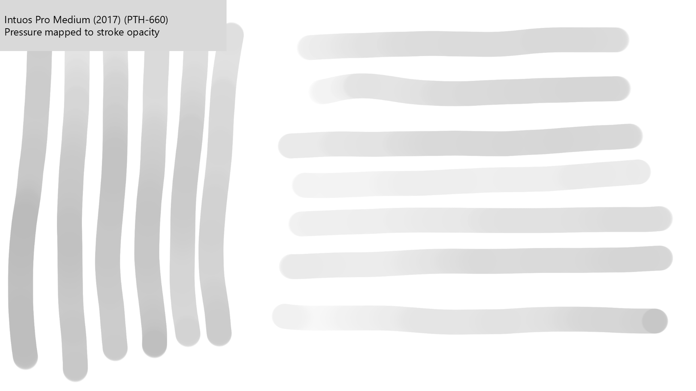
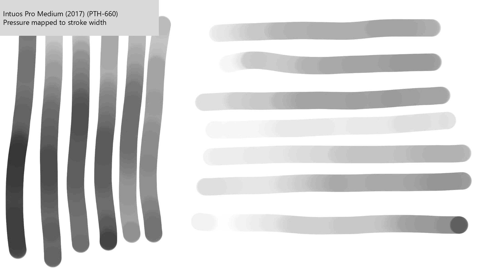

# Pressure banding

## Overview

Pressure banding features sudden dips or harsh transitions in pressure in very regular horizontal and vertical bands, especially when drawing at lower pressure.

## Prevalence

This is very rarely seen.

I have only encountered it in two tablets:

* Wacom One M (CTC-6110WL)
* Wacom One S (CTC-4110WL)

I do not recommend buying those two tablets for this reason.

## Cause

* The pen is NOT the problem
* I suspect it is a problem with the firmware in combination with the digitizer.

## Examples

All the examples below are from the Wacom One M (CTC-6110WL) pen tablet that was released in 2023. With the original firmware (v 1.5.0.0) of the tablet, significant pressure banding occurred. Later firmware updates significantly reduced the effect, but did not eliminate it.

## Pressure to stroke width

Here are 7 strokes drawn in Krita on the CTC-6110WL.

<figure><figcaption></figcaption></figure>

Even now, you may detect some regular pattern in the width of the strokes.

Looking carefully, you'll see that the strokes appear pinched in regular horizontal bands.

<figure><figcaption></figcaption></figure>

<figure><figcaption></figcaption></figure>

## Pressure to stroke opacity

The effect is more clearly shown when pressure controls opacity and you apply a little image processing.

You might be able to make out some banding in the original image.

<figure><figcaption></figcaption></figure>

Performing some contrast enhancement makes it much more obvious.

<figure><figcaption></figcaption></figure>

<figure><figcaption></figcaption></figure>

## What normal strokes should look like

These examples were created with a Wacom Intuos Pro Medium (2017) tablet.

<figure><figcaption></figcaption></figure>

<figure><figcaption></figcaption></figure>

<figure><figcaption></figcaption></figure>

## Testing

Here is how I test for banding: [Measuring pressure banding](../../process/measuring/measuring-pressure-banding.md)
