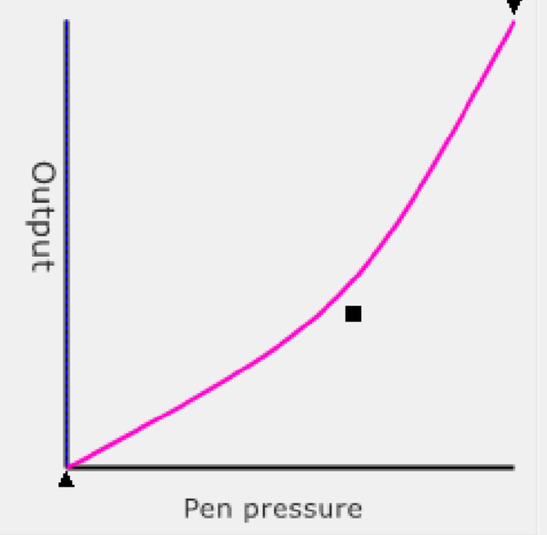

# Pressure curves


Before you read this document, read: [Pen pressure response](../pen-pressure-response.md)


## Overview

Your pen senses pressure and encodes it as a number. You can think of that number as ranging from 0 to the maximum number of pressure levels of your pen. In many cases, it's easier to "normalize" this number so that it ranges from 0.0 to 1.0. This makes pressure easier to discuss.

This number flows through a "pipeline" of components: tablet firmware -> tablet driver -> OS pen subsystem -> pen-aware application -> brush engine.

Some of these components can process the pressure. That means they can alter the number before it is sent to the next component.

The processing of the pressure number alters how the pen will feel to draw with.

There are different ways in which components can process the pressure number. These include:

* Pressure processing curves (also called just "pressure curves")
* Pressure smoothing

This document deals with pressure processing curves.

## Response curve vs processing curve

Thinking of it as numbers:

* The pressure response curve is how the pen hardware handles pressure. It maps physical pressure into a pressure number.
* The processing curve is a mathematical operation that takes a pressure number and can change it into a different number.

Thinking of it as a behavior ("how the pen feels")

* The pressure response curve is the "native" behavior of how the pen feels to draw with.
* The pressure processing curve is a way of modifying that behavior.

## What a pressure processing curve looks like

For example in the Wacom Tablet Properties app it looks like this:

* The X axis labeled "Pen pressure" is the logical input pressure.
* The Y axis labeled "Output" is the logical output pressure.
* This particular curve bends down a little, but many other shapes are possible. Each shape has its own uses.

## Popular coverage of pressure curves is misleading

You might encounter YouTube videos where people describe the pressure curve as the pressure behavior of the pen. This is inaccurate. The pressure curve describes how the pressure behavior, meaning the pressure response, is being modified. You cannot look at a pressure curve and understand the pressure behavior of your pen. The only way to understand the pressure behavior of a pen is to physically measure it with a scale and map physical pressure values to logical pressure values.

## Pressure curve shapes

There are a variety of pressure curve shapes. Each can solve some problem or achieve some visual effect.

<figure><figcaption></figcaption></figure>

To see which drivers and apps support which shapes, see: [App pressure curves](pressure-curve-in-app.md)

## Things you can do with pressure curves

* [Null pressure curve](pressure-curve-null.md) - a curve that "does nothing"
* [Constraining pressure curve output](pressure-curve-constrain-output.md)
* [Constraining pressure curve input](pressure-curve-constrain-input.md)
* [Decreasing IAF](../../../guides/customizing/lowering-iaf.md)
* [Increasing IAF](../../../guides/customizing/increasing-iaf.md)
* [Lowering maximum physical pressure](../../../guides/customizing/lowering-max-physical-pressure.md)

## Driver UX for pressure curves

See [Driver pressure curves](pressure-curve-in-driver.md)
