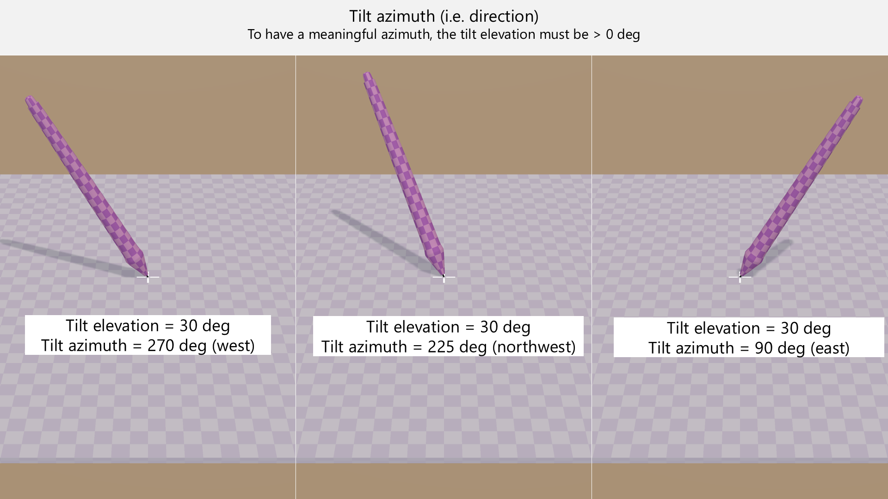

# Pen tilt

## Introduction

Almost all drawing tablets can detect the tilt of the pen. Tilt support for drawing tablets usually ranges from 0 degrees to 60 degrees.

Tilt is described by two angles: tilt elevation and tilt azimuth.

* elevation = "how much the pen leans over"
* azimuth = "the direction of the lean — like north, west, or northwest"

<figure><figcaption></figcaption></figure>

<figure><figcaption></figcaption></figure>

This video demonstrates tilt. I highly recommend that you watch it.



## How tilt is used in drawing applications

Using tilt in an application involves letting tilt azimuth or tilt altitude affect properties of a brush.

### Tilt altitude to size

A common use it to let tilt altitude control the width of the stroke. So leaning the pen over increaese the width of the stroke.&#x20;

For example, below is a stroke I drew with Krita. I configured the brush to ignore pressure entirely, but to let the tilt altitude control the width of the brush. As I drew from left to right, I started with the pen very perpendicular and gradually started tilting the pen.

<figure><figcaption></figcaption></figure>

### Tilt azimuth to size

Typically this means the direction of the tilt controls the rotation of the brush.

## Which tablets support tilt

The vast majority of modern drawing tablets support tilt.

It's easier to list the modern tablets that do not support tilt:

* Wacom One by Wacom Small (CTL-472)
* Wacom One by Wacom Medium (CTL-672)
* Wacom Intuos Medium (CTL-6100 & CTL-6100WL)
* Wacom Intuos Small (CTL-4100 & CTL-4100WL)
* Huion Frego S (L310)

## Do you need tilt support?

For some people tilt is critical and for others, it is not useful at all. It strongly depends on what they are doing.

| Scenario                                    | Is tilt useful? | Notes                                                    |
| ------------------------------------------- | --------------- | -------------------------------------------------------- |
| Whiteboarding                               | Not useful      | It's rare for whiteboarding apps to even support tilt.   |
| Taking notes                                | Not useful      | It's rare for note-taking apps to even support tilt.     |
| Educational videos                          | Not useful      |                                                          |
| Digital painting with natural media brushes | Can be useful   | Some artists require it.                                 |
| Line art                                    | Can be useful   | Many people create line art without using tilt features. |

## Technical details

You don't need to know these details. If you are curious about how an EMR tablet detects pen tilt, see [EMR tilt detection](../../tech/emr/emr-tilt-detection.md).

## Tilt altitude range

* The standard range for tile altitude is ±60 degrees in both the X and Y directions.
* I don't know of any tablets that support a wider range.
* Some very old tablets have a slightly narrower range.

## Tilt support in applications

See: [Using tilt with your brush](../../guides/customizing/using-tilt.md)

## Tilt effect on pen tracking accuracy (tilt compensation)

To calculate the pen location, the tablet must account for its tilt. This process is called **tilt compensation**. Remember: no tablet has perfect tilt compensation. You might see some deviation at extreme tilt angles. This is normal.

See [tilt compensation](tilt-compensation.md)

## Disabling tilt

You may not always want to have tilt affect your drawing. It is possible in some cases to disable it. More here: [Disabling pen tilt](../../guides/customizing/disable-tilt.md)
